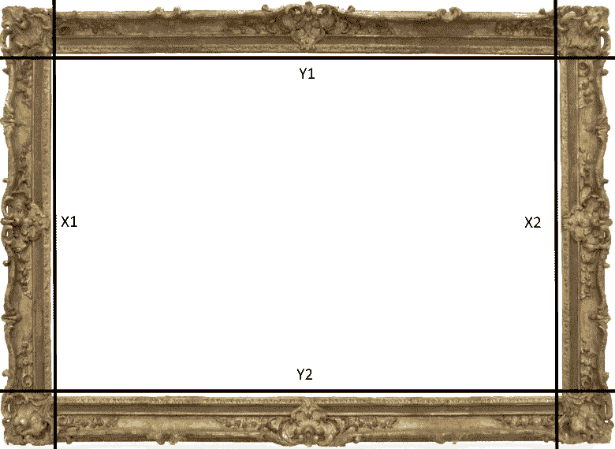

# CSS 边框

> 原文：<https://jenkov.com/tutorials/css/border.html>

正如关于 [CSS 盒子模型](/css/box-model.html)的文本中所解释的，一个 HTML 元素周围可以有一个边框。边框可以是实心的、虚线的、三维的、圆角的，甚至可以在边框中使用图像。

使用各种 CSS 边框属性来指定边框。本文涵盖了这些边界属性。

## CSS 边框属性

使用以下边框 CSS 属性设置边框样式:

*   `border`
    T2】
*   `border-width`
*   `border-style`
*   `border-color` 
*   `border-top`
*   `border-right`
*   `border-bottom`
*   `border-left` 
*   `border-top-width`
*   `border-top-style`
*   `border-top-color`
*   `border-right-width`
*   `border-right-style`
*   `border-right-color`
*   `border-bottom-width`
*   `border-bottom-style`
*   `border-bottom-color`
*   `border-left-width`
*   `border-left-style`
*   `border-left-color`
    T2】
*   `border-radius`
*   `border-top-left-radius`
*   `border-top-right-radius`
*   `border-bottom-left-radius`
*   `border-bottom-right-radius`

这些用于边框样式的 CSS 属性将在下面的章节中解释。

## 边界

CSS 属性设置 HTML 元素周围的边框，即所有四个边框(上、右、下和左)。`border` CSS 属性值由三部分组成:

*   边框宽度
*   边框样式
*   边框颜色

这些部分都是在设置`border`属性时指定的，用空格隔开。这里有一个例子:

```
#theDiv {
    border : 1px solid #000000;
}

```

第一个值是`1px`，它是*边框宽度*。该值将 HTML 元素周围的边框宽度设置为 1 个像素。使用任何有效的 [CSS 单位](/css/units.html)指定边框宽度。

第二个值是`solid`，它是*边框样式*。该值将边框设置为实线，即简单的线条(非虚线、无 3D 效果等)。).还有很多款式可供你选择。这些将在后面介绍。

第三个值是`#000000`，也就是`border color`。该值将边框颜色设置为黑色。使用 [CSS 颜色](/css/colors.html)格式指定边框颜色。

## 边框宽度

CSS 属性可以用来设置 HTML 元素的边框宽度。使用任何有效的 [CSS 单位](/css/units.html)来指定`border-width` CSS 属性的值。这里有一个例子:

```
#theDiv {
    border-width: 2px;
}

```

本示例 CSS 规则将 CSS 规则选择的 HTML 元素的边框宽度设置为 2 像素。

## 边框样式

CSS 属性可以用来设置 HTML 元素周围的边框样式。可用于`border-style` CSS 属性的有效值为:

*   `solid`
*   `dotted`
*   `dashed`
*   `double`
*   `groove`
*   `ridge`
*   `inset`
*   `outset`
*   `none`
*   `hidden`

`none`和`hidden`值具有相同的效果。它没有显示边界。

以下是这些边框样式呈现时的一些视觉示例:

```
    solid

```

```
    dotted

```

```
    dashed

```

```
    double

```

```
    groove

```

```
    ridge

```

```
    inset

```

```
    outset

```

注意，前三个示例的边框宽度设置为 2px，最后一个示例设置为 6px。有些边框样式要求边框宽度大于 2px，才能真正看到它们的效果。

## 边框颜色

CSS 属性设置边框的颜色。CSS 属性可以接受任何有效的 CSS 颜色 T4。这里有一个`border-color`的例子:

```
#theParagraph {
    border-width: 2px;
    border-style: solid;
    border-color: #ff00ff;
}

```

该示例呈现后的外观如下:

`border-color`举例。

## 顶部边框、右侧边框、底部边框、左侧边框

`border-top`、`border-right`、`border-bottom`和`border-left`属性的工作方式与[、`border`、](#border)属性相同，除了这些 CSS 属性只配置边框的一部分(上、左、下或右边框)。这些属性的配置方式相同。这里有一个例子:

```
#theDiv {
    border-left: 1px solid #000000;
}

```

本示例将所选 HTML 元素的左边框设置为 1 像素宽的黑色实心边框。这是它在浏览器中呈现时的样子:

带有`border-left: 1px solid #000000`的元素

## 附加边框 CSS 属性

边框的最后一个 CSS 属性(`border-top-width`、`border-top-style`、`border-top-color`等)。)的工作方式与`border-width`、`border-style`和`border-color`属性相同，除了这些最后的边框属性只设置在部分边框上(上、右、下或左)。

这里有一个例子:

```
#theDiv {
    border-top-width: 2px;
    border-top-style: dashed;
    border-top-color: #cccccc;
}

```

本示例将选定元素的上边框设置为 4 像素宽的灰色虚线边框。这是它在浏览器中呈现时的样子:

带有`border-top-width: 2px; border-top-style: dashed; border-top-color: #cccccc;`的元素

## 边框半径

CSS 属性是 CSS 3.0 中的新特性。CSS 属性用于在 HTML 元素上创建圆角边框。在`border-radius`之前，HTML 元素上的圆角只能使用表格和图像，而且 HTML 和浏览器的下载量都很大。幸运的是`border-radius` CSS 属性将我们从痛苦中解救出来。

这里有一个`border-radius`例子:

```
#theDiv {
    border        : 1px solid #cccccc;
    border-radius : 10px;
    padding       : 10px;
}

```

下面是应用了这些 CSS 样式的`div`元素的外观:

This `div` element has rounded corners.

如您所见，`div`元素现在有了圆角。因为我在`border-radius` CSS 属性声明中将`10px`设置为半径(值),所以圆角半径为 10 像素。

CSS 属性也可以处理背景颜色，即使 HTML 元素没有边框。这里有一个`border-radius`和`background-color`的例子:

```
#theDiv {
    background-color: #66ff66;
    border-radius : 20px;
    padding       : 10px;
}

```

下面是`border-radius`和`background-color`渲染后的样子:

This `div` element has rounded corners.

您可以指定垂直和水平方向的倒圆角半径。这样你就可以把盒子的角做成椭圆形，而不是圆形。这里有一个例子:

```
#theDiv {
    border        : 1px solid #cccccc;
    border-radius : 20px / 10px;
    padding       : 20px;
}

```

下面是边框渲染后的样子:

This `div` element has elliptic corners.

如您所见，水平方向(`20px`)的舍入比垂直方向(`10px`)的舍入要长。

您还可以通过为`border-radius` CSS 属性指定四个值来单独设置每个角的圆角。这里有一个例子:

```
#theDiv {
    border        : 1px solid #cccccc;
    border-radius : 20px 15px 10px 5px;
    padding       : 20px;
}

```

角的顺序是:左上、右上、右下、左下。它类似于`border` CSS 属性中的边框顺序(上、右、下、左)。

下面是角渲染后的样子:

This `div` element has four circluar corners with different radius.

如您所见，边框的每个角都有不同的圆角半径。

您还可以为每个角设置水平和垂直舍入，如下所示:

```
#theDiv {
    border        : 1px solid #cccccc;
    border-radius : 40px 20px 10px 5px / 20px 10px 5px 2px;
    padding       : 20px;
}

```

在`/`的左边是每个角的水平半径，在`/`的右边是每个角的垂直半径。

以下是边框渲染后的外观:

This `div` element has four elliptic corners with different radius.

就像`border` CSS 属性一样，`border-radius`属性有一组子属性，可以单独设置每个角的半径。这些子属性是:

*   `border-top-left-radius`
*   `border-top-right-radius`
*   `border-bottom-right-radius`
*   `border-bottom-left-radius`

设置拐角圆角半径的语法与`border-radius`相同。这里有几个例子:

```
#theDiv {
    border                 : 1px solid #cccccc;
    border-top-left-radius  : 40px;
    border-top-right-radius : 40px / 20px;
}

```

如你所见，你也可以用这些子属性创建圆形和椭圆形的拐角。

## 边框图像

CSS 3 允许你通过边框图像 CSS 属性使用边框内的图像。边框图像 CSS 属性有:

*   `border-image-source`
*   `border-image-slice`
*   `border-image-repeat`

除了这些边框图像 CSS 属性，您还必须将`border-style`设置为`solid`(以使其在 Firefox 中工作)。你还必须将`border-width`设置为你想要的边框宽度(边框图像将被调整大小以适应`border-width`)。请记住，您可以为每个边框单独设置边框宽度。

### 边界图像源

CSS 属性用于引用作为边框图像的图像。这里有一个`border-image-source`的例子:

```
border-image-source: url('/images/css/border-image.png');

```

### 边界图像切片

CSS 属性可以取 1 到 4 个值。这一到四个值就是*切片坐标*。切片坐标(`x1, y1, x2, y2`)的含义如下图所示:



注意四个坐标`x1, y2, x2, y2`。当你在`x1`和`x2`各画一条垂直线，在`y1`和`y2`各画一条水平线时，你总共会得到 4 条线。这些线将图像切割成 9 个切片。这 9 个片段将应用于目标 HTML 元素的边框。

如果您指定少于 4 个坐标，浏览器将从您指定的值外推所有四个坐标。例如，如果你只写了`50`，浏览器会认为你指的是距离图像每边 50 个像素。如果你写`50 100`,浏览器会认为你的意思是从图像的左右边缘向内 50 像素，上下边缘向内 100 像素。

这里有一个活生生的`border-image`例子。如果您调整浏览器窗口的大小，您可以看到边框图像如何被拉伸以适合它所应用的`div`元素。

Here is a `div` with border image.

以下是用于创建此边框图像的代码:

```
<style>
    #withBorderImage1  {
        border-image-source: url('/images/css/border-image.png');
        border-image-slice: 70;
        border-image-repeat: stretch;
        height : 300px;
        border-width: 70px;
        border-style: solid;
    }
</style>

<div id="withBorderImage1">
    Here is a <code>div</code> with border image.
</div>

```

注意`border-image-slice`是如何被设置为一个值:`70`。这意味着图像应该从图像的每个边缘被分割成 70 个像素。

还要注意`border-width`是如何被设置为`70px`的。因为我们使用了边界图像的 70 像素宽的切片，`border-width`应该设置为 70 像素，以便能够正确显示边界。如果您为`border-width`指定了一个值`35px`，那么边框图像将在渲染为边框之前从 70 像素调整为 35 像素。

最后，注意`border-style`是如何被设置为`solid`的。如果没有这个设置，边框图像将不会在 Firefox 中呈现(在编写本文时)。

### 边框-图像-重复

CSS 属性用于定义当边框图像和 HTML 元素尺寸不同时，边框图像的各个部分如何在 HTML 元素的边框内重复。

`border-image-repeat` CSS 属性可以接受以下值之一:

*   `stretch`
*   `repeat`
*   `round`
*   `space`

值`stretch`意味着切片将被拉伸/缩放，以适合它所应用的边框的宽度或高度。

值`repeat`意味着切片将被重贴以适合它所应用的边框的宽度或高度。

值`round`意味着切片将被重复整数次。重复的切片将被拉伸以完全适合它所应用的边框。

值`space`意味着切片将重复整数次，但不是拉伸切片(如在`round`中)，而是在重复的切片之间插入空间。