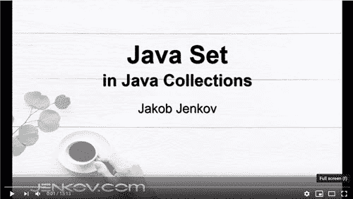

# Java 集

> 原文：<https://jenkov.com/tutorials/java-collections/set.html>

*Java* *集合*接口`java.util.Set`，代表一个对象集合，其中 Java *集合*中的每个对象都是唯一的。换句话说，同一个对象不能在一个 Java *集合*中出现多次。Java `Set`接口是标准的 [Java 接口](/java/interfaces.html)，是 [Java 集合](collection.html)接口的子类型，意思是`Set`继承了`Collection`。

您可以将任何 Java 对象添加到 Java `Set`中。如果`Set`没有类型化，使用 [Java 泛型](/java-generics/index.html)，那么你甚至可以在同一个`Set`中混合不同类型(类)的对象。然而，在同一个`Set`中混合不同类型的对象在现实中并不常见。

## Java 集教程视频

如果你比较喜欢视频，我做了一个 [Java Set 教程视频](https://www.youtube.com/watch?v=rruCajMgvGA):

[](https://www.youtube.com/watch?v=rruCajMgvGA)

## Java 集合与列表

Java `Set`和 [Java List](list.html) 接口彼此非常相似。Bot 接口代表了元素的集合。然而，有一些显著的差异。这些差异反映在`Set`和`List`接口包含的方法中。

Java `Set`和`List`接口的第一个区别是，同一个元素在 Java `Set`中不能出现超过一次。这与 Java `List`不同，在 Java 中每个元素可以出现不止一次。

Java `Set`和 Java `List`接口的第二个区别是，`Set`中的元素没有保证内部顺序。`List`中的元素有一个内部顺序，元素可以按照这个顺序迭代。

## Java 集合示例

这里首先是一个简单的 Java `Set`示例，让您感受一下集合是如何工作的:

```
package com.jenkov.collections;

import java.util.HashSet;

public class SetExample {

    public static void main(String[] args) {

        Set setA = new HashSet();

        setA.add(element);

        System.out.println( setA.contains(element) );
    }
}

```

这个例子创建了一个`HashSet`，它是实现`Set`接口的 Java APIs 中的一个类。然后将一个字符串对象添加到集合中，最后检查集合中是否包含刚刚添加的元素。

## 设置实现

作为`Collection`子类型，`Collection`接口中的所有方法在`Set`接口中也是可用的。

因为`Set`是一个接口，为了使用它，你需要实例化该接口的一个具体实现。您可以在 Java Collections API 的以下`Set`实现中进行选择:

*   java.util.EnumSet
*   java.util.HashSet
*   java.util.LinkedHashSet
*   java.util.TreeSet

这些`Set`实现中的每一个在迭代`Set`时的元素顺序，以及在集合中插入和访问元素所花费的时间(大 O 符号)方面都稍有不同。

`HashSet`背后是一个`HashMap`。迭代时，它不能保证元素的顺序。

`LinkedHashSet`与`HashSet`的不同之处在于，它保证了元素在迭代过程中的顺序与它们被插入到`LinkedHashSet`中的顺序相同。重新插入已经在`LinkedHashSet`中的元素不会改变这个顺序。

`TreeSet`迭代时也保证元素的顺序，但顺序是元素的排序顺序。换句话说，如果你在一个包含这些元素的`List`或数组上使用一个`Collections.sort()`，那么这些元素将被排序的顺序。这个顺序或者由它们的自然顺序决定(如果它们实现了`Comparable`)，或者由一个特定的`Comparator`实现决定。

在`java.util.concurrent`包中也有`Set`实现，但是我将把并发实用程序排除在本教程之外。

## 创建集合

下面是一些如何创建`Set`实例的例子:

```
package com.jenkov.collections;

import java.util.HashSet;
import java.util.LinkedHashSet;
import java.util.Set;
import java.util.TreeSet;

public class SetExample {

    public static void main(String[] args) {

        Set setA = new HashSet();
        Set setB = new LinkedHashSet();
        Set setC = new TreeSet();

    }
}

```

## 通用集合

默认情况下，您可以将任何`Object`放入`Set`中，但是从 Java 5 开始，Java 泛型使得限制您可以插入到`Set`中的对象类型成为可能。这里有一个例子:

```
Set<MyObject> set = new HashSet<MyObject>();

```

这个`Set`现在只能插入`MyObject`个实例。然后，您可以访问和迭代它的元素，而无需强制转换它们。这是它的样子:

```
for(MyObject anObject : set){
   //do someting to anObject...
}

```

只要知道，总是为 Java 集指定一个泛型类型被认为是一个好习惯。本教程中的大多数示例都使用泛型类型。

关于 Java 泛型的更多信息，请参见 [Java 泛型教程](/java-generics/index.html)。

## Set.of()

自 Java 9 以来，set 接口包含一组静态工厂方法，可以创建不可修改(不可变)的 Set 实例。我将在本节中解释其中的一些方法。

Java Set 静态工厂方法被称为`of()`,接受零个或多个参数。这里首先是一个使用`Set.of()`创建一个空的不可变集合的例子:

```
Set set = Set.of();

```

此示例创建一个未指定泛型类型的不可修改集合。

指定由`Set.of()`返回的集合的一般类型如下所示:

```
Set<String> set3 = Set.<String>of();    

```

您也可以创建包含您选择的元素的不可修改的集合实例。您将这些元素传递给`of()`方法。下面是一个使用`Set.of()`方法创建包含元素的集合的例子:

```
Set<String> set3 = Set.<String>of("val1", "val2", "val3");

```

## 将元素添加到集合

要向一个`Set`添加元素，您需要调用它的`add()`方法。这个方法继承自`Collection`接口。这里有几个例子:

```
Set<String> setA = new HashSet<>();

setA.add("element 1");
setA.add("element 2");
setA.add("element 3");

```

三个`add()`调用将一个`String`实例添加到集合中。

## 迭代集合元素

有两种方法可以迭代 Java `Set`的元素:

*   使用从`Set`获得的`Iterator`。
*   使用 for-each 循环。

这两个选项都包含在以下部分中。

当迭代`Set`中的元素时，元素的顺序取决于您使用的`Set`实现，如前所述。

### 使用迭代器迭代集合

要使用 [Java 迭代器](iterator.html)迭代`Set`的元素，必须首先从`Set`获得一个`Iterator`。您通过调用`iterator()`方法从一个`Set`中获得一个`Iterator`。下面是一个从`Set`获取`Iterator`的例子:

```
Set<String> setA = new HashSet<>();

setA.add("element 1");
setA.add("element 2");
setA.add("element 3");

Iterator<String> iterator = set.iterator();

while(iterator.hasNext(){
  String element = iterator.next();
}

```

### 使用 For-Each 循环迭代集合

迭代`Set`元素的第二种方法是使用 for-each 循环。下面是使用 for-each 循环迭代`Set`的元素的样子:

```
Set set = new HashSet();

for(Object object : set) {
    String element = (String) object;
}

```

`Set`接口实现了 [Java Iterable](iterable.html) 接口。这就是为什么您可以使用 for-each 循环迭代`Set`的元素。

如果集合指定了泛型类型，则可以将该类型用作 for-each 循环中的变量类型。这是它的样子:

```
Set<String> set = new HashSet<>();

for(String str : set) {
    System.out.println(str);
}

```

这是使用 for-each 循环的首选方式——结合为使用 for-each 循环的集合指定的泛型类型。

### 使用 Java 流 API 迭代集合

迭代 Java `Set`的第三种方式是通过 [Java 流 API](/java-functional-programming/streams.html) 。要使用 Java 流 API 创建 Java `Set`，您必须从`Set`创建一个`Stream`。下面是一个从`Set`创建 Java `Stream`并迭代`Stream`的例子:

```
Set<String> set = new HashSet<>();

set.add("one");
set.add("two");
set.add("three");

Stream<String> stream = set.stream();

stream.forEach((element) ->  { System.out.println(element); });

```

你可以在我的 [Java Stream API 教程](/java-functional-programming/streams.html)中阅读更多关于 Java Stream API 中可用选项的信息。

## 从集合中移除元素

您可以通过调用`remove(Object o)`方法从 Java `Set`中移除元素。下面是一个从 Java `Set`中删除元素的例子:

```
set.remove("object-to-remove");

```

因为元素的顺序取决于`Set`的实现，所以无法根据`Set`中的索引移除对象。

## 从集合中移除所有元素

您可以使用`clear()`方法从 Java `Set`中移除所有元素。下面是一个从 Java `Set`中移除所有元素的例子:

```
set.clear();

```

## 添加另一个集合中的所有元素

Java `List`接口有一个名为`addAll()`的方法，它将来自另一个`Collection` ( `List`或`Set`)的所有元素添加到`Set`。在集合论中，这对应于`Set`和另一个`Collection`的*联合*。下面是一个将另一个`Set`中的所有元素添加到 Java `Set`中的例子:

```
Set<String> set = new HashSet<>();
set.add("one");
set.add("two");
set.add("three");

Set<String> set2 = new HashSet<>();
set2.add("four");

set2.addAll(set);

```

执行这个代码示例后，`set2`将包含字符串元素`four`，以及来自`set`的三个字符串元素`one`、`two`和`three`。

## 从另一个集合中移除所有元素

Java `Set`接口是一个名为`removeAll()`的方法，它移除了`Set`中的所有元素，这些元素也存在于另一个`Collection`中。在集合论中，这被称为`Set`和另一个`Collection`之间的*差*。下面是一个从 Java `Set`中移除所有元素的例子，这些元素也存在于另一个`Collection`中:

```
Set<String> set = new HashSet<>();
set.add("one");
set.add("two");
set.add("three");

Set set2 = new HashSet();
set2.add("three");

set.removeAll(set2);

```

运行这个 Java 示例后，`set`将包含字符串元素`one`和`two`。元素`three`已被删除，因为它出现在`set2`中，作为参数提供给`set.removeAll(set2)`。

## 保留另一个集合中的所有元素

Java `Set`接口也有一个方法，它保留了`Set`中的所有元素，这些元素也存在于另一个`Collection`中。在`Set`中发现的、在另一个`Collection`中不存在的所有元素都将被移除。在集合论中，这被称为`Set`和另一个`Collection`之间的*交集*。下面是一个保留 Java `Set`中所有元素的例子，这些元素也存在于另一个`Set`中:

```
Set<String> set = new HashSet<>();
set.add("one");
set.add("two");
set.add("three");

Set<String> set2 = new HashSet<>();
set2.add("three");
set2.add("four");

set.retainAll(set2);

```

运行完这段 Java 代码后，`set`将只包含字符串元素`three`。这是唯一同时出现在`set`和`set2`中的元素。

## 设置大小

你可以使用`size()`方法检查一个 Java `Set`的*大小*。一个`Set`的大小就是包含在`Set`中的元素个数。下面是一个读取 Java `Set`大小的例子:

```
Set<String> set = new HashSet<>();

set.add("123");
set.add("456");
set.add("789");

int size = set.size();

```

在执行这个 Java 代码之后,`size`变量的值将是 3，因为在这个例子中创建的`Set`添加了 3 个元素。

## 检查集合是否为空

您可以通过调用`Set`上的`isEmpty()`方法来检查 Java `Set`是否为空，这意味着它不包含任何元素。下面是一个检查 Java `Set`是否为空的例子:

```
Set<String> set = new HashSet<>();

boolean isEmpty = set.isEmpty();

```

运行这段 Java 代码后，`isEmpty`变量将包含值`true`，因为`Set`是空的(其中没有元素)。

您还可以通过比较`size()`方法返回的值和 0 来检查`Set`是否为空。这里有一个例子来说明如何:

```
Set<String> set = new HashSet<>();

boolean isEmpty = (set.size() == 0);

```

运行这段 Java 代码后，`isEmpty`变量将包含值`true`，因为`Set` `size()`方法返回 0——因为示例中的`Set`不包含任何元素。

## 检查集合是否包含元素

您可以通过调用`contains()`方法来检查 Java `Set`是否包含给定的元素(对象)。下面是一个检查 Java `Set`是否包含给定元素的例子:

```
Set<String> set = new HashSet<>();

set.add("123");
set.add("456");

boolean contains123 = set.contains("123");

```

运行这段 Java 代码后，`contains123`变量将包含值`true`，因为`Set`实际上包含字符串`123`。

为了确定`Set`是否包含元素，`Set`将在内部迭代它的元素，并将每个元素与作为参数传递的对象进行比较。比较使用元素的 [Java equals](hashcode-equals.html) 方法来检查元素是否等于参数。

因为可以将`null`值加到`Set`上，所以也可以检查`Set`是否包含`null`值。下面是如何检查一个`Set`是否包含一个`null`值:

```
set.add(null);

containsElement = set.contains(null);

System.out.println(containsElement);

```

显然，如果`contains()`的输入参数是`null`,`contains()`方法不会使用`equals()`方法来比较每个元素，而是使用`==`操作符。

## 将 Java 集转换为列表

通过创建一个`List`并调用它的`addAll()`方法，将`Set`作为参数传递给`addAll()`方法，可以将 Java `Set`转换成 Java `List`。下面是一个将 Java `Set`转换成`List`的例子:

```
Set<String> set = new HashSet<>();
set.add("123");
set.add("456");

List<String> list = new ArrayList<>();
list.addAll(set);

```

运行这个 Java 示例后，`List`将包含字符串元素`123`和`456`——因为当调用`List` `addAll(set)`时，这些都是出现在`Set`中的元素。

## JavaDoc 中的更多详细信息

使用`Set`您可以做更多的事情，但是您必须查看 JavaDoc 以获得更多的细节。本文主要关注两个最常见的操作:添加/删除元素和迭代元素。