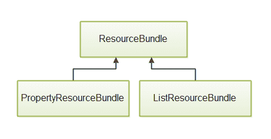

# Java 资源包

> 原文：<https://jenkov.com/tutorials/java-internationalization/resourcebundle.html>

*Java**resource bundle*类`java.util.ResourceBundle`，用于存储区分区域设置的文本和组件。例如，您的应用程序中使用的文本标签可能需要根据当前使用您的应用程序的用户的语言进行更改。因此，文本标签被称为是用户区域敏感的。顺便说一下，用户的语言环境由 Java 语言环境类表示。这篇文章仔细研究了`ResourceBundle`类及其子类。

## ResourceBundle 类层次结构

`ResourceBundle`类有两个子类，叫做`PropertyResourceBundle`和`ListResourceBundle`。下图说明了类的层次结构:

|  |
| ResourceBundle 有两个子类 PropertiesResourceBundle 和 ListResourceBundle。 |

`PropertyResourceBundle`类在标准的 Java 属性文件中存储本地化的文本。这些文件的格式在我的 [Java 属性](/java-collections/properties.html)教程中有解释。

您不直接与这两个子类交互。所有的交互都要经过`ResourceBundle`类。

## 创建 ResourceBundle

您像这样创建一个`ResourceBundle`实例:

```
Locale locale = new Locale("en", "US");

ResourceBundle labels = ResourceBundle.getBundle("i18n.MyBundle", locale);

System.out.println(labels.getString("label1"));

```

首先你需要一个`Locale`实例。然后将这个`Locale`实例和要加载的资源包的名称一起传递给`ResourceBundle.getBundle()`方法。最后，您可以通过不同的`getString()`和`getObject()`等访问`ResourceBundle`中的本地化值。方法。

您实际上从未创建过一个`ResourceBundle`实例，而是它的两个子类之一的实例。两者都是使用上面的工厂方法创建的。首先`ResourceBundle`类将寻找一个`ListResourceBundle`，然后寻找一个`PropertyResourceBundle`。它首先将请求的资源包的名称(`getBundle()`方法中的第一个参数)与`ListResourceBundle`的类名进行匹配，如果没有找到，则与属性文件资源包进行匹配。

以下章节将详细介绍`ListResourceBundle`和`PropertyResourceBundle`。

## 作为 ResourceBundle 的属性文件

您可以使用标准属性文件来存储本地化文本。您可以通过`ResourceBundle`类加载这些属性。这里有一个例子:

```
Locale locale = new Locale("en", "US");

ResourceBundle labels = ResourceBundle.getBundle("i18n.MyBundle", locale);

System.out.println(labels.getString("label1"));

```

为了让这个例子工作，您应该将一个名为`MyBundle.properties`的标准 Java 属性文件放在一个名为`i18n`的 Java 包中。当你运行上面的代码时，确保这个属性文件在你的类路径上是可用的，这意味着属性文件应该位于你的应用程序的类中，并且在`i18n`包中。

资源包的名称类似于类名。因此，`i18n.MyBundle`表示包(目录)`i18n`中名为`MyBundle.properties`的属性文件。

下面是属性文件内容的一个示例:

```
label1 = Label 1 is done!
label2 = Label 2 is through!

```

作为 Java 属性文件的标准，它是一个键和值对的列表。键在=的左边，值在右边。值是你应该本地化的东西，而不是键。

### 不同属性文件中的不同语言

为了提供不同语言的字符串，请为每种语言创建一个属性文件，并在它们后面加上下划线(_)和语言代码。例如:

```
MyBundle.properties
MyBundle_da.properties
MyBundle_de.properties
MyBundle_fr.properties

```

所有这些文件应该位于同一个包(目录)中。

没有语言后缀的文件(如`MyBundle.properties`)是默认的属性文件。如果传递给`ResourceBundle.getBundle()`方法的语言(`Locale`)没有可用的属性文件，并且系统没有默认的区域设置(例如，一台德国计算机将有一个默认的德国区域设置)，那么这个文件被读取并作为`ResourceBundle`返回。

带有语言代码后缀的其他属性文件包含相同的键，但值使用不同的语言。因此，丹麦的属性文件可能如下所示:

```
label1 = Label 1 er klar!
label2 = Label 2 er igennem!

```

## 作为 ResourceBundle 的类

您还可以使用一组类来包含您的资源。使用类，你不仅仅可以使用字符串值。

与属性文件一样，您可以创建一组具有包基本名称和语言后缀的类。例如:

```
i18n.MyClassBundle
i18n.MyClassBundle_da
i18n.MyClassBundle_en
i18n.MyClassBundle_de

```

下面是默认捆绑包类文件的一个示例实现:

```
package i18n;

import java.util.ListResourceBundle;

public class MyClassBundle extends ListResourceBundle {

    @Override
    protected Object[][] getContents() {
        return contents;
    }

    private Object[][] contents = {
            { "price"   , new Double(10.00) },
            { "currency", "EUR" },
    };
}

```

下面是丹麦语资源包的一个实现:

```
public class MyClassBundle_da extends ListResourceBundle {

    @Override
    protected Object[][] getContents() {
        return contents;
    }

    private Object[][] contents = {
            { "price"   , new Double(75.00) },
            { "currency", "DKK" },
    };

}

```

请注意`contents`数组。它由键和值的二维数组组成。因此，`price`和`currency`是键，它们右边的值是本地化值。这两个例子包含两种不同货币的价格。

您获得一个`ListResourceBundle`的实例的方式与获得一个`PropertyResourceBundle`的实例的方式相同。下面是两个获得丹麦语默认的`ResourceBundle`和`ResourceBundle`的实例的例子:

```
Locale locale = new Locale("de", "DE"); //no bundle for German -> default
ResourceBundle bundle = ResourceBundle.getBundle("i18n.MyClassBundle", locale);

System.out.println("price   : " + bundle.getObject("price"));
System.out.println("currency: " + bundle.getObject("currency"));

locale = new Locale("da", "DK");
bundle = ResourceBundle.getBundle("i18n.MyClassBundle", locale);

System.out.println("price   : " + bundle.getObject("price"));
System.out.println("currency: " + bundle.getObject("currency"));

```

这段代码的输出将是:

```
price   : 10.0
currency: EUR
price   : 75.0
currency: DKK

```

从默认`ResourceBundle`得到的价格列在`EUR`中，从丹麦`ResourceBundle`得到的价格列在`DKK`中。

## 从 ResourceBundle 获取值

一旦您获得了一个`ResourceBundle`实例，您就可以使用以下方法之一从中获得本地化值:

```
getObject(String key);
getString(String key);
getStringArray(String key);

```

您还可以使用`keySet()`方法获得一组包含在`ResourceBundle`中的所有键，如下所示:

```
Set<String> keys = bundle.keySet();

```

## 其他 ResourceBundle 方法

`ResourceBundle`类有更多的方法(例如`getLocale()`)。有关这些方法的更多信息，请查看 JavaDoc。