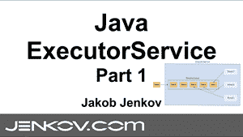
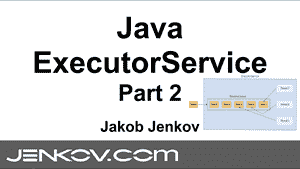
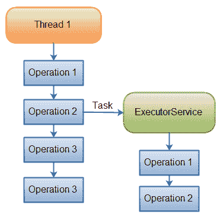

# Java ExecutorService

> 原文：<https://jenkov.com/tutorials/java-util-concurrent/executorservice.html>

Java *ExecutorService* 接口`java.util.concurrent.ExecutorService`，代表一种异步执行机制，能够在后台并发执行任务。在这篇 Java `ExecutorService`教程中，我将解释如何创建一个`ExecutorService`，如何向它提交任务以供执行，如何查看这些任务的结果，以及如何在需要时再次关闭`ExecutorService`。

## Java ExecutorService 视频教程

如果你喜欢视频，我这里有视频介绍:

[](https://www.youtube.com/watch?v=Nb85yJ1fPXM&list=PLL8woMHwr36EDxjUoCzboZjedsnhLP1j4&index=12 "Java ExecutorService Tutorial Video - Part 1")
[](https://www.youtube.com/watch?v=MB_qCXBSgK0&list=PLL8woMHwr36EDxjUoCzboZjedsnhLP1j4&index=13 "Java ExecutorService Tutorial Video - Part 2")

## 任务委托

下图显示了一个线程将任务委托给 Java `ExecutorService`进行异步执行:

|  |
| 将任务委托给 ExecutorService 进行异步执行的线程。 |

一旦线程将任务委托给了`ExecutorService`，该线程将独立于该任务的执行继续其自身的执行。然后，`ExecutorService`独立于提交任务的线程，并发地执行任务。

## Java ExecutorService 示例

在我们深入了解`ExecutorService`之前，让我们看一个简单的例子。下面是一个简单的 Java `ExecutorService`例子:

```
ExecutorService executorService = Executors.newFixedThreadPool(10);

executorService.execute(new Runnable() {
    public void run() {
        System.out.println("Asynchronous task");
    }
});

executorService.shutdown();

```

首先使用`Executors` `newFixedThreadPool()`工厂方法创建一个`ExecutorService`。这会创建一个线程池，其中有 10 个线程执行任务。

其次，`Runnable`接口的匿名实现被传递给`execute()`方法。这使得`Runnable`被`ExecutorService`中的一个线程执行。

在本教程中，你会看到更多关于如何使用`ExecutorService`的例子。这个例子只是让您快速了解如何使用`ExecutorService`在后台执行任务。

## Java ExecutorService 实现

Java `ExecutorService`非常类似于[线程池](/java-concurrency/thread-pools.html)。事实上，`java.util.concurrent`包中的`ExecutorService`接口的实现是一个线程池实现。如果你想了解`ExecutorService`接口如何在内部实现，请阅读上面的教程。

因为`ExecutorService`是一个接口，为了使用它，你需要了解它的实现。`ExecutorService`在`java.util.concurrent`包中有如下实现:

*   [ThreadPoolExecutor](threadpoolexecutor.html)
*   [ScheduledThreadPoolExecutor](scheduledexecutorservice.html)

## 创建执行服务

如何创建`ExecutorService`取决于您使用的实现。然而，您也可以使用`Executors`工厂类来创建`ExecutorService`实例。这里有几个创建`ExecutorService`的例子:

```
ExecutorService executorService1 = Executors.newSingleThreadExecutor();

ExecutorService executorService2 = Executors.newFixedThreadPool(10);

ExecutorService executorService3 = Executors.newScheduledThreadPool(10);

```

## 执行者服务用法

有几种不同的方法将任务委托给`ExecutorService`执行:

*   执行(可运行)
*   提交(可运行)
*   提交(可调用)
*   invokeAny(...)
*   invokeAll(...)

在接下来的小节中，我将逐一介绍这些方法。

### 执行 Runnable

Java `ExecutorService` `execute(Runnable)`方法接受一个`java.lang.Runnable`对象，并异步执行它。下面是一个用`ExecutorService`执行`Runnable`的例子:

```
ExecutorService executorService = Executors.newSingleThreadExecutor();

executorService.execute(new Runnable() {
    public void run() {
        System.out.println("Asynchronous task");
    }
});

executorService.shutdown();

```

如果需要，无法获得执行`Runnable`的结果。为此，您必须使用一个`Callable`(在下面的章节中解释)。

### 提交可运行的

Java `ExecutorService` `submit(Runnable)`方法也采用一个`Runnable`实现，但是返回一个`Future`对象。这个`Future`对象可以用来检查`Runnable`是否已经执行完毕。

下面是一个 Java `ExecutorService` `submit()`的例子:

```
Future future = executorService.submit(new Runnable() {
    public void run() {
        System.out.println("Asynchronous task");
    }
});

future.get();  //returns null if the task has finished correctly.

```

`submit()`方法返回一个 [Java Future](java-future.html) 对象，该对象可用于检查`Runnable`何时完成。

### 提交可调用

Java `ExecutorService` `submit(Callable)`方法类似于`submit(Runnable)`方法，除了它使用一个 [Java 可调用的](java-callable.html)而不是一个`Runnable`。一个`Callable`和一个`Runnable`之间的精确区别稍后解释。

`Callable`的结果可以通过`submit(Callable)`方法返回的 [Java Future](java-future.html) 对象获得。下面是一个`ExecutorService` `Callable`的例子:

```
Future future = executorService.submit(new Callable(){
    public Object call() throws Exception {
        System.out.println("Asynchronous Callable");
        return "Callable Result";
    }
});

System.out.println("future.get() = " + future.get());

```

上面的代码示例将输出以下内容:

```
Asynchronous Callable
future.get() = Callable Result

```

### invokeAny()

`invokeAny()`方法接受一组`Callable`对象，或`Callable`的子接口。调用这个方法不会返回一个`Future`，而是返回一个`Callable`对象的结果。你无法保证你会得到哪个`Callable`的结果。只是其中一个完成的。

如果一个可调用实例完成，结果从`invokeAny()`返回，那么其余的可调用实例被取消。

如果其中一个任务完成(或者抛出异常)，其余的`Callable`将被取消。

下面是一个代码示例:

```
ExecutorService executorService = Executors.newSingleThreadExecutor();

Set<Callable<String>> callables = new HashSet<Callable<String>>();

callables.add(new Callable<String>() {
    public String call() throws Exception {
        return "Task 1";
    }
});
callables.add(new Callable<String>() {
    public String call() throws Exception {
        return "Task 2";
    }
});
callables.add(new Callable<String>() {
    public String call() throws Exception {
        return "Task 3";
    }
});

String result = executorService.invokeAny(callables);

System.out.println("result = " + result);

executorService.shutdown();

```

这个代码示例将打印出由给定集合中的一个`Callable`返回的对象。我试着运行了几次，结果发生了变化。有时是“任务 1”，有时是“任务 2”等等。

### invokeAll()

`invokeAll()`方法调用您在作为参数传递的集合中传递给它的所有`Callable`对象。`invokeAll()`返回一个`Future`对象的列表，通过它你可以获得每个`Callable`的执行结果。

请记住，任务可能会由于异常而完成，因此它可能没有“成功”。没有办法在一个`Future`上分辨出不同。

下面是一个代码示例:

```
ExecutorService executorService = Executors.newSingleThreadExecutor();

Set<Callable<String>> callables = new HashSet<Callable<String>>();

callables.add(new Callable<String>() {
    public String call() throws Exception {
        return "Task 1";
    }
});
callables.add(new Callable<String>() {
    public String call() throws Exception {
        return "Task 2";
    }
});
callables.add(new Callable<String>() {
    public String call() throws Exception {
        return "Task 3";
    }
});

List<Future<String>> futures = executorService.invokeAll(callables);

for(Future<String> future : futures){
    System.out.println("future.get = " + future.get());
}

executorService.shutdown();

```

### 可运行与可调用

`Runnable`界面与`Callable`界面非常相似。Runnable 接口表示一个可以由一个线程或一个`ExecutorService`并发执行的任务。Callable 只能由 ExecutorService 执行。两个接口只有一个方法。虽然在`Callable`和`Runnable`界面之间有一个小的区别。当您看到接口声明时，`Runnable`和`Callable`接口之间的区别更容易看出来。

这里首先是`Runnable`接口声明:

```
public interface Runnable {
    public void run();
}

```

下面是`Callable`接口声明:

```
public interface Callable{
    public Object call() throws Exception;
}

```

`Runnable` `run()`方法和`Callable` `call()`方法的主要区别在于`call()`方法可以从方法调用中返回一个`Object`。`call()`和`run()`的另一个区别是`call()`可以抛出异常，而`run()`不能(未检查的异常除外——是`RuntimeException`的子类)。

如果你需要提交一个任务给 Java `ExecutorService`并且你需要任务的结果，那么你需要让你的任务实现`Callable`接口。否则你的任务可以只实现`Runnable`接口。

### 取消任务

通过调用任务提交时返回的`Future`上的`cancel()`方法，可以取消提交给 Java `ExecutorService`的任务(`Runnable`或`Callable`)。只有当任务尚未开始执行时，才可能取消任务。下面是一个通过调用`Future.cancel()`方法取消任务的例子:

```
future.cancel();

```

## ExecutorService Shutdown

当你使用完 Java `ExecutorService`时，你应该关闭它，这样线程就不会继续运行。如果您的应用程序是通过一个`main()`方法启动的，并且您的主线程退出了您的应用程序，那么如果您的应用程序中有一个活动的`ExexutorService`，应用程序将继续运行。这个`ExecutorService`中的活动线程防止 JVM 关闭。

### 关机()

要终止`ExecutorService`中的线程，您需要调用它的`shutdown()`方法。`ExecutorService`不会立即关闭，但它不再接受新任务，一旦所有线程都完成了当前任务，`ExecutorService`就会关闭。在`shutdown()`被调用之前提交给`ExecutorService`的所有任务都被执行。下面是一个执行 Java `ExecutorService`关闭的例子:

```
executorService.shutdown();

```

### 关闭现在()

如果想立即关闭`ExecutorService`，可以调用`shutdownNow()`方法。这将尝试立即停止所有正在执行的任务，并跳过所有已提交但未处理的任务。对于正在执行的任务没有任何保证。也许他们会停下来，也许会一直执行到最后。这是最大的努力。下面是一个调用`ExecutorService`T3 的例子:

```
executorService.shutdownNow();

```

### awaitTermination()

`ExecutorService` `awaitTermination()`方法将阻塞调用它的线程，直到`ExecutorService`完全关闭，或者直到给定的超时发生。通常在调用`shutdown()`或`shutdownNow()`之后调用`awaitTermination()`方法。下面是一个调用`ExecutorService` `awaitTermination()`的例子:

```
executorService.shutdown();

executorService.awaitTermination(10_000L, TimeUnit.MILLISECONDS );

```