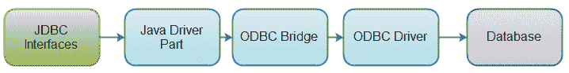
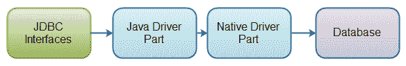
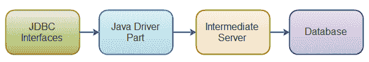
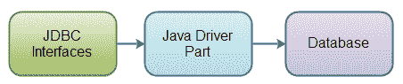

# JDBC 驱动程序类型

> 原文：<https://jenkov.com/tutorials/jdbc/driver-types.html>

JDBC 驱动程序是一组实现 JDBC 接口的 Java 类，目标是特定的数据库。JDBC 接口是标准 Java 附带的，但是这些接口的实现是特定于您需要连接的数据库的。这种实现被称为 JDBC 驱动程序。JDBC 驱动程序通常由数据库供应商提供，但有时也可能由数据库周围的开发人员社区提供。

## JDBC 驱动程序类型列表

有四种不同的 JDBC 驱动程序类型。这些驱动程序类型包括:

*   类型 1: JDBC-ODBC 桥 JDBC 驱动程序
*   类型二:Java +原生代码 JDBC 驱动
*   类型 3:全 Java +中间件翻译 JDBC 驱动
*   类型 4:所有 Java JDBC 驱动程序。

今天，大多数 JDBC 司机都是 4 类司机。不过，我将只是讨论 4 种类型的 JDBC 司机很快。

## 1 型 JDBC 驱动程序

类型 1 JDBC 驱动程序由一个 Java 部件组成，该部件将 JDBC 接口调用转换为 ODBC 调用。然后，ODBC 桥调用给定数据库的 ODBC 驱动程序。第 1 类驱动程序最初主要是在没有第 4 类驱动程序(全是 Java 驱动程序)的时候使用的。下面举例说明了 1 型 JDBC 驱动程序是如何组织的:

| [T2】](/images/java-jdbc/driver-type-1.png) |
| **1 型 JDBC 驾驶员。** |

## 2 型 JDBC 驱动程序

类型 2 JDBC 驱动程序类似于类型 1 驱动程序，只是 ODBC 部分被替换为本机代码部分。本机代码部分针对特定的数据库产品。下面是一个 2 型 JDBC 驱动程序的图示:

| [T2】](/images/java-jdbc/driver-type-2.png) |
| **2 型 JDBC 驾驶员。** |

## 3 型 JDBC 驱动程序

类型 3 JDBC 驱动程序是一个全 Java 驱动程序，它将 JDBC 接口调用发送到一个中间服务器。然后，中间服务器代表 JDBC 驱动程序连接到数据库。下面是一个 3 型 JDBC 驱动程序的图示:

| [T2】](/images/java-jdbc/driver-type-3.png) |
| **3 型 JDBC 驾驶员。** |

## 4 型 JDBC 驱动程序

第 4 类 JDBC 驱动程序是直接连接到数据库的全 Java 驱动程序。它是为特定的数据库产品实现的。今天，大多数 JDBC 司机都是 4 类司机。下面举例说明了 4 型 JDBC 驱动程序是如何组织的:

| [T2】](/images/java-jdbc/driver-type-4.png) |
| **4 型 JDBC 驾驶员。** |

