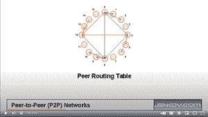

# 对等(P2P)网络

> 原文：<https://jenkov.com/tutorials/p2p/index.html>

点对点(Peer-to-Peer)网络(Peer-to-Peer)是一类分布式系统，在这类系统中，对等点(计算机或“节点”)在没有中央服务器的情况下一起工作，以提供和使用一种或多种服务。因此，在对等网络中，对等体通常既充当客户端又充当服务器，这意味着其他对等体的客户端和其他对等体的服务器。这就是对等网络中的节点被称为*对等体*的原因——因为节点彼此是平等的(对等体)，不像在客户端-服务器拓扑中，客户端和服务器具有不同的角色和职责。

*P2P 网络*也是[去中心化系统](/tutorials/decentralized-systems/index.html)。然而，并不是所有的分散系统都是 *P2P* 系统。例如，像 Cassandra 这样的数据库可能在内部使用 P2P 技术，其中 Cassandra 集群中的所有节点都是彼此的客户端和服务器。然而，Cassandra 集群也有一组外部客户机，它们只是集群的客户机，而不是提供数据库服务的参与者。因此，使用 Cassandra 数据库的客户端系统不被归类为 P2P 网络。然而，P2P 技术在这样的系统中仍然非常有用。

## 在 P2P 中，网络就是服务

在一个普通的客户机/服务器应用程序中，服务器通常向客户机提供一个服务，这就是所谓的“消费”服务。然而，在 P2P 网络中，每个对等点既提供又消费服务。你可能会忍不住说，“网络就是服务”。

## 全球规模的 P2P 网络

在本教程中，我将关注全球规模的 P2P 网络——如何让数百万的对等点在没有中央服务器的情况下一起工作。全球规模的 P2P 网络通常也可以用于小型工作组，但是小型工作组 P2P 技术并不总是适合全球规模的 P2P 网络。这就是我关注大规模 P2P 技术的原因。

## 现有的 P2P 网络和 P2P 技术

已经有很多活跃的 P2P 网络和一些 P2P 技术。围绕 P2P 网络的一些产品有:

*   LBRY
*   IPFS 吗
*   烧杯浏览器
*   网络电话
*   比特流
*   努特拉（软件名称）

还有一个名为 libp2p 的开源工具包，它提供了 Kademlia P2P 算法的一些实现。

## P2P 网络算法

术语 *P2P 网络算法*我指的是 P2P 网络中的对等体如何相互连接、相互发现以及相互之间路由消息的核心算法，如下面的 [P2P 网络挑战](#p2p-network-challenges)一节所述。

P2P 网络算法通常以特定的 P2P 拓扑为中心。这些 P2P 拓扑基本上可以分为两类 P2P 网络:

*   结构化 P2P 拓扑
*   非结构化 P2P 拓扑

我将在接下来的章节中更详细地解释这两者。

### 结构化 P2P 拓扑

结构化 P2P 拓扑试图将网络中的所有对等点组织成一个单一的结构化拓扑。然后，这种结构化拓扑提供了合理的可预测的对等点可发现性和消息可路由性。结构化 P2P 拓扑也试图避免网络碎片。

我所知道的一些结构化 P2P 网络算法有:

*   [和弦](chord.html)
*   卡德姆利亚
*   挂毯
*   面粉糕饼
*   多形聚环(见下文)

所有这些 P2P 算法都是相似的。它们都将对等体组织成单个虚拟环，每个对等体持有指向网络中其他对等体子集的路由表。换句话说，所有的对等体都是同一个环的一部分。环中每个对等体之间的主要区别在于它在其路由表中引用了哪些其他对等体。

Chord 和 Kademlia 使用相似类型的路由表和算法。另外，Pastry 和 Tapestry 使用相似类型的路由表。更具体地说，Pastry 和 Tapestry 使用路由表设计，您可以调整每个对等体的路由表中的对等体数量。路由表中的对等体越多，查找特定对等体所需的集线器就越少，但是需要更多的内存/存储来保存每个对等体中的路由表。

其他算法可以位于基本的连接、定位和路由算法之上。诸如分布式共识、分布式哈希表(DHT)、广播、多播、缓存等算法。然而，在这篇 P2P 教程中，我将主要关注底层的 P2P 网络组织算法。

### 非结构化 P2P 拓扑

非结构化 P2P 拓扑不会试图将所有对等点组织成一个单一的结构化拓扑。相反，每个对等体都试图在其路由表中保存一组“合理的”其他对等体——这对于对等体的可发现性和消息路由来说可能相当有效，但不提供任何保证。理论上，一个非结构化的 P2P 网络可能会分裂成多个独立的网络，因此不可能在整个网络中实现可发现性和可路由性。

一些众所周知的非结构化 P2P 网络拓扑是:

*   努特拉（软件名称）
*   蒲公英
*   蒲公英++
*   游泳

## 多态 P2P 网络算法

我目前正在从事一个名为 [Polymorph](https://plmph.com) 的“艺术”项目，它也可以用来实现 P2P 网络(以及其他网络拓扑)。这是我关于[多态 P2P 拓扑和算法](polymorph.html)的文章。

与 Chord、Kademlia、Pastry 和 Tapestry 相比，多态网络拓扑能够更好地控制网络拓扑和性能。不同于像 Chord、Kademlia、Pastry 和 Tapestry 那样努力实现统一的拓扑，Polymorph 努力实现多态拓扑，这意味着不同的拓扑用于不同的目的。

Polymorph 的目的是创建一个智能媒体平台，旨在简化更多标准类型媒体的打包、分发和消费，如文本文档、图像、动画、视频、音频、演示文稿等。P2P 网络算法针对的是其中的信息分发部分。

我把 Polymorph 称为“艺术”项目，因为它不是一个旨在快速成长的创业项目。我的多态项目的主要目标是看看我的想法在实践中是否有效——如果有效，看看它们的效果如何。

即使《变形》中的想法运作良好，也不能保证有人会在实践中真正使用《变形》。即使有些人在实践中使用它，也不能保证他们愿意付费使用它的任何部分。但是采用和货币化并不是多态的主要目标。概念证明是主要目标。除此之外的任何东西都是“值得拥有的”。

变形术项目开始于 2021 年——在我的业余时间。请耐心等待，因为设计、验证、进行概念验证和记录整个项目都需要很长时间。

## P2P 网络挑战

P2P 网络必须解决一系列挑战才能正常工作。确切的挑战取决于 P2P 网络试图提供什么样的服务。然而，所有 P2P 网络都需要应对一些基本挑战。这些挑战是:

*   连通性
*   可寻址能力
*   可发现性和/或可路由性

下面将更详细地解释这些挑战。一旦这些挑战都解决了，你就可以开始在 P2P 网络上构建服务了。根据服务的不同，可能会出现其他挑战，例如:

*   广播和多播
*   贮藏
*   查找(DHT)
*   负载平衡
*   认证和授权
*   隐私
*   等等。

我的项目变形最终也必须解决这些挑战。

### 连通性

为了使 P2P 网络中的对等点能够通信，它们必须能够相互连接。由于许多对等点将在 NAT 或防火墙后运行，P2P 网络必须提供某种解决方案，使其能够在 NAT /防火墙后与这些对等点通信。

我将在本文中更详细地介绍对等连接:[对等连接](peer-connectivity.html)。

### 可寻址能力

为了使 P2P 网络中的对等体能够通信，它们还必须能够唯一地寻址彼此。否则，对等体不能指定它想要与哪个对等体对话。P2P 网络通常通过对每个对等体唯一的对等体地址或 GUID 来解决这个问题。

我将在本文中更详细地介绍对等寻址能力:[对等寻址能力](peer-addressability.html)

### 可发现性和可路由性

一旦一个对等体有了它想要与之通信的对等体的地址，它就需要能够在网络中找到那个对等体，这样它就可以建立到它的连接。或者，对等体需要能够通过 P2P 网络将消息路由到目的对等体。

典型地，P2P 网络通过对等地址(GUIDs)和路由表的组合来解决这些挑战。guid 是以一种方式构造的，这种方式支持 guid 的某种组织系统，然后支持对等体的可发现性和消息的可路由性。因此，您将经常看到对等 GUIDs 的结构与用于组织网络并提供可查找性和可路由性的路由表的结构之间的紧密联系。

我在本文中介绍了对等点可发现性和消息可路由性:[对等点可发现性和消息可路由性](peer-findability-and-message-routablity.html)

## P2P 教程视频

几年前，我制作了一个视频，解释了 Chord 和 Kademlia 等 P2P 网络算法的基本原理。这是:

当我更新这个系列教程时，我可能会为 P2P 网络算法制作一组新的视频(从 2021 年开始)。