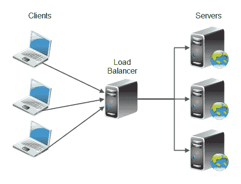
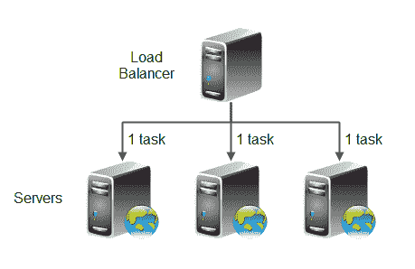
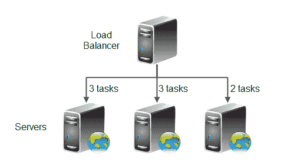
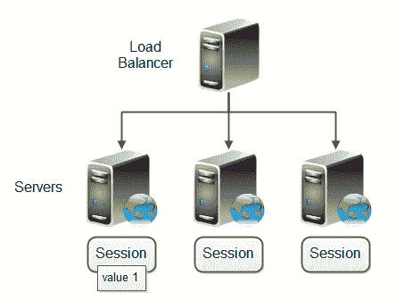
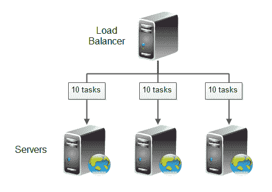
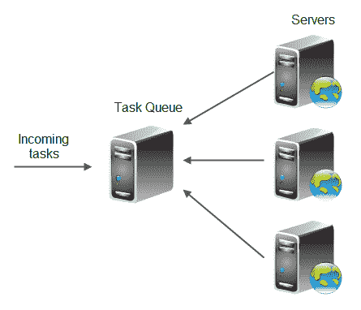

# 负载平衡

> 原文：<https://jenkov.com/tutorials/software-architecture/load-balancing.html>

负载平衡是一种将任务分配到多台计算机上的方法。例如，将 web 应用程序的传入 HTTP 请求(任务)分发到多个 web 服务器上。有几种不同的方法来实现负载平衡。我将在本文中解释一些常见的负载平衡方案。下图说明了负载平衡的基本原理:

负载平衡的主要目的是将应用程序的工作负载分布到多台计算机上，以便应用程序可以处理更高的工作负载。负载平衡是一种扩展应用程序的方式。

负载平衡的第二个目标通常(但不总是)是在应用程序中提供冗余。也就是说，如果服务器群集中的一台服务器出现故障，负载平衡器可以暂时将该服务器从群集中移除，并将负载分配到正常运行的服务器上。让多台服务器以这种方式互相帮助通常被称为“冗余”。当错误发生时，任务从故障服务器转移到正常运行的服务器，这通常称为“故障转移”。

一组协同运行同一应用程序的服务器通常被称为服务器“集群”。集群的目的通常是上述两个目标:将负载分布到不同的服务器上，并为彼此提供冗余/故障转移。

## 常见的负载平衡方案

最常见的负载平衡方案有:

*   平均任务分配方案
*   加权任务分配方案
*   粘性会话方案
*   均匀大小任务队列分配方案
*   自主排队方案

下面更详细地解释了这些方案中的每一个。

## 平均任务分配方案

平均任务分配方案意味着任务在集群中的服务器之间平均分配。因此，这个方案非常简单。这使得它更容易实现。均匀任务分配方案也称为“循环”，意味着服务器以循环方式接收工作(均匀分配)。下图说明了平均任务分配负载平衡:

当集群中的服务器都具有相同的容量，并且传入的任务在统计上需要相同的工作量时，甚至任务分布负载平衡也是合适的。

即使是任务分配也忽略了处理每项任务所需工作量的差异。这意味着，即使每台服务器分配了相同数量的任务，也可能会出现一台服务器比其他服务器有更多需要大量处理的任务的情况。这可能是由于来话任务的随机性造成的。随着时间的推移，这种情况会逐渐消失，因为过载的服务器可能会突然接收到一组轻工作负载的任务。

因此，即使均匀任务分布负载平衡将任务均匀地分布到集群中的服务器上，这也可能不会导致真正均匀的工作负载分布。

### 基于 DNS 的负载平衡

基于 DNS 的负载平衡是一个简单的方案，当不同的计算机为您的域名请求 IP 地址时，您可以配置 DNS 将不同的 IP 地址返回给不同的计算机。这实现了类似于平均任务分配方案的效果，除了大多数计算机缓存 IP 地址，从而保持回到相同的 IP 地址，直到进行新的 DNS 查找。

虽然基于 DNS 的负载平衡是可能的，但它不是在多台计算机之间可靠地分配流量的最佳方式。您最好使用专用的负载平衡软件或硬件。

## 加权任务分配方案

加权任务分配负载平衡方案使用权重将传入的任务分配到集群中的服务器上。这意味着您可以指定一个服务器相对于其他服务器应该接收的任务的权重(比率)。如果群集中的服务器不都具有相同的容量，这将非常有用。

例如，如果三台服务器中的一台的容量只有另外两台的 2/3，您可以使用权重`3, 3, 2`。这意味着每接收 8 个任务，第一个服务器应该接收 3 个任务，第二个服务器接收 3 个任务，最后一个服务器只接收 2 个任务。这样，与集群中的其他服务器相比，具有 2/3 容量的服务器只能接收 2/3 的任务。下面的图表说明了这个例子:

如前所述，当集群中的服务器不具有相同的容量时，加权任务分布负载平衡非常有用。然而，加权任务分配仍然没有考虑处理任务所需的工作。

## 粘性会话方案

之前的两种负载平衡方案都是基于这样的假设，即任何传入的任务都可以独立于之前执行的任务进行处理。然而，情况可能并不总是如此。

想象一下，如果集群中的服务器保持某种会话状态，比如 Java web 应用程序(或者 PHP 或 ASP)中的会话对象。如果一个任务(HTTP 请求)到达服务器 1，并导致将一些值写入会话状态，如果来自同一用户的后续请求被发送到服务器 2 或服务器 3，会发生什么情况？则该会话值可能会丢失，因为它存储在服务器 1 的内存中。下面的图表说明了这种情况:

这个问题的解决方案叫做粘性会话负载平衡。属于同一会话(例如同一用户)的所有任务(例如 HTTP 请求)被发送到同一服务器。这样，后续任务(请求)可能需要的任何存储的会话值都是可用的。

使用粘性会话负载平衡，不是任务被分发到服务器，而是任务会话。这当然会导致工作负载的分布更加不可预测，因为一些会话将包含很少的任务，而其他会话将包含许多任务。

另一种解决方案是完全避免使用会话变量，或者将会话变量存储在集群中所有服务器都可以访问的数据库或缓存服务器中。如果可能的话，我更喜欢完全避免会话变量，但是你可能有很好的理由使用会话变量。

避免会话变量的一种方法是使用一个 [RIA GUI +架构](/software-architecture/ria-architecture.html)，它可以在 RIA 客户端的内存中包含任何需要的会话范围变量，而不是在 web 服务器的内存中。

## 均匀大小任务队列分配方案

均匀大小任务队列分布方案类似于加权任务分布方案，但有所不同。负载平衡器为每个服务器保留一个任务队列，而不是盲目地将任务分配到集群中的服务器上。任务队列包含每个服务器当前正在处理或等待处理的所有请求。下图说明了这一原理:

当一个服务器完成一项任务时，例如，已经完成向客户机发回一个 HTTP 响应，该任务将从该服务器的任务队列中删除。

偶数任务排队分布方案的工作原理是确保每个服务器队列同时有相同数量的正在进行的任务。容量较高的服务器比容量较低的服务器更快完成任务。因此，较高容量服务器的任务队列将更快地清空，从而更快地为新任务提供空间。

可以想象，这个负载平衡方案隐含地考虑了处理每个任务所需的工作和每个服务器的容量。新任务被发送到排队任务最少的服务器。任务完成后会从队列中清空，这意味着处理任务所需的时间会自动影响队列的大小。由于任务完成的速度取决于服务器的容量，因此服务器的容量也会被自动考虑在内。如果一个服务器暂时过载，它的任务队列大小将大于集群中其他服务器的任务队列。因此，过载的服务器将不会有新的任务分配给它，直到它完成它的队列。

使用这种方案，负载平衡器将不得不做更多的计算。它必须跟踪任务队列，并且必须跟踪任务完成的时间，以便可以将其从相应的任务队列中删除。

## 自主排队方案

在自主队列负载平衡方案中，所有进入的任务都存储在一个任务队列中。服务器群集中的服务器连接到该队列，并接受它们可以处理的任务数。下图说明了这一方案:

在这个方案中，没有真正的负载平衡器。每个服务器*承担*它能够处理的负载。只有任务队列和服务器。如果一个服务器脱离集群，它的任务将在任务队列中保持未处理状态，稍后由其他服务器处理。因此，每个服务器独立于其他服务器和任务队列运行。负载平衡器不需要知道哪些服务器是集群的一部分等等。任务队列不需要知道服务器。每个服务器只需要知道任务队列。

自治队列负载平衡还隐含地考虑了每个服务器的工作负载和容量。服务器只从队列中提取任务，然后才有能力处理它们。

与均匀队列大小分布相比，自治队列有一点劣势。想要任务的服务器需要首先连接到队列，然后下载任务，然后提供响应。这是 2 到 3 次网络往返(取决于是否需要发回响应)。

均匀队列大小分布方案减少了一次网络往返。负载平衡器向服务器发送请求，服务器发回响应(如果需要)。这只是 1 到 2 次网络往返。

## 负载平衡硬件和软件

在许多情况下，您不必实现自己的负载平衡器。你可以为此购买现成的硬件和软件。许多 web 服务器实现都有某种内置的软件负载平衡功能。在开始实现自己的负载平衡软件之前，一定要看看已经存在的东西！