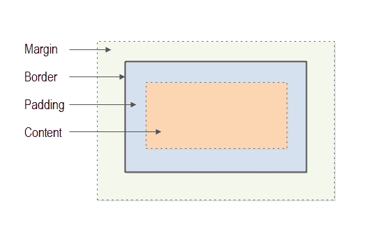

# CSS 盒子模型

> 原文：<https://jenkov.com/tutorials/css/box-model.html>

CSS 盒子模型指定了 HTML 元素的边距、边框和填充是如何呈现的。

## CSS 盒子模型的可视化

CSS 盒子模型看起来像这样:



呈现的每个 HTML 元素被认为是一个盒子。这个盒子有四个部分(或层)。

1.  **边距**:最外面的部分是这个 HTML 元素到其他 HTML 元素之间的边距。
2.  **边框**:第二部分是边框。边框位于边距内，包围 HTML 元素的填充和内容。
3.  **填充**:第三部分是填充。填充位于边框内，包围 HTML 元素的内容。
4.  **内容**:第四部分是内容。HTML 元素的内容是 HTML 元素内部显示的任何内容。这通常是文本、图像和其他 HTML 元素的组合。

边距、边框和填充可以通过 CSS 属性来控制。这些文本中解释了这些属性中的每一个:

*   [CSS 边距](/css/margin.html)
*   [CSS 填充](/css/padding.html)
*   [CSS 边框](/css/border.html)

内容框可以设置其宽度和高度。您还可以指定当内容框中的内容太大而无法容纳时会发生什么情况。

## 宽度和高度

您可以使用 CSS 属性`width`和`height`来控制 HTML 元素框的宽度和高度。可以使用任何[标准 CSS 单位](units.html)指定宽度和高度。这里有一个例子:

```
#theDiv {
    width  : 300px;
    height : 200px;
}

```

这个 CSS 规则将 id 为`theDiv`的 HTML 元素的宽度设置为 300 像素，高度设置为 200 像素。

CSS 属性`width`和`height`设置 HTML 元素内容框的宽度和高度。这意味着，HTML 元素占据的整个宽度和高度可能会更大。对于`width`和`height`，你必须添加填充、边框和边距的大小。

```
total width  = width  + margin-left + margin-right 
                      + border-left-width + border-right-width 
                      + padding-left + padding-right

total height = height + margin-top + margin-bottom 
                      + border-top-width + border-bottom-width 
                      + padding-top + padding-bottom

```

如果 HTML 元素的填充为 5 个像素，边框为 1 个像素，边距为 10 个像素(所有边都是)，则 HTML 元素的总宽度和高度将为:

```
total width  = width  + 10 + 10 + 1 + 1 + 5 + 5 = width  + 32
total height = height + 10 + 10 + 1 + 1 + 5 + 5 = height + 32

```

## 盒子尺寸

您可以使用`box-sizing` CSS 属性更改浏览器计算 HTML 元素大小的方式。CSS 属性是 CSS 3.0 中的新特性。

在 Firefox 中，你必须使用前缀`-moz-`，所以这个属性叫做`-moz-box-sizing`。只需将属性`box-sizing`和`-moz-box-sizing`设置为相同的值，就可以在 IE、Chrome 和 Firefox 中工作。

`box-sizing`属性可以取这些值:

*   `content-box`
*   `border-box`
*   `inherit`

`content-box`值是默认值。这使得`width`和`height` CSS 属性单独设置内容框的宽度和高度。

`inherit`值意味着 HTML 元素从它的父 HTML 元素继承了这个 CSS 属性的值。

`border-box`值使浏览器将`width`和`height` CSS 属性解释为边框的宽度和高度。边框是 HTML 元素边框内的一切，包括边框本身。

使用`box-sizing : border-box`时，内容框的宽度和高度将计算如下:

```
content-box-width  = border-box-width  - border-width  - padding width
content-box-height = border-box-height - border-height - padding height

```

如果 HTML 元素的宽度为 200，高度为 180，填充为 5 个像素，边框为 1 个像素(所有边都是)，则内容框的宽度和高度将为:

```
content-box-width  = 200  - (2 * 1) - (2 * 5) = 200 - 2 - 10  = 188
content-box-height = 180  - (2 * 1) - (2 * 5) = 180 - 2 - 10  = 168 

```

HTML 将占用 200 x 180 像素(加上边距，如果元素有边距的话)，这是由 CSS 属性`width`和`height`设置的。内容框将只占用 188 x 168 像素，因为边框和填充是从边框的宽度和高度中减去的，以获得内容框的宽度和高度。