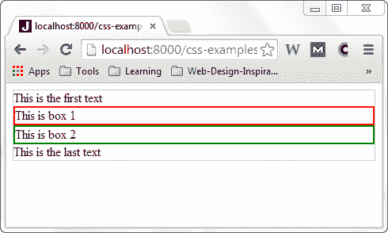
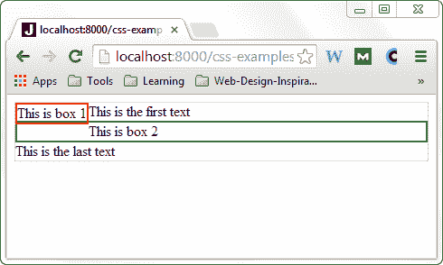
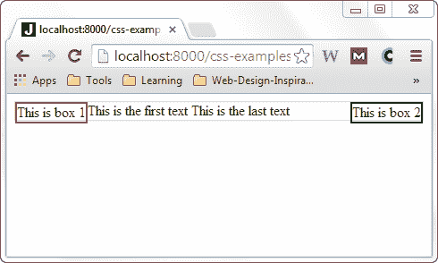
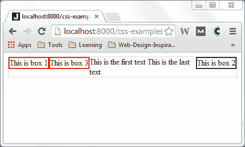
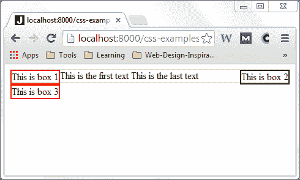

# CSS 浮动

> 原文：<https://jenkov.com/tutorials/css/float.html>

CSS *float* 属性可以使 HTML 元素在其父元素中向左或向右浮动。同一父元素中的内容将向上移动并环绕浮动元素。在这个 *CSS 浮动教程*中，我将更详细地解释 *CSS 浮动*属性是如何工作的。

## CSS 浮动示例

为了说明 CSS `float`属性是如何工作的，让我们首先看一个 HTML 示例:

```
<div style="border:1px solid #cccccc;">

  This is the first text

  <div style="border: 2px solid red;">This is box 1</div>
  <div style="border: 2px solid green;">This is box 2</div>

  This is the last text
</div>

```

HTML 代码包含一个有文本的`div`元素、两个`div`元素和另一个文本。渲染时，看起来是这样的:



在接下来的几节中，我将展示如何使用 CSS `float`属性让两个嵌套的`div`元素在它们的父元素中左右浮动。

## 浮动:左侧

现在，让我们尝试使用`float` CSS 属性使第一个嵌套的`div`元素向左浮动。我们通过将 HTML 元素的 CSS `float`属性设置为值`left`来实现。下面的例子展示了一个 CSS `float`属性设置为`left`的`div`元素:

```
<div style="border:1px solid #cccccc;">

  This is the first text

  <div style="float: left; border: 2px solid red;">This is box 1</div>
  <div style="border: 2px solid green;">This is box 2</div>

  This is the last text
</div>

```

下面是在浏览器中呈现左侧浮动元素的示例:



注意第一个`div`元素(带有红色边框)现在如何浮动到其父元素的左侧。第一个文本现在很好地环绕在第一个`div`元素的右边。第二个`div`元素仍然位于第一个`div`元素之下，最后一个文本位于该元素之下。

现在，让我们试着让第二个嵌套的`div`也向左浮动。下面是代码的样子:

```
<div style="border:1px solid #cccccc;">

  This is the first text

  <div style="float: left; border: 2px solid red;">This is box 1</div>
  <div style="float: left; border: 2px solid green;">This is box 2</div>

  This is the last text
</div>

```

下面是代码在浏览器中呈现的样子:


现在，第一个和第二个嵌套的`div`元素都在它们的父元素中向左浮动。文本很好地包裹了两个浮动元素。

## 浮动:对

现在让我们试着让第二个嵌套的`div`向右浮动。我们通过将它的`float` CSS 属性设置为`right`而不是`left`来做到这一点。代码如下:

```
<div style="border:1px solid #cccccc;">

  This is the first text

  <div style="float: left; border: 2px solid red;">This is box 1</div>
  <div style="float: right; border: 2px solid green;">This is box 2</div>

  This is the last text
</div>

```

下面是它在浏览器中呈现时的样子:



看看这两个元素是如何在它们的父元素中向各自的方向浮动的。它们甚至位于相同的垂直位置(朝向父元素的顶部)。文本现在通过呈现在两个`div`元素之间来环绕两个`div`元素。

## 清楚的

现在，让我们添加第三个`div`元素，它也向左浮动:

```
<div style="border:1px solid #cccccc;">

  This is the first text

  <div style="float: left; border: 2px solid red;">This is box 1</div>
  <div style="float: right; border: 2px solid green;">This is box 2</div>
  <div style="float: left; border: 2px solid red;">This is box 3</div>

  This is the last text
</div>

```

这是代码在浏览器中呈现时的样子:



请注意两个左侧浮动元素是如何一个接一个地定位在同一水平“线”上的。

现在想象一下，您希望两个带有红色边框的`div`元素向左浮动，但是在彼此下面，而不是在彼此旁边。为此，您需要设置`clear` CSS 属性。

`clear` CSS 属性可以取以下值之一:

*   `left`
*   `right`
*   `both`
*   `none`

`left`值意味着该元素应该远离所有左边的浮动元素。`right`值意味着元素应该远离所有右边的浮动元素。`both`值意味着元素应该远离左右浮动元素。`none`值表示不清除，这与省略`clear` CSS 属性是一样的。

让我们将最后一个`div`元素的`clear` CSS 属性设置为`left`。那么最后一个`div`元素仍然应该向左浮动，但是要避开第一个向左浮动的`div`元素。下面是代码的样子:

```
<div style="border:1px solid #cccccc;">

  This is the first text

  <div style="float: left;  border: 2px solid red;">This is box 1</div>
  <div style="float: right; border: 2px solid green;">This is box 2</div>
  <div style="float: left; clear: left border: 2px solid red;">This is box 3</div>

  This is the last text
</div>

```

下面是代码在浏览器中呈现时的样子:



请注意最后一个`div`元素仍然向左浮动，但是停留在第一个向左浮动的`div`元素的下面。