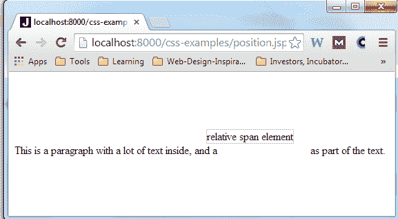
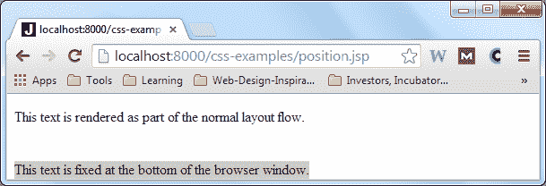
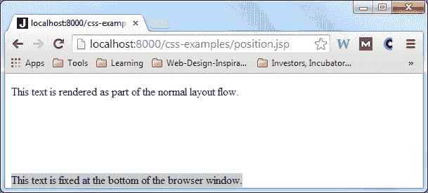
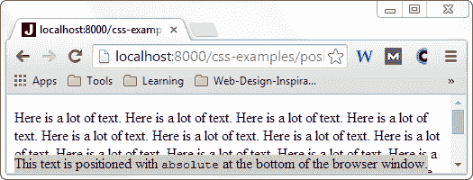
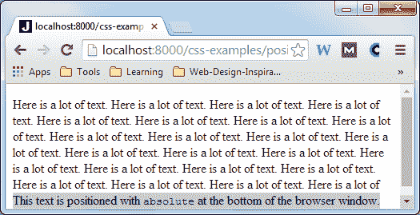
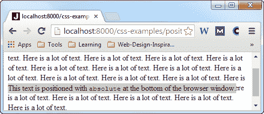
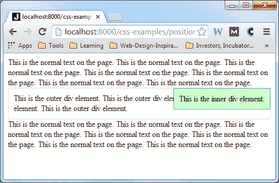

# CSS 位置

> 原文：<https://jenkov.com/tutorials/css/position.html>

通过`position` CSS 属性，您可以用不同于普通文本流的方式以及不同于 [`display`](/css/display.html) CSS 属性的方式来定位 HTML 元素。

`position` CSS 属性可以设置为以下值之一:

*   `static`
*   `relative`
*   `fixed`
*   `absolute`

这些值将在下面的章节中介绍。

## 位置:静态

将`position`设置为值`static`会使浏览器正常呈现 HTML 元素。换句话说，`static`值是 HTML 元素的默认行为。大多数情况下，您不需要将`position`设置为`static`。相反，你可以根本不设置`position` CSS 属性。

## 位置:相对

将`position` CSS 属性设置为`relative`会使浏览器在相对于普通文本和元素流中 HTML 元素呈现位置的*位置呈现 HTML。要指定 HTML 元素的位置，需要四个额外的 CSS 属性:*

*   `top`
*   `left`
*   `bottom`
*   `right`

下面是一个示例，它将一个 HTML 元素放置在流中其正常位置的左侧 20 个像素和上方 20 个像素处:

```
<style>    
#theRelativeSpan {
    position : relative;
    top      : -20px;
    left     : -20px;
    border   : 1px solid #cccccc; //shows the boundaries of the element.
}
</style>
<p>
  This is a paragraph with a lot of text inside, and a  <span id="theRelativeSpan">relative span element</span>
  as part of the text.
</p>

```

此浏览器屏幕截图显示了元素的呈现方式:



请注意`span`元素是如何呈现在它正常位置的左上方的。还要注意的是，在`span`通常被渲染的地方仍然显示了一个空白。

## 位置:固定

将`position` CSS 属性设置为值`fixed`会使应用该属性的 HTML 元素显示在浏览器窗口(视口)内的固定位置。即使用户垂直或水平滚动 HTML 页面，或者调整 browswer 窗口的大小，元素仍然固定在浏览器窗口内的相同位置。

下面是两个浏览器屏幕截图，展示了`position: fixed` CSS 属性声明的效果:

 

请注意，在第二个屏幕截图中，浏览器稍微高了一点(调整了浏览器的大小)，但是带有灰色背景的 HTML 元素仍然位于浏览器窗口的底部。

## 位置:绝对

将`position` CSS 属性值设置为`absolute`有点像`fixed`值，只是有一些例外。与`fixed`一样，HTML 元素相对于浏览器窗口(视窗)定位，但是当用户水平或垂直滚动时，HTML 元素不会停留在视窗内的同一位置。

请看下面的示例代码:

```
<style>
  #theAbsoluteDiv {
      position: absolute;
      bottom  : 0px;
      background-color: #cccccc;
  }
</style>

<div id="theAbsoluteDiv">
  This text is positioned with <code>absolute</code> at the bottom of the browser window.
</div>

```

本示例将`div`元素设置为`position: absolute`，将`div`元素定位在距离浏览器底部 0 像素的位置。以下是在包含更多文本的页面中呈现时的外观:



当调整浏览器窗口大小时，`div`元素相对于浏览器窗口保持不变。您可以在同一页面的这个浏览器屏幕截图中看到，但是浏览器的尺寸被调整为更高:



但是，请注意，当您再次将浏览器窗口缩小一点，然后向下滚动一点页面时会发生什么。现在`div`元素突然在屏幕中间向上滚动:



### 位置:绝对在其他定位元素内

当一个元素应用了`position : absolute` CSS 样式，并且该元素嵌套在另一个也设置了某个`position`值的元素中时，那么带有`position : absolute`的元素被绝对定位`inside`为父元素。

这里有一个例子:

```
<style>
  #theOuterDiv {
      position: relative;
      top     : 0px;
      left    : 0px;
      border  : 1px solid #cccccc;
      padding : 10px;
  }

  #theInnerDiv {
      position: absolute;
      top     : 0px;
      right   : 0px;
      padding : 10px;
      background-color: #ccffcc;
      border  : 1px solid #99cc99;
  }

</style>

<div id="theOuterDiv">
  This is the outer div element.
  This is the outer div element.
  This is the outer div element.
  This is the outer div element.

  <div id="theInnerDiv">
      This is the inner div element.
  </div>
</div>

```

这个例子为外部的`div`元素设置`position`到`relative`。由于`top`和`left`被设置为`0px`，外部`div`元件被精确地定位在没有将`position`设置为`relative`的情况下它应该被定位的位置。

内部`div`元素将`position`设置为`absolute`，将`top`设置为`0px`，将`right`设置为`0px`。这将内部的`div`放置在其父元素内的右上角(因为父元素已经设置了`position: relative`)。

下面是它在浏览器中呈现在包含更多文本的页面中时的样子:



请注意，内部 div 的位置现在在其父元素中是绝对的。