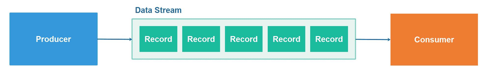

# 数据流

> 原文：<https://jenkov.com/tutorials/data-streaming/index.html>

*数据流*是一种数据分发技术，数据生产者将数据记录写入有序的数据流，数据消费者可以按照相同的顺序从该数据流中读取数据。下面是一个简单的数据流图，说明了数据生产者、数据流和数据消费者:

## 数据流有多种形式

从表面上看，数据流作为一个概念可能看起来非常简单。数据生产者将记录存储到数据流中，供消费者日后读取。然而，在表面之下，有许多细节会影响您的数据流系统的外观、行为方式和用途。

每种数据流产品都会对要支持的用例及处理技术做出一定的假设。这些假设导致了某些设计选择，这些设计选择会影响您可以用它们实现什么类型的流处理行为。本数据流教程研究了许多这样的设计选择，并讨论了它们对基于这些设计选择的产品用户的影响。

## 数据流解耦生产者和消费者

数据流将数据生产者和数据消费者相互分离。当数据生产者简单地将其数据写入数据流时，生产者不需要知道读取数据的消费者。可以独立于生产者添加和删除消费者。消费者也可以开始和停止或者暂停和恢复他们的消费，而不需要数据生产者知道。这种分离简化了数据生产者和消费者的实现。

## 作为数据共享机制的数据流

数据流是在大型分布式系统中存储和共享数据的一种非常有用的机制。如前所述，数据生产者只是将数据发送到数据流系统。生产者不需要了解消费者的任何情况。消费者可以在不影响生产者的情况下增加、减少、增加和删除。

像 LinkedIn 这样的大公司在内部广泛使用数据流。优步也在内部使用数据流。许多企业级公司正在或已经在内部采用数据流。很多创业公司也是如此。

## 持久数据流

数据流可以是持久的，在这种情况下，它有时被称为*日志*或*日志*。持久数据流的优点在于，数据流中的数据可以在数据流服务关闭后继续存在，因此没有数据记录丢失。

与仅在存储器中保存记录的数据流服务相比，持久数据流服务通常可以保存更大量的历史数据。一些数据流服务甚至可以将历史数据一直保存到写入数据流的第一条记录。其他仅保存例如若干天的历史数据。

在持久数据流保存记录的完整历史的情况下，消费者可以重放所有这些记录，并基于这些记录重新创建它们的内部状态。如果消费者发现自己的代码中有错误，它可以更正代码并重放数据流以重新创建内部数据库。

## 数据流使用案例

数据流是一个非常通用的概念，可用于支持许多不同的用例。在这一节中，我将介绍一些更常用的数据流用例。

### 用于事件驱动架构的数据流

数据流通常用于实现[事件驱动架构](/software-architecture/event-driven-architecture.html)。事件由事件生产者作为记录写入某个数据流系统，事件消费者可以从该系统中读取这些事件。

### 面向智慧城市和物联网的数据流

数据流还可以用来传输来自安装在智能城市周围的传感器、来自 T2 智能工厂内部的传感器或来自 T4 物联网设备的数据。数值，如温度、污染程度等。可以定期从设备中采样并写入数据流。数据使用者可以在需要时从数据流中读取样本。

### 定期采样数据的数据流

智能城市中的传感器和物联网设备只是可以定期采样并通过数据流提供的数据源的两个例子。但是还有许多其他类型的数据可以定期采样和流式传输。例如，也可以对货币汇率或股票价格进行采样和流式传输。民意测验数字也可以定期取样和流式传输。

### 数据点的数据流

在民意测验数字的例子中，您可以决定流式传输每个单独的民意测验答案，而不是流式传输定期抽样的总数。在某些情况下，总数是由单个数据点组成的(如民意测验)，有时对单个数据点评分者进行流式处理比计算出的总数更有意义。这取决于具体的用例，以及其他因素，如各个数据点是匿名的还是包含不应该共享的私人信息。

## 记录、消息、事件、样本等。

数据流记录有时被称为消息、事件、样本、对象和其他术语。使用什么术语取决于数据流的具体用例，以及生产者和消费者如何处理数据和对数据做出反应。从用例中，通常可以合理地清楚通过什么术语引用记录是有意义的。

值得注意的是，用例也会影响给定记录所代表的内容。并非所有的数据记录都是相同的。事件与采样值不同，不能总是以相同的方式使用。我将在本(和/或其他)教程中更详细地讨论这一点。