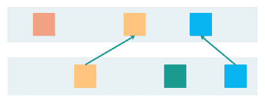
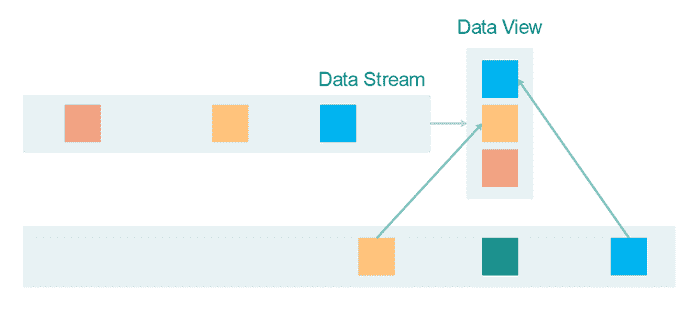
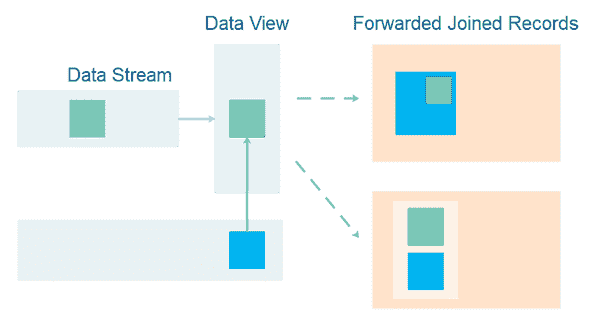
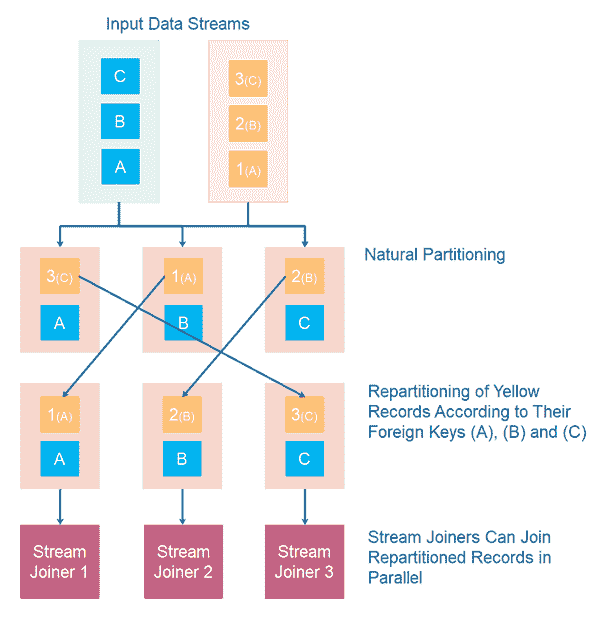

# 连接数据流

> 原文：<https://jenkov.com/tutorials/data-streaming/joining-data-streams.html>

连接数据流意味着将一个数据流中的消息与另一个数据流中的消息连接起来，通常是基于在这些消息中找到的关键字。一旦您开始加入数据流，它将影响您处理数据流的方式以及扩展数据流的方式。连接数据流还会影响沿途存储消息所需的存储量。

## 基本流加入

连接流的基本概念是指从多个流中读取消息，并将这些消息连接在一起。例如，假设您有一个包含客户更新的更新事件的数据流，另一个包含客户合同的更新事件的数据流。当您收到客户的更新时，您可能想要查找客户的所有联系人并对他们进行处理。例如，您可以将合同附加到客户对象上，并将该丰富的客户对象转发到另一个数据流上。或者，假设客户的婚姻状况从已婚变为单身，也许您想检查他们的合同是否应该相应地更改。

当加入流时，彼此相关的不同流中的消息通常由某组关键字来标识。例如，一个客户可能有一个客户 ID，一个合同可能有一个合同 ID 加上该合同所属客户的客户 ID(外键)。要将客户对象与其相关的合同对象连接起来，可以在合同流中查找合同对象，这些合同对象的客户 ID 引用了相关客户的客户 ID。

## 流数据视图

处理数据流时，一次只能处理一条消息或一条记录。您无权访问该数据流中任何以前的记录，也无权访问任何将来的记录。因此，为了能够定位来自另一个流的记录，该流的消息必须存储在某种数据视图中。

数据视图有两种常见形式:

*   Windows 操作系统
*   桌子

### 数据窗口

一个*数据窗口*保持一个记录的*窗口*，可以在其中查找记录。数据窗口 通常受到时间、记录数量或其他存储约束的限制。当期望两个流中的记录在时间上彼此接近时，通常使用时间 。 然后，一个数据流中的记录可以存储在一个窗口中，例如 5 分钟或 30 分钟(或任何适合 您的用例的时间窗口),直到另一个数据流中的记录到达。

### 数据表

一个*数据表*以表格数据结构保存记录。这样的数据结构可以是一个简单的 键，记录映射，其中记录可以通过它们的键来查找。记录也可以像数据库表一样存储更多的字段 ，因此可以通过它们的主键、外键和其他值找到记录。

### 窗口和表格的组合

数据窗口和表格可以合并。一个数据表只能从一个记录窗口放在一起。当一条记录“太旧”而不能出现在窗口中时，它将再次从表中删除。

### 其他数据视图

还可以使用其他数据结构(如来自数据流或数据窗口中的记录的树或图)来构建数据视图。这完全取决于你的需求是什么。

## 转发联合记录

有时，您可能希望转发一个数据流中已与另一个数据流中的记录相联接的记录。我所说的*转发*是指将连接的记录写到另一个数据流上，供其他人 使用。通过*连接*我的意思是要么一个记录被插入到另一个记录中， 要么一个新记录被创建，它包含来自两个记录的连接信息。这两个 选项在这里都有说明:

一旦转发了连接的记录，有几个问题会影响系统的正确性和性能。我将在接下来的几节中讨论这些问题。

## 时间问题

输入数据流中记录的到达时间会影响处理或转发时连接记录的外观。下图说明了时间差异如何影响两个输入记录的合并记录:

记录 A 和 B 各更新 2 次。这两个版本被标注为 A1、A2、B1 和 B2。该数字代表记录的版本。请注意 A1、A2、B1 和 B2 的到达时间如何影响处理或转发时连接记录的外观。该图显示了 3 种不同的时序排列，每种情况下的合并结果看起来都不同。

请注意，即使最终连接的记录看起来相同，导致最终记录的连接记录也不相同。此外，请记住，您永远不知道“最终”记录何时被加入。没有办法知道输入数据流中将来会出现什么。因此，您不能只看上面示例中的最后一条记录，就认为这是数据流中这些记录的连接操作的“最终”结果。“最终”结果是所有中间突变的连接记录的完整序列。

## 水平可扩展性问题

如果您的数据流是水平扩展的(横向扩展)，连接记录会有些困难。在本节中，我将尝试向您解释这是为什么。

正如本教程前面提到的，连接的记录通常由它们的键匹配。例如，客户记录可能有一个 customerId 作为主键，而合同记录可能有一个外键 customerIdFk 引用客户记录的主键 customerId。

当数据流被水平缩放时，数据流中的记录被划分到不同的计算机上。为了联接两条记录，要么必须将记录分区到同一台计算机上，要么联接操作必须知道如何查找存储在另一台计算机上的记录。这两个选项将在下面的章节中详细解释。

### 记录重新分区

如果联接操作不知道如何查找存储在另一台计算机上的记录，则必须对要联接的记录进行分区，以便要联接的记录位于同一台计算机上。如果这种分区不是记录的自然分区，则必须对其中一个数据流中的记录进行重新分区，以便将要连接的记录放在同一台计算机上。

请注意，记录的重新分区会降低整个记录处理链(也称为图形或拓扑)的性能。重新分区还会创建重新分区记录的额外副本。

请记住，根据记录构建的数据视图保存在记录连接器内部，而不是保存在包含原始记录(数据流)的计算机上。

## 关联记录的外键更新