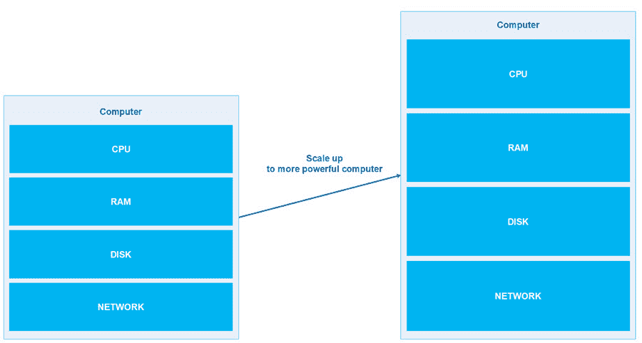
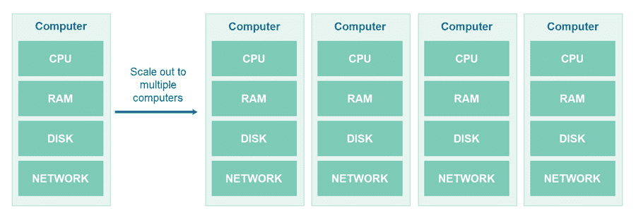
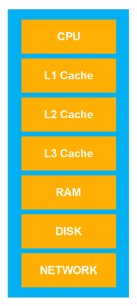
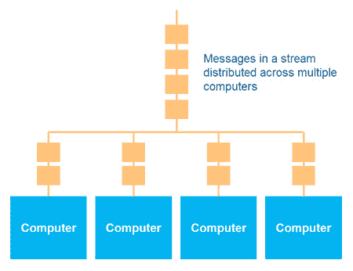
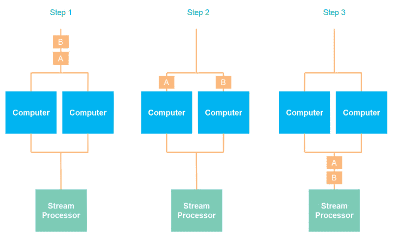
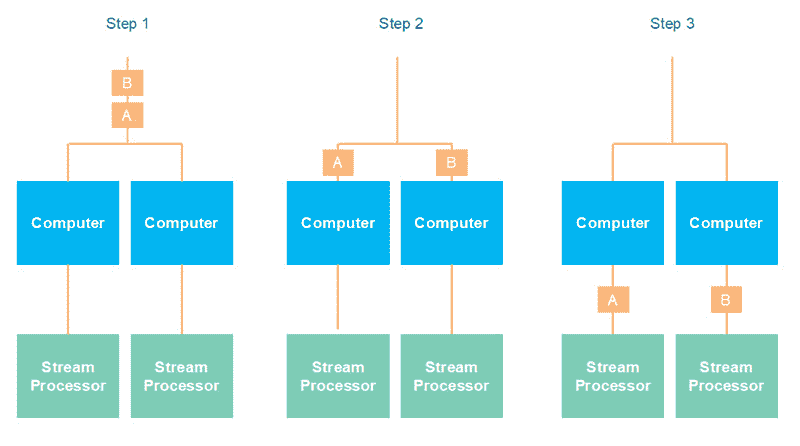
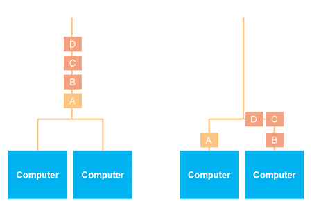

# 数据流可扩展性

> 原文：<https://jenkov.com/tutorials/data-streaming/scalability.html>

数据流是一种简单而强大的机制，用于在分布式系统中存储和共享数据。数据流简单的原因之一是它们易于扩展。数据流在垂直方向上的伸缩性非常好(增加了计算机的大小)，在水平方向上的伸缩性也相当好(增加了更多的计算机)。在本数据流可伸缩性教程中，我们将了解为什么数据流在垂直方向上可以很好地伸缩，以及在水平方向上可以用来伸缩数据流的选项。正如您将看到的，当水平缩放时，您的流处理可能也必须水平缩放，这将影响您的流处理管道的设计。

## 垂直与水平缩放

为了避免混淆任何读者，我将首先定义垂直和水平缩放。*垂直扩展* 意味着在更强大的计算机上运行您的数据流存储和处理器。垂直缩放也称为 ，有时也称为*向上缩放*。你扩大了它的磁盘、内存、CPU 速度，可能还有 CPU 内核、显卡等的大小和速度。

*水平扩展*是指在多台计算机之间分配工作负载。因此，数据流 中的数据分布在多台计算机中，处理数据流的应用程序也是如此(或者至少 它们可以如此)。水平扩展有时也被称为*向外扩展*。您可以从一台 计算机扩展到多台计算机。

水平扩展在两种情况下是必要的:第一，如果不再可能得到更大的机器，更大的内存，更大的磁盘等等。它足够容纳和处理你所有的数据。第二，如果这么大的机器变得太贵而无法升级。

## 垂直缩放

如上所述，垂直扩展意味着从功能较弱的计算机向上扩展到功能更强的计算机。传统计算机体系结构的各层如下所示:

数据离 CPU 越远，CPU 访问它的速度就越慢。在上图中，数据在堆栈中的位置越低，CPU 访问的速度越慢。

上述计算机体系结构中的每一层都针对串行读取数据进行了优化。这意味着，读取磁盘、RAM 或 L3、L2 和 L1 高速缓存中按顺序排列的数据比读取随机分布在磁盘、RAM 或高速缓存中的数据要快。将数据顺序写入磁盘也比随机写入磁盘的不同部分要快得多。

数据流正是串行数据结构。它们被连续地读取，并被连续地写入。这意味着，你可以让数据流在一台电脑上很好地扩展。写入流的数据可以附加到流文件中。追加到文件是写入文件的最快方式，而不是返回并重写文件的一部分。

从文件中读取数据时，会将一大块数据读入 RAM。从 RAM 中，一个较小的数据块被读入 L3 缓存，一个较小的数据块被读入 L2 缓存，还有一个更小的数据块被读入 CPU 可以访问的 L1 缓存。如果您只需要将一小部分数据块从磁盘读入 RAM、L3、L2 和 L1 缓存，因为您的数据分散在整个磁盘上，那么在读取所有数据之前，您将需要更多的读取。当数据连续位于一个大数据块中时，磁盘、RAM、L3、L2 和 L1 缓存读取该数据的速度要快得多。很简单，需要更少的读取操作，因为每一步读取的整个块都包含相关数据。

由于数据流的读取和写入很好地利用了现代计算机，随着运行数据流服务的计算机规模的扩大，数据流服务的性能也将几乎线性地扩大。

## 水平缩放

正如本教程前面提到的，水平扩展意味着将应用程序扩展到多台计算机上。在数据流中，这意味着将数据流中的消息分发到多台计算机上。下图说明了数据流的消息在多台计算机上的分布情况:

将数据流的消息分发到多台计算机上也称为对数据流进行*分区* 。

### 分区影响消息序列保证

对数据流进行分区会影响消息序列保证。只要数据流的消息停留在一台机器上，就可以保证消息以与它们被写入时相同的顺序被读取。一旦对数据流进行分区，这种保证可能会受到影响。消息序列保证以何种方式受到影响取决于具体的消息划分方法。

### 循环分区

循环数据流分区是在多台计算机上划分数据流消息的最简单方法。循环分区方法只是在计算机之间均匀有序地分发消息。换句话说，第一消息存储在第一计算机上，第二消息存储在第二计算机上，等等。当所有计算机都接收到来自流的消息时，循环法再次从第一台计算机开始。

如果只有一个应用程序写入数据流，那么使用循环机制是最简单的。协调多个作者之间的循环调度并不容易。

当使用循环数据流分区机制时，对于流的读者来说，以消息在被分区之前在流中的相同顺序来重组流中的消息是相当容易的。读取器只需以循环方式从每个分区读取一条消息。

### 基于键的分区

基于键的分区根据从每条消息中读取的特定键值将消息分发到不同的计算机上。通常，标识 id(例如主密钥)被用作分发消息的密钥。通常，从每个键值计算哈希值，然后使用该哈希值将邮件映射到群集中的一台计算机。

当使用基于键的分区时，您可能会失去整体消息序列保证。写入同一台计算机(同一分区)的消息仍将保持其相对于彼此的顺序，但可能会失去它们在整个顺序中的位置，因为写入其他计算机(其他分区)的消息可能会在它们之前被读取。如下图所示:

如果您要获得数据流分区的全部好处，您不能控制流处理器从不同分区读取的顺序。如果您还扩展了流处理器，这就更不切实际了，如下所示:

在许多情况下，您不需要完全的消息序列保证。你只需要数据流中*相关消息*的消息序列保证。例如，如果消息代表对客户 的更新，那么对同一个客户的所有更新应该在集群中的同一台计算机(分区)上结束。这样 您可以保证对每个客户的更新顺序，这对您的应用程序来说足够好了。 对不同客户的更新之间的顺序可能会改变，但是只要对 相同逻辑实体(例如客户)的更新顺序保持不变，对不同 逻辑实体的更新之间的顺序改变就不一定是问题。

对消息进行分区，使所有相关的消息都位于同一服务器上，这通常是通过对消息主键上的数据进行分区来实现的。这应该保证与同一逻辑实体(例如，同一客户)相关的所有消息最终都在同一台计算机上。

使用基于键的分区，消息可能不会均匀分布。它取决于密钥的分布，以及用于将消息映射到集群中的计算机的哈希算法。不适当的哈希算法可能会将更多的消息映射到某些计算机上，而不是其他计算机上。不均匀的消息分布将导致集群中的计算机之间的不完美的负载分布，这将再次导致可用计算机资源的次优利用。

在某些情况下，根据非标识字段值(例如外键或其他字段值)来划分消息是有意义的。这显然会导致消息的不同分布，甚至可能导致非常不均匀的分布，例如，如果用作分区键的一个值比其他值更普遍。

下图显示了一个水平扩展的数据流，其中群集中的计算机之间的消息分区不均匀:

