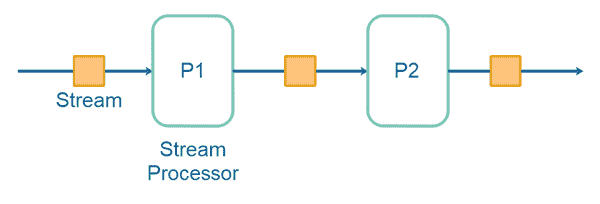
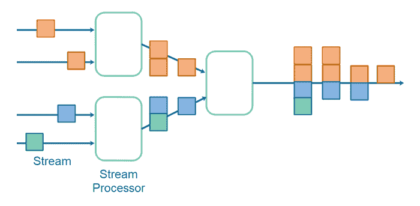
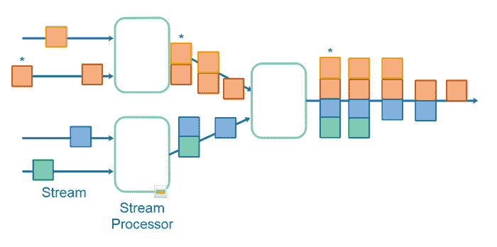

# 数据流存储

> 原文：<https://jenkov.com/tutorials/data-streaming/storage.html>

根据数据流管道的设计，数据流可能会使用相当多的存储。在这个数据流存储教程中，我将介绍影响数据流管道存储使用的不同因素。

## 影响数据流存储消耗的因素

影响数据流存储消耗的因素有:

*   原始的、唯一的实体计数和大小(E)
*   实体的变更频率(F)
*   复制因子
*   数据流处理拓扑(T)

最终的公式类似于:

```

F * E * R * T

```

我将在下面的小节中更详细地解释每一个因素。

## 改变频率

每次域中的实体发生更改时，都会触发一个更改事件。根据您构建数据流系统的方式，事件可能包含已更改数据的完整副本。在这种情况下，每个更改都会导致另一个副本。因此，每秒更改的单个实体将导致每天 86，400 次更改，30 天内 2，592，000 次更改。

我用 F(变化频率)表示变化频率。

## 实体计数和大小

变化的实体数量也会影响您的数据流解决方案所需的存储容量。如果您的系统中有 1，000 名客户每年更改一次他们的信息，那么您将在数据流中获得 1，000 条代表这些更改的记录。类似地，如果您有 10，000 个客户每年更改一次，您将得到 10，000 条代表每年更改的记录。如果客户一年换两次，你最终每年会有 20000 份。

由于对实体的改变通常会产生该实体的新副本，所以该实体的字节大小也在新副本需要多少存储空间中起作用。

## 复制因子

通常会复制数据流来降低磁盘故障的风险。例如，拥有数据流的 2 或 3 个副本并不罕见。这意味着，对于数据流中的每个记录，总共有 2 或 3 个副本，包括复制品。

## 数据流处理拓扑

数据流处理拓扑对于记录的每次更改会获得多少份副本起着重要的作用。我所说的拓扑是指完整的数据流处理“管道”是如何构成的。影响副本数量的流处理拓扑有两个主要因素:

*   拓扑长度
*   拓扑构成

这两个因素中的每一个都将在下面的章节中解释。

### 拓扑长度

我所说的拓扑长度是指处理管道中集线器的数量。集线器通常是一个流处理应用程序，它从一个流中读取一条记录，并在另一个流中生成一条或多条记录。请看数据流处理管道的图示:



上述流处理拓扑中的集线器数量是 2。这导致数据的一个原始副本，加上由每个集线器(流处理器)产生的一个附加副本。总数是 3 份。因此，流处理拓扑的长度会影响产生多少数据副本。

在记录是事件的情况下，也许一个事件导致由其他流处理器产生的其他事件。因此，单个原始事件可能会导致几个派生事件。

### 拓扑构成

拓扑合成我指的是流处理器如何从输入记录合成输出记录。请看下面的流处理拓扑:



请注意拓扑中的每个集线器如何通过将两个输入记录相互连接来组成新的输出记录，可能会将记录存储在内部表中以使连接成为可能。我已经在我的[数据流连接教程](joining-data-streams.html)中对此做了更多的解释。

注意，只有 4 个原始输入记录，但是因为它们在不同的时间到达流，所以流处理器为每个输入记录产生一个输出记录。其中一些输出记录由多个输入记录组成，因此会产生原始记录的更多副本。请特别注意在最终的输出流中产生了多少原始记录的副本。

想象一下，如果红色记录发生变化，并且一个新的副本被写到红色原始输入流的末尾，会发生什么。这将导致由来自第一流处理器的红色和黄色记录组成的另一个记录，以及由红色、黄色、蓝色和绿色记录组成的另一个记录。因此，对单个记录(红色记录)的更改导致黄色记录的 2 个额外副本，以及蓝色和绿色记录的 1 个额外副本——总共 7 个记录副本，因为 1 个记录发生了更改。这里举例说明了这一点:



在图示中，已更改的红色记录和源自该更改的记录标有`*`。

## 数据流存储摘要

正如您所看到的，一旦您开始使用数据流，您很容易就会得到您正在记录更改的原始数据的许多副本。有几个因素会影响您的流处理系统最终使用多少存储。这对你来说可能是问题，也可能不是问题。至少现在您已经为进行一些合理的存储计算做好了准备，因此您知道实际需要多少存储空间。