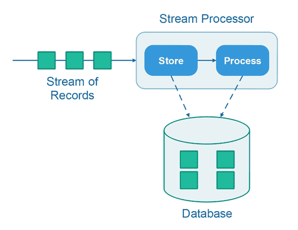
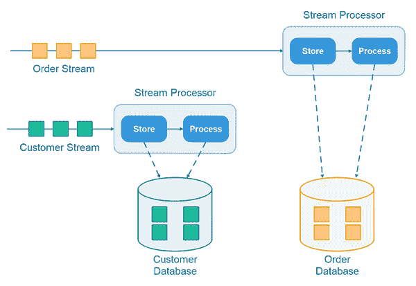
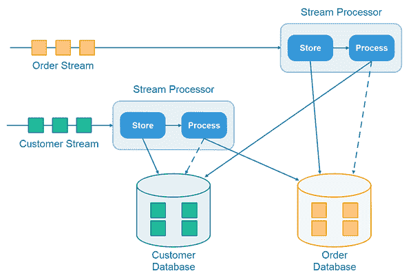

# 存储和流程流处理设计模式

> 原文：<https://jenkov.com/tutorials/data-streaming/store-and-process.html>

*存储和处理*流处理设计模式对于流处理应用程序来说是一个简单，但是非常强大和通用的 设计，无论我们谈论的是简单还是高级的流处理。从简单的流处理到高级的流处理，该模式在代码方面可以很好地扩展，在性能方面也可以很好地扩展。在这个*商店和流程教程*中，我将解释这个设计模式 是如何工作的，如何实现它，以及如何将它应用到各种常见的用例中。

## 背景

当您查看主流流处理 API(如 Kafka Streams 或 RxJava)时，您会得到这样的印象:功能流处理模型是流处理的“必由之路”。然而，在 Kafka Streams 上工作了 15 个多月之后，我意识到函数式流处理范例有多少局限性。基于观察器的流处理模式限制较少，但是在许多情况下，使用大量观察器和监听器在内部设计流处理应用程序是多余的。

在本教程中，我不会详细讨论基于函数的和基于观察器的流处理方法的局限性和区别。我想把重点放在*存储和处理模式*上。 但是请放心，在不久的将来，我将在另一篇教程中记录特别是函数式流处理范例 的缺点。开发人员需要知道他们正在陷入什么问题，以及为什么 他们不需要在这些问题上浪费时间。

*存储和处理设计模式*是对基于功能/观察者的 流处理趋势的反应和替代，尽管它使用了基于观察者的流处理范例的元素， *存储和处理*设计并不是一个成熟的基于观察者的设计。

*存储和处理设计模式*是在 数据流引擎、处理 API 等领域的研究和开发相结合的结果。我们已经在 [完成了 Nanosai](https://nanosai.com) ，并且在一家更大的斯堪的纳维亚保险公司的 数据仓库部门中使用了 Kafka Streams。

## 存储和流程设计模式

存储和流程设计模式将流上的传入记录的处理分为两个步骤:

*   存储记录
*   处理记录

这些存储和处理步骤如下所示:



基本思想是，首先流处理器将在数据库中存储记录，然后由 T4 处理记录。在处理记录时，流处理器可以访问存储在数据库中的所有记录。 因此，记录处理器可以在处理过程中考虑历史事件/记录。

## 存储和处理步骤都是可选的

*商店*和*流程*步骤都是可选的。有时你可能需要存储一个记录 ，然后处理它。其他时候，您可能只需要存储记录，而不需要处理它。还有一些时候 你可能只需要处理记录，而不需要存储它。这取决于具体的用例、事件/记录、 事件/记录的定时等。

## 实施模板

实现遵循存储和处理设计模式的流处理器非常简单。以下是实现存储和流程流处理器的模板:

```

public class StreamProcessor {

    public void onRecord(Record record) {

    }
}

```

注意这个模板中的`StreamProcessor`类只有一个方法。对于它所处理的流中的每个记录，都会调用这个方法 。如果一个流处理器要处理来自多个流的消息 ，那么每个流就有一个方法。我们稍后会更详细地讨论这个问题， 但是这里有一个简单的例子来给你一个关于这个模型的印象:

```

public class StreamProcessor {

    public void onAdClickRecord(AdClickRecord record) {
    }

    public void onLandingPageVisitRecord(PageVisitRecord record) {

    }

    public void onOrderRecord(OrderRecord record) {

    }
}

```

在这个例子中，来自所有三个流的记录都由同一个`StreamProcessor`实例处理。 然而，将记录的处理分成多个处理器类是完全可能的。这取决于 在具体应用中什么是有意义的。

## 批处理流记录

可以将记录聚集到一个数组中，将它们列出或插入到数据库中，并且当一整批记录被聚集时，可以在那时处理该批记录。使用存储和流程设计模式，将记录聚合成一个批处理非常简单。下面显示的实现也只是一个模板，因此并不完整。但它应该足够完整，让你有个概念。

```

public class StreamProcessor {

    private List<AdClickRecord> batch = new ArrayList<>();

    private int batchLimit = 1000;

    public void onAdClickRecord(AdClickRecord record) {
        this.batch.add(record);

        if(this.batch.size()) {
            processBatch();
        }
        this.batch.clear();
    }

    protected void processBatch() {
        //... process the batch
    }
}

```

## 处理来自多个流的记录

协调来自多个流的记录的处理可能具有挑战性。然而，*存储和处理*设计模式很好地处理了这种情况。 为了向您展示存储和处理模式如何处理多个 流的协调处理，让我们首先想象两个需要协调处理的流。

假设我们有一个客户流和一个订单流。客户流包含代表新客户的记录以及对现有客户的更新。订单流包含表示新订单的记录，以及对现有订单的更新。每个订单都有一个`customerId`，引用发出订单的 客户的 ID。

随着订单记录的流入，我们希望将相应的客户记录附加到每个订单记录上。为此，我们需要将所有收到的客户记录存储在数据库中。当收到订单记录时，我们可以在数据库中查找相应的客户记录，并将其附加到订单记录(或者我们需要对订单-客户记录对做的任何事情)。

以下是处理来自多个流的记录时，存储和流程设计模式的外观:



注意:来自不同流的记录不一定必须存储在不同的数据库中。它们也可以存储在同一数据库的不同表中。

### 实施模板-多个流

前面的实现模板暗示了如何设计一个流处理器来处理来自多个流的记录，但是让我再次向您展示一个草稿，让这个想法更加清晰:

```

public class StreamProcessor {

    private OrderDao    orderDao = null;
    private CustomerDao orderDao = null;

    public StreamProcessor(OrderDao orderDao, CustomerDao customerDao) {
        this.orderDao    = orderDao;
        this.customerDao = customerDao;
    }

    public void onOrderRecord(OrderRecord orderRecord) {
        this.orderDao.insertOrder(orderRecord);

        CustomerRecord customer =
            this.customerDao.readCustomer(orderRecord.getCustomerId());

        //process order with customer hereafter.
    }

    public void onCustomerRecord(CustomerRecord record) {
        this.customerDao.insertCustomer(record);
        //process customer hereafter.
    }

}

```

显然，您需要对这个模板进行修改。例如，如果订单和客户记录可以表示对现有订单和客户的更新，您可能需要将记录合并到数据库中，而不仅仅是插入它们(merge = insert if not exists，update if exists)。

## 处理无序记录到达

当同时处理来自多个流的记录时，您需要考虑的一个问题是，记录到达的顺序可能会发生混乱。

例如，在上面提到的例子中，如果一个订单记录到达了，但是没有与之匹配的客户记录，因为那个客户记录还没有到达，那么会发生什么呢？那么我们就不能将客户记录附加到订单记录上。

解决方案是，在数据库中存储没有匹配客户记录的订单记录，而不处理它们。当匹配的客户记录稍后到达时，您检查订单数据库是否有等待该客户的订单记录。如果有，您将处理当时所有的等待订单记录。当然也存储了迟到的客户记录，以便与未来的订单记录进行匹配。

下面是在协调处理来自多个流的记录时，存储和处理模式的样子:



当订单记录到达时，处理器检查客户数据库中是否有匹配的客户记录。类似地，当客户记录到达时，处理器检查订单数据库中等待的订单记录。如果找到任何等待订单记录，它们将与新到达的客户进行匹配，并且可以删除等待记录(或者标记为“已处理”)。

顺便说一下，这个解决方案可以很好地扩展到 2 个以上的流。

### 实施模板-无序处理

下面是一个使用存储和流程设计的无序处理的简单实现模板:

```

public class StreamProcessor {

    private OrderDao    orderDao = null;
    private CustomerDao orderDao = null;

    public StreamProcessor(OrderDao orderDao, CustomerDao customerDao) {
        this.orderDao    = orderDao;
        this.customerDao = customerDao;
    }

    public void onOrderRecord(OrderRecord orderRecord) {
        this.orderDao.insertOrder(orderRecord);

        CustomerRecord customer =
            this.customerDao.readCustomer(orderRecord.getCustomerId());

        if(customer != null) {
            // process order with customer hereafter.
        } else {
            // leave order in database for when matching customer arrives
        } 

    }

    public void onCustomerRecord(CustomerRecord record) {
        this.customerDao.insertCustomer(record);

        //process customer hereafter.

        // lookup any unprocessed orders in database for this customer.
        // if any unprocessed orders found, process them with newly arrived customer

        List<OrderRecord> unprocessedOrders =
            this.orderDao.readUnprocessedOrdersForCustomer(customer.getId());

        // process orders, and mark them as processed in the database. 

    }

}

```

## 贮藏

为了提高性能，可以将数据库中的记录缓存在内存数据结构中，如哈希表、列表、树等。当在数据库中存储记录时，相应的缓存也必须更新。当查找记录时，可以在缓存中查找它们。如果在缓存中找不到，可以在数据库中查询该记录。缓存可以显著加快记录处理速度。

## 数据调试

将记录存储在数据库中使得调试您已经处理的记录、查看记录的最新版本、连接表之间的记录、检查您是否实际收到了您期望收到的所有数据等等变得容易得多。-以防您发现管道中的错误。流处理管道在其他方面是非常不透明的，因为记录在被处理时只在管道中存在一小段时间。

在开发和测试期间启用数据库存储非常方便——即使在生产环境中不需要数据库。