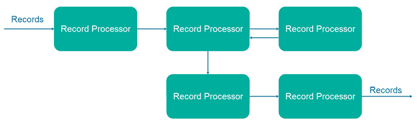
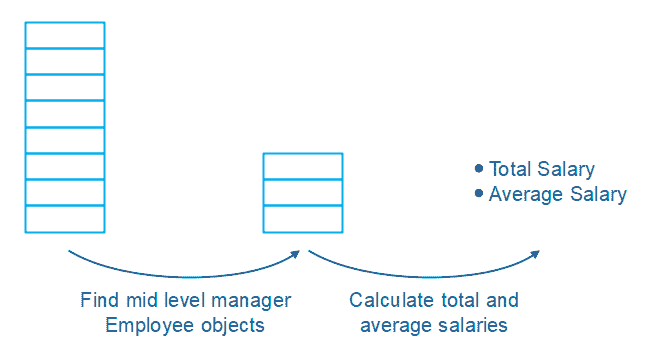
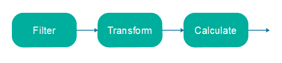
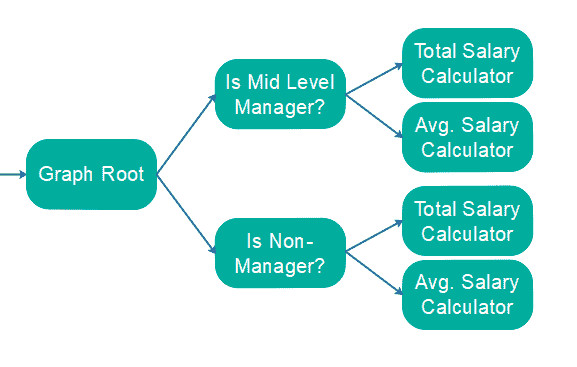
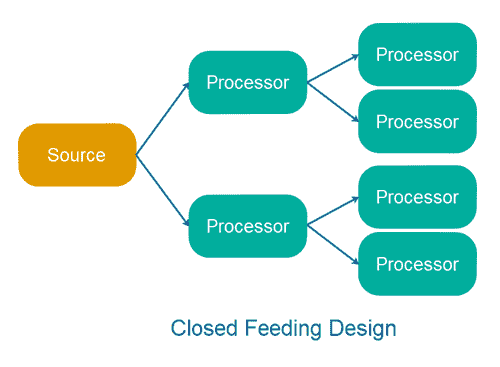
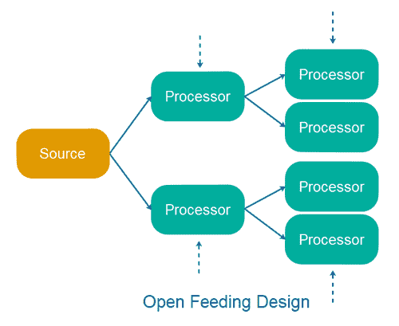

# 流处理 API 设计

> 原文：<https://jenkov.com/tutorials/data-streaming/stream-processing-api-designs.html>

流处理作为一种技术已经变得非常流行，这种技术可以在接收到事件流 或记录流时对其进行处理。流处理(又名数据流)有许多好处和使用案例， 因此开发了几个*流处理 API*来帮助开发人员更轻松地处理流。

从表面上看，这些流处理 API 看起来很相似。然而，一旦您尝试使用这些 API 实现复杂的流处理拓扑，您就会意识到这些 API 的设计对使用它们处理流变得有多“容易”有着相当大的影响。即使是设计上的细微差别也会对你能实现什么，尤其是实现起来有多容易产生很大的影响。

在各种流处理 API 上吃过苦头之后，我决定写这篇流处理 API 设计分析，以帮助那些即将涉足流处理的人，以及那些希望在选择 API 时得到一些指导的人。

## 流处理 API 设计方面

在开始设计分析之前，我想列出流处理 API 设计中我已经意识到很重要的方面。这些设计方面是:

*   拓扑学
*   饲养
*   促进
*   触发
*   状态
*   反馈
*   并发模型

我将在接下来的章节中探讨不同的设计选项及其结果。

## 拓扑学

流处理设计中最常见的设计选择之一是，将流处理组件构建为一个协同工作的组件图。每个组件获取一个记录，处理它，可能转换它，然后输出 0、1 或更多记录到图中的以下组件。这是一个简单的流处理拓扑示例:

这种流处理 API 设计的最初动机来自于为轻松处理大量对象或记录而设计的 API，如 [Java 流 API](http://tutorials.jenkov.com/java-functional-programming/streams.html) 。 这里有一个解释动机的例子:

假设您在一个列表中有数百万个雇员对象(或记录),您需要:

*   找到代表中层管理人员的雇员对象。
*   根据这些对象，计算这组员工的总工资和平均工资。

实现这一需求的一个简单方法是首先迭代 Employee 对象的列表，并将代表中层管理人员的所有 Employee 对象添加到一个新列表中。之后，我们可以迭代这个中层经理的列表，并计算他们的总工资和平均工资。这种实现如下所示:

请注意，您首先必须迭代所有的 Employee 对象一次，以便找到符合标准的 Employee 对象。其次，您必须迭代符合标准的雇员对象列表，并执行计算。最后，您将迭代比原始元素列表更多的元素(原始+过滤列表)。

现在想象一下，您需要执行相同的计算，但是这次是针对代表非经理的 Employee 对象。同样，首先您需要迭代整个雇员列表以找到匹配的雇员对象，当您找到这些对象时，迭代该列表并执行计算。

在上述 2 个需求的简单实现中，您将迭代原始列表 2 次(一次用于查找中层管理人员，一次用于查找非管理人员)，并迭代每个过滤列表一次。那是许多本质上相同的对象的重复迭代！

相反，您可以构建一个对象处理图，迭代一次对象的原始列表，并将每个对象传递给该图进行处理。下面是如何将上面示例中提到的计算组织成图形:

使用这种设计，对象只迭代一次。两个过滤器将只把相关记录转发给总工资和平均工资计算器。

### 流处理与批处理

当您有一个想要处理的对象列表时，使用面向图形的对象处理 API 是非常有意义的。对象列表也被称为*批次*。面向图形的设计意味着你只需要重复 记录一次。面向图形的 API 通常也是动态可组合的，这使得 实现不同类型的拓扑来适应不同的处理需求变得相当简单。

然而，在真正的流处理中，一次只能有一个记录或对象。您永远不会像前面的例子中所展示的那样试图以一种低效的方式实现迭代，因为一次总是只有一个对象需要处理。不需要迭代。即使一次只有一条记录，你仍然可以使用面向图形的设计。您仍将获得可组合性优势。

然而，对于许多较小的处理需求来说，使用完全面向图的方法可能是多余的。有一个单独的监听器来计算你需要计算的所有东西，而不是一个带有过滤器等的完整图表。可以更容易实现，也可以执行得更好。

此外，如果图表变得太大，就很难推断它在做什么，并且您可能很难在图表上提供反馈，这取决于您使用的面向图表的设计类型(基于功能的还是基于观察者的)。

这里没有明确的结论。请记住，面向图形的设计在真正的流处理中并不总是像在批处理中那样有益。根据您的流处理需求，允许您对可能的解决方案持开放态度。基于图形的方法可能是合适的，也可能是多余的。然而，如果您只是创建一个做所有事情的监听器/处理器，您可能仍然可以用面向图形的 API 实现简单的方法。

由于面向图形的流处理 API 设计既常见又流行，本文的其余部分将讨论基于图形设计的各个方面。

### 链与图

不同的面向图形的流处理 API 设计是围绕不同类型的拓扑结构设计的。例如， [Java Streams API](http://tutorials.jenkov.com/java-functional-programming/streams.html) 使用链式拓扑，就像这样:

链式拓扑由单个处理器链组成，每个处理器链接收一个对象或记录作为输入，并将一个对象或记录输出到链中的下一个处理器。在这个链的末端，你只有一个结果。结果可以是多个子结果的组合，但它将包含在单个对象或记录中。

其他流处理 API 允许您创建更高级的处理器图形。在处理完流中的所有记录或对象后，这样的图可以包含多个结果。这是本文前面的一个例子:

### 非循环图与循环图

一些面向图形的流处理 API 只允许您创建一个非循环图，这意味着记录最终只能在图中的一个方向上流动。记录不能“循环”回图表并被重新处理。在许多情况下，循环图并不是执行所需操作的必要条件，但是偶尔循环图 API 可能会很方便。

## 饲养

*馈入*指的是流处理 API 如何被设计成将数据馈入其处理拓扑。 例如，一些 API 有一个*流*的概念，你可以监听它，或者附加各种类型的处理器 ，来构建一个拓扑。但是您不能将记录直接输入到源流中。 流被锁定，以便从特定的源获取数据。例如来自列表或卡夫卡主题等。 我称之为*封闭送料*设计。

其他 API 使得在拓扑的每一步将数据输入拓扑变得容易。在正常操作期间，这对于许多流处理用例来说可能不是必需的，但是对于一些用例来说，以及在测试期间，这可能非常有用。能够在图中的每个节点向拓扑中输入数据使得测试更加容易。我称之为*开放式进料*设计。

## 促进

*转发*指的是流处理 API 如何被设计成在其流处理拓扑中将数据 从一个处理器转发到下一个处理器。有许多方法来设计转发， 但通常转发设计分为以下两类:

*   静态转发
*   动态转发

静态转发和动态转发不一定是截然不同的类别。你可以有“半动态”的设计(或者“半静态”，取决于你选择的术语)。也许你可以认为这两个类别是一个光谱的不同端。

静态转发意味着给定的处理器只能将已处理的消息或消息处理的结果转发给一个(或多个)预定义的处理器。创建拓扑时，这是静态的。一旦创建，拓扑是静态的(或者至少很难改变)。

动态转发意味着给定的处理器可以自由选择将结果转发给哪个处理器(或后续处理器可以监听的队列)。或者说，至少它有更高的选择自由度，如果不是 100%自由选择是可能的。

## 触发

*触发*是指流处理 API 拓扑中的处理器是如何被激活(触发)的。 触发机制往往属于这些类别之一:

*   数据触发
*   非数据触发

数据触发是流处理 API 最常见的触发机制。数据触发意味着流处理拓扑中的处理器被通过它发送的数据触发。调用处理器方法来处理数据，数据从那里流过拓扑。

非数据触发意味着基于非数据事件激活处理器。例如，您可能希望每 5 分钟调用一次处理器。这将是该处理器的基于时间的非数据触发。

非数据触发非常有用。例如，假设一个处理器在缓冲区中收集输入数据，然后每 60 秒将数据一次性写入磁盘或数据库。如果有稳定的数据流，可以通过传入的数据触发对磁盘/数据库的写入。但是，如果通过拓扑的数据流不稳定，您需要使用非数据触发器显式地触发写操作。

非数据触发对于从处理器收集监控指标也非常有用。您可以收集给定时间段内通过每个处理器的消息/记录的数量信息。

## 状态

*状态*指的是流处理 API 拓扑中的处理器如何处理状态。我所说的状态是指 拓扑中处理器内部的内存中保存的状态，以及处理器外部保存的状态- 例如在数据库中。

一些流处理 API 被设计成只使用无状态处理器。对于功能流处理设计来说，这通常是正确的——例如 Java 流 API 和 Kafka 流。请注意，即使这些 API 打算在它们的拓扑结构中使用无状态处理器，仍然有可能插入有状态处理器。只是这些 API 的并发模型使用了[共享状态并发设计](http://tutorials.jenkov.com/java-concurrency/concurrency-models.html#shared-state-vs-separate-state)——正是因为它们不期望它们的处理器有状态。 因此，如果你插入一个有状态处理器，你必须自己保证状态访问线程的安全。

其他 API 被设计成允许有状态处理器——例如通过使用[独立状态并发模型](http://tutorials.jenkov.com/java-concurrency/concurrency-models.html#shared-state-vs-separate-state)。 有状态处理器违背了函数式编程中的所有建议(其中每个处理器只是一个无状态函数)， 然而有状态处理器有时真的很有用。能够在对处理器的调用 之间拥有内部缓存对象可以提高性能。例如，当计算有多少记录 通过拓扑时，状态也是必要的。状态对于拓扑的反馈也很有用(见下一节)。

## 反馈

我所说的*反馈*是指通过拓扑结构的反馈，从拓扑结构后面的处理器到拓扑结构前面的处理器的反馈 。

想象一个由以下处理器组成的简单拓扑:

*   映射器:从 A 转换到 B.

*   筛选:接受 10 个符合某些标准的最佳选项。

想象一下，从 A 到 B 的转换在 CPU 资源方面是很昂贵的。在这种情况下，对转换后的 B 进行过滤的过滤器能够通过拓扑结构给*反馈*，告诉 已经接受了 10 个 B，因此不再需要将 A 转换为 B，这将是非常有用的。下面是更改后的拓扑外观:

*   过滤器 1:接受所有 A，除非另有通知。

*   映射器:从 A 转换到 B.

*   过滤器 2:接受 10 个符合某些标准的最佳选项。
    10 个匹配 B 后，通知过滤器 1 不再接受 A。

为了实现 at 拓扑，要求处理器可以是有状态的。

有状态处理器的另一种选择是可以在运行时动态改变的拓扑结构。在上面的例子中，当过滤器 2 意识到不再需要将 A 转换成 B 时，可以添加过滤器 1。

## 并发模型

流处理 API 的*并发模型*指的是 API 如何被设计成能够在多个线程之间共享 工作负载。设计并发模型有几种方法，正如我在我的[并发模型教程](/java-concurrency/concurrency-models.html)中 所解释的。 当谈到流处理 API 时，拓扑的并发模型通常是最重要的。 拓扑使用共享状态还是分离状态并发模型？等等。

例如，流处理 API 可能被设计成让多个线程执行相同的拓扑。这基本上导致了共享状态并发模型。卡夫卡溪流就是这样设计的。这是一个令人讨厌的设计。

或者，可以设计一个流处理 API，为执行它的每个线程创建一个拓扑实例。因此，每个线程都有自己的拓扑副本来执行。这导致了一个独立的状态并发模型。

很重要的一点是，您要准确地找出您所选择的流处理 API 正在使用的并发模型。否则你可能会创建一个不安全的拓扑。

更多即将推出...