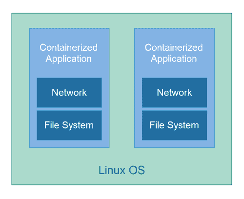
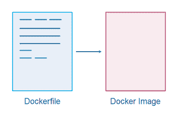
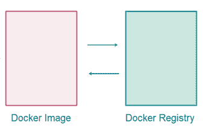

# 坞站教程

> 原文：<https://jenkov.com/tutorials/docker/index.html>

Docker 是一种将应用和服务器配置打包成 Docker *映像*的简单方法，它使用一种简单的打包规范，称为 Dockerfile。然后 *Docker* *镜像*可以在你想要的任何情况下启动。Docker 映像的每个运行实例被称为一个 *Docker* *容器*这个 Docker 教程解释了什么是 Docker 映像、容器和 Docker 文件，如何创建、运行和发布它们等等。

## 码头工人福利

使用 docker 文件将应用程序及其服务器配置打包的最大好处是:

*   您不会忘记您的服务器是如何配置的。档案员会为你记住这一点。
*   您可以在新的 Docker 主机上轻松运行您的应用程序。只需将应用程序的 Docker 映像部署到 Docker 主机上，并启动它。都是自动化的。
*   像 Kubernetes 和 Docker Swarm 这样的集群工具可以很容易地为你管理集群中的 Docker 容器。
*   很多云平台都可以轻松部署 Docker 容器。因此，Docker 是一种更加独立于云的简单方法。
*   Docker 容器是客户在自己的服务器上安装应用程序的一种简单方式。

## 什么是 Docker 容器？

Linux 操作系统有几个特性允许在操作系统(OS)上运行的应用程序的容器化。这些容器化特性提供了分离容器化应用程序的文件系统和网络的能力。换句话说，一个容器化的应用程序不能访问另一个容器化的应用程序的文件系统或网络，除非您明确允许。Docker 使用这些 Linux 容器化特性，并通过一套易于使用的工具来公开它们。

## Docker 容器与虚拟机

Docker 容器本质上类似于虚拟机。但是，虚拟机在总堆栈中有一个额外的操作系统。虚拟机有一个虚拟机操作系统，然后虚拟机运行在某台也有自己的操作系统的计算机上。

另一方面，Docker 容器没有自己的内部操作系统。容器直接在主机 Linux 操作系统中运行。因此，Docker 容器的大小更小，因为它不包含整个 VM OS。Docker 容器也可以执行得更好，因为不需要虚拟化虚拟机。

## Dockerfile

如前所述，您通过一个特殊的文件来指定 Docker 容器中包含的内容，这个文件按照惯例称为 *Dockerfile* 。Docker 文件包含一组由 Docker 命令行工具执行的 Docker 指令。结果是一个 Docker 图像。Dockerfile 在 [Dockerfile 教程](dockerfile.html)中有更详细的解释。

## Docker 图像

当 Docker 命令行工具执行 Docker 文件中的指令时，命令行工具会产生一个 *Docker 映像*。一个 *Docker 映像*是 Docker 容器的一个可移植的、可执行的配方。Docker 映像包含运行相应 Docker 容器所需的所有文件和指令。可以从同一个 Docker 映像启动多个 Docker 容器。

## 坞站注册表

Docker 图像可以存储在 Docker 注册表中。Docker 注册表是一个 Docker 图像存储库，Docker 图像可以上传到这里，也可以从这里下载。Docker 注册可以是私有的，也就是说只有你、你的组织或者你授权的任何人可以访问，也可以是公共的，也就是说任何人都可以访问它——或者至少可以从它那里下载 Docker 图像。

一个公共的 Docker 注册表是一个很好的方式来允许你的软件的潜在用户下载，安装和运行软件。只需将您的应用程序打包成 Docker 映像，上传到公共 Docker 注册表，您的用户就可以访问它。

Docker 公司将 Docker 注册中心作为一项服务来托管。他们有公共和私人码头注册可用。一些云提供商，如 AWS、Azure 和 Google 也有 Docker 注册表，您也可以使用它来上传您的 Docker 映像，以便轻松部署到他们云基础架构上的虚拟机或 Kubernetes 集群上。

## Docker 命令行工具

当您在计算机上安装 Docker 时，Docker 命令行工具会随 Docker 一起提供。Docker 命令行工具可以从 Docker 文件构建 Docker 映像，将 Docker 映像上传到远程 Docker 注册表，从远程 Docker 注册表下载 Docker 映像，以及从 Docker 映像启动和停止 Docker 容器。

## 复合坞站

Docker Compose 特性使您能够将多个 Docker 容器“链接”到一个“组合”中，这个组合可以一次性安装/部署和启动。例如，一个 Docker 容器中的应用程序和另一个 Docker 容器中的数据库——如果两个 Docker 容器都是应用程序运行所必需的。