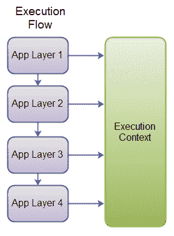
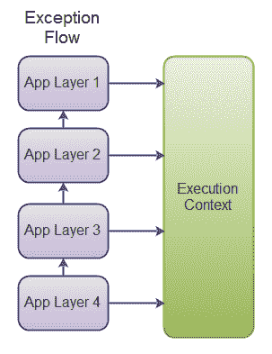

# 执行上下文

> 原文：<https://jenkov.com/tutorials/exception-handling-strategies/execution-context.html>

执行上下文是异常处理模板中描述的`AppException`和`ErrorInfo`的替代或补充。

如 AppException 上的文本所示，当上下文信息向上传播到应用程序顶部时，您可以在`AppException`中收集上下文信息。该上下文信息存储在`ErrorInfo`列表中。

在这篇文章中，我将向你展示一个替代方案，或者一个补充，叫做“执行上下文”。

执行上下文是附加到当前执行线程的对象。例如，将执行上下文对象存储在一个`ThreadLocal`变量中，或者将它映射到一个静态可用的`Map`中的线程。

因此，在应用程序的任何级别，您都可以将执行上下文信息写入执行上下文对象。您可以在执行向下流动时这样做，如下所示:

<center>

|  |
| **执行流——调用执行上下文。** |

</center>

还可以在异常沿调用堆栈向上传播时写入执行上下文，如下所示:

<center>

|  |
| **异常传播流程——调用执行上下文。** |

</center>

可以想象，执行上下文对象可以包含执行上下文信息，不管请求是成功还是失败。您可以将执行上下文对象视为“执行日志”。无论请求是失败还是成功，这个执行日志都包含与请求处理相关的所有信息，前提是您的应用程序将这些信息写入其中。

当一个请求被成功处理时，您可以将整个执行上下文对象写入一个日志文件，作为一个单一的、连贯的结构(例如 XML)。或者，您可以忽略它，并清除上下文。

类似地，当请求失败时，您可以将完整的执行上下文对象以及异常中包含的任何相关信息写入日志文件。

## 利益

将执行上下文与`AppException`一起使用的好处是，与单独使用`AppException`相比，您可以获得更多关于执行的信息。

关于执行的额外信息可能无法让您更好地确定异常的类型和严重性。但是，在记录错误时，您也可以记录执行上下文。当试图理解异常发生的原因时，这可能对开发人员有所帮助。

## 缺点

使用执行上下文的一个缺点是，你的代码会因为大量的对执行上下文的小调用而变得混乱。此外，不能保证记录的信息确实有助于开发人员诊断错误。这完全取决于如何使用执行上下文，以及在调用中包含什么信息。

## 简单的执行上下文实现

让我们看看如何实现一个简单的执行上下文。它被实现为一个名为`ExecutionContext`的类，将所有对它的调用保存在一个列表中。因此，执行路径是平坦的。您看不到代码中执行路径所遵循的真正的树状结构。

```
public class ExecutionContext {

  protected String contextId  = null;
  protected String locationId = null;
  protected Object details    = null;

  protected static Map<Thread, List<ExecutionContext>> executionContexts =
    new ConcurrentHashMap<Thread, List<ExecutionContext>>();

  public static void log(String contextId, String locationId,
      Object details){

    List<ExecutionContext> executionContextListForThread =
          getExecutionContext();

    ExecutionContext executionContext = new ExecutionContext();
    executionContext.contextId  = contextId;
    executionContext.locationId = locationId;
    executionContext.details    = details;

    executionContextListForThread.add(executionContext);
  }

  public static void clearExecutionContext() {
    getExecutionContext().clear();
  }

  public static List<ExecutionContext> getExecutionContext() {

    List<ExecutionContext> executionContextListForThread =
            executionContexts.get(Thread.currentThread());

    if(executionContextListForThread == null){

        executionContextListForThread =
            new ArrayList<ExecutionContext>();

        executionContexts.put(Thread.currentThread(),
              executionContextListForThread);
    }

    return executionContextListForThread;
  }
}

```

下面是如何使用它的一个简单示例:

```
public class ExecutionContextExample {

  public static void main(String[] args) {

    ExecutionContext.log("ExecutionContextExample", "main", null);

    try {
      level1();
    } catch(AppException e){
      log(e);
      log(ExecutionContext.getExecutionContext());
    }

  }

  private static void level1() throws AppException {
    ExecutionContext.log("ExecutionContextExample", "level1", null);
    level2();
  }

  private static void level2() throws AppException{
    try {

      ExecutionContext.log("ExecutionContextExample", "level2-1", null);
      level3();
      ExecutionContext.log("ExecutionContextExample", "level2-2", null);

    } catch (Throwable t){

      AppException appException = new AppException();
      ErrorInfo errorInfo = appException.addInfo();
      errorInfo.setCause(t);

      //... fill more data into ErrorInfo object.

     ExecutionContext.log("ExecutionContextExample", "level-2-error",
         errorInfo);

      throw appException;

    }
  }

  private static void level3() throws Exception {
    ExecutionContext.log("ExecutionContextExample", "main", null);
  }

  private static void log(List<ExecutionContext> executionContext) {
    //log execution context list to file. Perhaps as an XML structure.
  }

  private static void log(AppException e) {
    //log AppException to file. Perhaps as an XML structure.
  }

}

```

注意每个方法(`level1()`到`level3()`)是如何调用`ExecutionContext`的。还要注意`ExecutionContext`列表现在是如何记录的，以防出现异常。

## 高级执行上下文实施

先前的`ExecutionContext`实现只保存了一个写入其中的执行上下文信息的平面列表。执行路径实际上是一个树形结构，而不是一个平面列表。所以我开发了一个`ExecutionContextTree`类，可以包含这些信息。

为了正确收集执行树路径，现在必须使用两种方法而不是一种:

```
ExecutionContextTree.pre("contextId", "locationId", null);

ExecutionContextTree.post();

```

调用`pre()`创建一个新节点，并将其附加到父节点(如果有的话)。在此之后对`pre()`的任何调用都将导致新节点被附加到新创建的节点。

调用`post()`删除执行树中作为当前父节点的节点。对`pre()`的下一个调用现在会将一个节点附加到刚刚作为父节点移除的节点的父节点。

代码如下:

```
public class ExecutionContextTree {

    public static class ExecutionContextNode {

        public String contextId  = null;
        public String locationId = null;
        public Object details    = null;

        public ExecutionContextNode   parent   = null;
        public List<ExecutionContextNode> children =
            new ArrayList<ExecutionContextNode>();
    }

    protected static Map<Thread, ExecutionContextNode> roots          =
        new ConcurrentHashMap <Thread,ExecutionContextNode>();

    protected static Map<Thread, ExecutionContextNode> currentParents =
        new ConcurrentHashMap<Thread, ExecutionContextNode>();

    public static void pre(String contextId, String locationId,
            Object details){

        Thread currentThread = Thread.currentThread();
        ExecutionContextNode node = new ExecutionContextNode();
        if(roots.get(currentThread) == null) {
            roots.put(currentThread, node);
        }

        node.contextId  = contextId;
        node.locationId = locationId;
        node.details    = details;

        node.parent = currentParents.get(currentThread);
        if(node.parent != null){
            node.parent.children.add(node);
        }
        currentParents.put(currentThread, node);
    }

    public static void post(){
        Thread currentThread = Thread.currentThread();
        ExecutionContextNode node = currentParents.get(currentThread);
        if(node.parent != null){
            currentParents.put(currentThread, node.parent);
        } else {
            //remove top node from currentParents and from root,
            // root was removed so there are no more parents or root.
            currentParents.remove(currentThread);
            roots.remove(currentThread);
        }
    }

    public static ExecutionContextNode root() {
        return roots.get(Thread.currentThread());
    }

    public static void clear() {
        roots.remove(Thread.currentThread());
        currentParents.remove(Thread.currentThread());
    }

}

```

下面是一个如何使用这个`ExecutionContextTree`的例子:

```
public class ExecutionContextTreeExample {

  public static void main(String[] args) {
    try {
      ExecutionContextTree.pre("ExecutionContextExample", "main", null);
      level1();
      ExecutionContextTree.post();

      ExecutionContextTree.clear();

    } catch(AppException e){
      log(e);
      log(ExecutionContextTree.root());
    }
      log(ExecutionContextTree.root());
    }

  private static void level1() throws AppException {
    ExecutionContextTree.pre("ExecutionContextExample", "level1", null);
    level2();
    ExecutionContextTree.post();
  }

  private static void level2() throws AppException{
    try {
      ExecutionContextTree.pre("ExecutionContextExample", "level2-1",
            null);

      level3();
      ExecutionContextTree.post();

    } catch (Throwable t){

      AppException appException = new AppException();
      ErrorInfo errorInfo = appException.addInfo();
      errorInfo.setCause(t);

      //... fill more data into ErrorInfo object.

      ExecutionContextTree.pre("ExecutionContextExample", "level-2-error",
            errorInfo);
      ExecutionContextTree.post();

      throw appException;
    }
  }

  private static void level3() throws Exception {
    ExecutionContextTree.pre("ExecutionContextExample", "Level-3", null);
    ExecutionContextTree.post();
  }

  private static void log(AppException e) {
    //log AppException to file. Perhaps as an XML structure.
  }

  private static void log(
    ExecutionContextTree.ExecutionContextNode executionContextRoot) {

    //log execution context list to file. Perhaps as an XMl structure.

    ExecutionContextTree.ExecutionContextNode node =
          ExecutionContextTree.root();

  }

}

```

注意`pre()`和`post()`呼叫是如何配对的。

还要注意如果没有异常发生，如何清除`ExecutionContextTree`,如果发生异常，如何记录。

### 使用 AOP 插入 pre()和 post()调用

正如您所看到的，pre()和 post()调用经常被插入到方法调用的开始和结尾。如果您必须手动操作，那么在每个方法内部都要做大量的工作。幸运的是，这种任务正是我们面向方面编程(AOP)所要做的。

但是请记住，您可能不需要整个上下文树都可以用于调试。小心使用`ExecutionContextTree`。收集有意义的信息，忽略一些较小的细节。

当然，很难准确预测在调试过程中哪些细节变得重要，因为您无法提前准确知道将会出现哪些错误。在调试过程中，您可能需要添加更多对`ExecutionContextTree`的调用来获取您需要的所有信息。