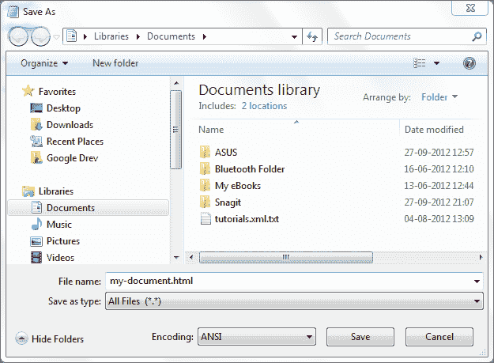

# 创建你的第一个 HTML 文档

> 原文：<https://jenkov.com/tutorials/html4/creating-a-html-document.html>

要创建你的第一个 html 文档，你需要打开你最喜欢的文本编辑器。如果您使用的是 Windows，这可能是记事本或写字板。如果你用的是 Mac，可能是文本编辑。

将以下文本复制到文本文档中:

```
<!DOCTYPE HTML PUBLIC "-//W3C//DTD HTML 4.01//EN"
    "http://www.w3.org/TR/html4/strict.dtd">
<html>
<head>
    <title>Page Title</title>
</head>
<body>
    Visible Page Content
</body>
</html>

```

保存文档，并给它一个以`.html`结尾的名称。例如，`my-document.html`可能是文件名。

在浏览器中打开文件。这通常可以通过简单地双击文件来完成。现在你应该在浏览器中看到文本`Visible Page Content`。

## Windows 用户注意事项

如果您使用 windows，并使用记事本创建 HTML 文档，您需要确保在“另存为”对话框的“保存类型”下拉框中选择“所有文件”。如果没有，记事本将追加一个“.”。txt”转换为您的文件的文件名。然后，Windows 会将该文件识别为文本文件，而不是 HTML 文件。

以下是记事本“另存为”对话框的屏幕截图，其中选择了“所有文件”项:

|  |
| **在 Windows 上从记事本保存 HTML 文档。** |