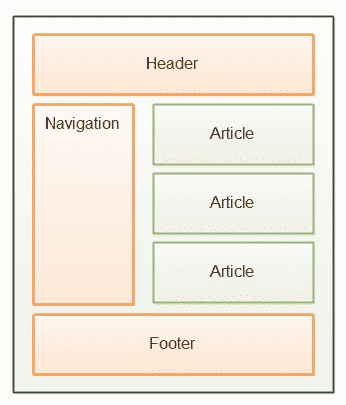

# HTML5 文章元素

> 原文：<https://jenkov.com/tutorials/html5/article.html>

HTML5 `article`元素用于语义标记页面的主要内容部分。

一个 HTML5 页面可能包含主要内容的多个独立部分。例如，博客网站可能包含一个页面，其中有多个博客帖子。在这种情况下，每篇博客文章都将包含在自己的`article`元素中。另一个例子是新闻网站上的个别新闻文章。

下面是一个包含多个内容部分的页面的图示:

|  |
| 一个 HTML5 页面的主要内容部分。 |

下面是它在 HTML5 代码中的样子:

```
    <html>
    <body>
      <header>
          Logo etc.
          <nav>
              <a href="page1.html">Page 1</a>
              <a href="page2.html">Page 2</a>
              <a href="page3.html">Page 3</a>
          </nav>
      </header>

        <nav>
            <a href="subpage1.html">SubPage 1</a>
            <a href="subpage2.html">SubPage 2</a>
            <a href="subpage3.html">SubPage 3</a>
        </nav>

        <article>
            <p>Main content section 1</p>
        </article>

        <article>
            <p>Main content section 2</p>
        </article>

        <footer>...</footer>

    </body>
    </html>

```

记住`article`元素是一个语义元素。它没有任何特别的外观。尽管如此，您仍然可以使用 CSS 对其进行样式化，就像您可以使用`div`元素一样。

还要记住，作为一个语义元素，你不必把一个`article`元素放到你的页面中。元素旨在被未来的智能浏览器(也许)和网络爬虫等使用。但是不能保证这些软件组件将如何使用这些元素。只有未来会告诉我们。

## 主要内容标题

如果你的主要内容部分有标题行或其他标题信息(出版日期、作者等)。)，该内容放在`article`元素中。这里有一个例子:

```
<article>
    <h2>Title</h2>
    <p>Main content section 1</p>
</article>

```