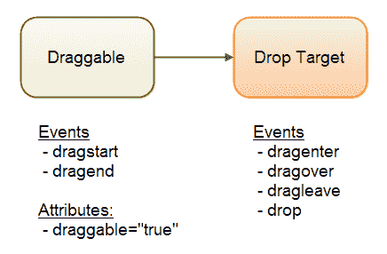

# HTML5 拖放

> 原文：<https://jenkov.com/tutorials/html5/drag-and-drop.html>

在 HTML5 中，可以在 HTML 页面中拖放 HTML 元素。通过 JavaScript 事件侦听器，您可以决定当用户拖放元素时会发生什么。

在拖放过程中，HTML 元素可以扮演两个角色:

1.  可拖动的
2.  投放目标/投放区域。

draggable 元素是用户应该能够在 HTML 页面上拖动并放到某个地方的元素，以便发生一些动作。这可以是一个或多个元素。

拖放目标或拖放区是可拖动元素被拖放到的元素。

## 拖放事件

要控制拖放 HTML 元素时会发生什么，您需要执行 3 个步骤:

1.  将 HTML 元素设置为可拖动。
2.  将事件侦听器附加到可拖动的 HTML 元素
3.  将事件侦听器附加到放置目标 HTML 元素

事件和属性如下所示:



首先，在 HTML 元素上设置`draggable="true"`属性，使其可拖动。

其次，在可拖动元素上为`dragstart`和`dragend`事件附加事件监听器。在这些事件侦听器中，您可以实现当用户开始拖动元素以及拖动结束时将会发生什么。

第三，在 drop target 元素上附加事件侦听器。您可以收听的事件有`dragenter`、`dragover`、`dragleave`和`drop`。

当用户将可拖动对象拖动到放置目标上时，触发`dragenter`事件。此事件仅在可拖动元素从外部变为上方时触发，这通常由鼠标光标的位置决定。

一旦可拖动元素在放置目标上，就会触发`dragover`事件，并且只要可拖动元素被拖动到放置目标上，事件就会一直触发。

如果用户再次将可拖动对象拖出放置目标，则触发`dragleave`事件。

如果用户将可拖动对象放到放置目标上，就会触发`drop`事件。

## 拖放事件示例

这是一个你可以尝试的例子。尝试将 HTML5 徽标拖动到拖放目标上，看看会发生什么。尝试拖放图像，然后再次将其拖出。

Drop element heredragstart: dragend: dragenter: dragover: dragleave: drop: 

## 拖放代码

让我们看看如何处理拖放事件。为了看到这一点，我们将首先创建一个可以拖动的元素。下面是它的 HTML 代码:

```


```

一旦我们有一个可拖动的元素，我们需要一个拖放目标。我将使用一个`<div>`元素:

```
<div id="droptarget1" style="width: 200px; height: 200px;">Drop here</div>

```

一旦我们有了 draggable 元素和 drop target 元素，我们需要附加事件侦听器。以下是相关的 JavaScript 代码:

```
<script>
    var draggable = document.getElementById("draggable1");

    draggable.addEventListener('dragstart', dragStart, false);
    draggable.addEventListener('dragend'  , dragEnd  , false);

    var droptarget = document.getElementById("droptarget1");

    droptarget.addEventListener('dragenter', dragEnter  , false);
    droptarget.addEventListener('dragover' , dragOver   , false);
    droptarget.addEventListener('dragleave', dragLeave  , false);
    droptarget.addEventListener('drop'     , drop       , false);

    /* Draggable event handlers */
    function dragStart(event) {
        event.dataTransfer.setData('text/html', "You dragged the image!");
    }

    function dragEnd(event) {
    }

    /* Drop target event handlers */
    function dragEnter(event) {
    }

    function dragOver(event) {
        event.preventDefault();
        return false;
    }

    function dragLeave(event) {
    }

    function drop(event) {
        var data = event.dataTransfer.getData('text/html');
        event.preventDefault();
        return false;
    }
</script>

```

`dragStart()`函数调用`event.dataTransfer.setData()`来设置当元素被放下时传输到放下目标的数据。无论您需要什么数据来正确地完成拖放操作，请在这里设置它。您设置了数据及其 mime 类型。

dragOver()和`drop()`事件处理程序都调用`event.preventDefault()`并返回 false。这是使拖放正常工作所必需的。浏览器可能有一些默认的拖放行为，您需要禁用这些行为以使您的代码工作。

还要注意的是，`drop()`事件处理函数通过调用`event.dataTransfer.getData()`来读取`dragStart()`中的数据集。它将数据的 mime 类型作为参数传递，以正确提取数据。

这就是在 HTML5 中实现拖放所需的全部内容。正如我们将在下一节中看到的，您可以使它看起来更令人愉快。

## 视觉反馈

您可以使用拖放事件处理函数为用户提供更明确的视觉反馈。

首先，您可以标记被拖动的元素，以便用户可以看到他或她正在拖动哪个元素。如果多个元素看起来一样，并且它们都可以被拖动，那么用户很容易看到哪个元素被拖动了。您可以这样做来响应`dragstart`事件。这里有一个例子:

```
var draggable = document.getElementById("draggable1");

draggable.addEventListener('dragstart', dragStart, false);

function dragStart(event) {
    event.dataTransfer.setData('text/html', "You dragged the image!");
    event.target.style.border = "1px solid #cccccc";
}

```

拖动结束后，我们希望再次移除边框。这是为了响应`dragend`事件。这是如何做到的:

```
var draggable = document.getElementById("draggable1");

draggable.addEventListener('dragstart', dragStart, false);
draggable.addEventListener('dragend'  , dragEnd, false);

function dragStart(event) {
    event.dataTransfer.setData('text/html', "You dragged the image!");
    event.target.style.border = "1px solid #cccccc";
}

function dragEnd(event) {
    event.target.style.border = "none";
}

```

现在，用户将获得视觉反馈，显示哪个元素正在被拖动。

我们还希望向用户展示，当可拖动元素被拖动到拖放目标上时，可以拖放该元素。我们将再次改变元素的边界。我们将这样做以回应`dragenter`、`dragleave`和`drop`事件。这是如何做到的:

```
    var droptarget = document.getElementById("droptarget1");

    droptarget.addEventListener('dragenter', dragEnter  , false);
    droptarget.addEventListener('dragleave', dragLeave  , false);
    droptarget.addEventListener('drop'     , drop       , false);

    /* Drop target event handlers */
    function dragEnter(event) {
        event.target.style.border = "2px dashed #ff0000";
    }

    function dragLeave(event) {
        event.target.style.border = "none";
    }
    function drop(event) {
        event.target.style.border = "none";
        event.preventDefault(); // don't forget this!
    }

```

现在，当可拖动元素被拖动到拖放目标上时，拖放目标的边框将变成绿色虚线。当可拖动元素再次被拖出时，或者如果该元素被放在放置目标上，边框将被移除。

上面的例子没有显示`dragOver()`事件处理函数，但是确保你添加了它来防止默认的浏览器行为。

以下是添加视觉反馈后的完整代码:

```
<script>
    var draggable = document.getElementById("draggable1");

    draggable.addEventListener('dragstart', dragStart, false);
    draggable.addEventListener('dragend'  , dragEnd  , false);

    var droptarget = document.getElementById("droptarget1");

    droptarget.addEventListener('dragenter', dragEnter  , false);
    droptarget.addEventListener('dragover' , dragOver   , false);
    droptarget.addEventListener('dragleave', dragLeave  , false);
    droptarget.addEventListener('drop'     , drop       , false);

    /* Draggable event handlers */
    function dragStart(event) {
        event.dataTransfer.setData('text/html', "You dragged the image!");
        event.target.style.border = "1px solid #cccccc";
    }

    function dragEnd(event) {
        event.target.style.border = "none";
    }

    /* Drop target event handlers */
    function dragEnter(event) {
        event.target.style.border = "2px dashed #ff0000";
    }

    function dragOver(event) {
        event.preventDefault();
        return false;
    }

    function dragLeave(event) {
        event.target.style.border = "none";
    }

    function drop(event) {
        event.target.style.border = "none";
        var data = event.dataTransfer.getData('text/html');
        event.preventDefault();
        return false;
    }
</script>

```

### DataTransfer 对象、effectsAllowed、dropEffect 和 setDragImage()

您可以使用`DataTransfer`对象增加拖放操作期间给用户的视觉反馈。`DataTransfer`对象有两个属性和一个函数可以用于这个目的。这些是:

*   允许的效果
*   落差效应
*   setDragImage()

您可以访问`dragstart`和`drop`事件对象中的`DataTransfer`对象。下面是一个示例`dragstart`监听器函数，它在`DataTransfer`对象上设置了`effectsAllowed`属性:

```
 function dragStart(event) {
    event.dataTransfer.effectsAllowed = "copy";
    event.dataTransfer.setData('text/html', "You dragged the image!");
    event.target.style.border = "1px solid #cccccc";
}

```

浏览器使用`effectsAllowed`属性来改变鼠标光标，以显示拖放元素时执行的操作。通常，当拖动的元素位于放置目标上时，鼠标光标会发生变化。以前没有。`effectsAllowed`属性的有效值为:

*   没有人
*   复制
*   移动
*   复制移动
*   环
*   链接移动
*   复制链接
*   全部
*   未初始化

`dropEffect`应该向用户(通过光标)显示当鼠标悬停在拖放目标上时会发生什么，但在撰写本文时(2014 年 2 月),浏览器似乎忽略了这一点。`dropEffect`属性的有效值为:

*   没有人
*   复制
*   环
*   移动

`setDragImage(image, x, y)`函数可以用来设置用户拖动元素时浏览器显示的图像。默认情况下，浏览器显示原始元素的半透明副本，但是如果您想要不同的图像，可以使用此功能设置不同的图像。`x`和`y`属性可用于设置图像显示时的位置偏移。默认情况下，拖动图像的左上角位于鼠标指针的尖端。通过设置不同的`x`和`y`属性，你可以改变这一点。您可以使用正或负的`x`和`y`偏移。

下面是一个代码示例，展示了如何在`dragStart()`事件监听器函数中设置拖动图像:

```
function dragStart(event) {
    event.dataTransfer.effectAllowed  = "all";
    event.dataTransfer.dropEffect     = "copy";

    var dragImage = document.createElement('img');
    dragImage.src = dragImageUrl;
    dragImage.width = 75;
    event.dataTransfer.setDragImage(dragImage, 0, 0); 
    event.dataTransfer.setData('text/html', "You dragged the image!");
    event.target.style.border = "1px solid #cccccc";
}

```

这是一个让你在`DataTransfer`对象上玩各种设置的例子。尝试更改`effectsAllowed`并拖动图像，看看当您将 HTML5 徽标向下拖动到`div`拖放目标上时会发生什么。

<select id="effectAllowed"><option value="none">effectAllowed options</option> <option value="none">none</option> <option value="copy">copy</option> <option value="copyLink">copyLink</option> <option value="move">move</option> <option value="copyMove">copyMove</option> <option value="link">link</option> <option value="linkMove">linkMove</option> <option value="all">all</option> <option value="uninitialized">uninitialized</option></select> <select id="dropEffect"><option value="none">dropEffect options</option> <option value="none">none</option> <option value="copy">copy</option> <option value="move">move</option> <option value="link">link</option></select> <select id="dragImage"><option value="none">dragImage options</option> <option value="none">none</option> <option value="http://jenkov.com/images/screenshots/tutorials-screenshot.png">Screenshot</option> <option value="http://tutorials.jenkov.com/images/layout/small-portrait_mini.jpg">Portrait</option></select>
Drop here

## 将文件拖入浏览器

可以将文件从文件系统拖动到浏览器中，并从 JavaScript 中读取被拖动文件的名称和内容。你可以通过 [HTML5 文件 API](file-api.html) 来实现。下面是一个拖放目标侦听器，它检测被拖动文件的文件名:

```

var droptarget2 = document.getElementById("droptarget2");
droptarget2.addEventListener('drop'     , drop       , false);

function drop(event) {

    // Files - array of dragged files.
    var files = event.dataTransfer.files;

    for(var i= 0; i < files.length; i++){
        var file = files[i];
        console.log("file: " + file.name);
    }

    event.preventDefault();
    return false;
}

```

注意`drop()`函数并不调用`getData()`函数，而是访问`DataTransfer`的`files`属性。`files`属性包含了被拖入浏览器的文件列表。要了解如何读取这些文件，请参考 HTML5 文件 API(我很快会写出来)。

你可以在我的 [HTML5 文件 API 教程](file-api.html)中了解更多关于如何访问拖动的文件。