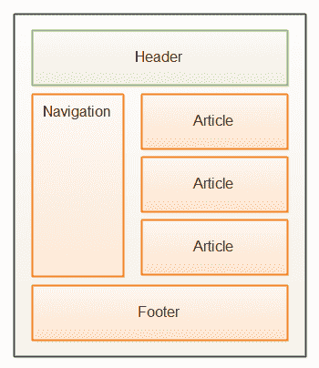
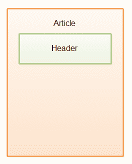

# HTML5 标题元素

> 原文：<https://jenkov.com/tutorials/html5/header.html>

HTML5 `header`元素用于语义标记页面的标题部分，或者页面的各个部分。例如，包含博客帖子或文章列表的页面可能具有整个页面的标题部分，以及每个博客帖子/文章的标题部分。

下图说明了 HTML5 页面的标题部分通常位于何处:

|  |
| HTML5 页面的标题部分。 |

下面是它在 HTML 代码中的样子:

```
<html>
<body>
    <header>
        <div>
            Logo, logo text, top navigation links etc.
        </div>
    </header>
</body>
</html>

```

记住`header`元素是一个语义元素。它没有任何特别的外观。尽管如此，您仍然可以使用 CSS 对其进行样式化，就像您可以使用`div`元素一样。

还要记住，作为一个语义元素，你不必把一个`header`元素放到你的页面中。元素旨在被未来的智能浏览器(也许)和网络爬虫等使用。但是不能保证这些软件组件将如何使用这些元素。只有未来会告诉我们。

## 文章元素中的标题元素

一个`article`元素也可以有一个 header 部分，它也可以包含在一个`header`元素中。下图显示了带有标题部分的`article`元素:

|  |
| HTML5 页面中文章元素的标题部分。 |

下面是它在 HTML5 代码中的样子:

```
    <html>
    <body>
        <header>
            <div>
                Logo, logo text, top navigation links etc.
            </div>
        </header>

        <article>
            <header>
                Title, author, rating buttons etc. related to this article.
            </header>
            <p>
                Article text...
            </p>
        </article>
    </body>
    </html>

```