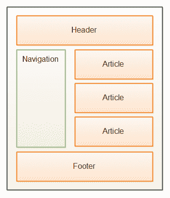
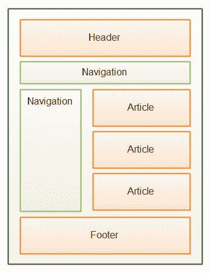

# HTML5 导航元素

> 原文：<https://jenkov.com/tutorials/html5/nav.html>

HTML5 `nav`元素用于语义标记页面的导航部分。

一个页面可能包含不止一个`nav`部分。例如，在页面的标题栏中可能有一个站点范围的导航菜单，在页面的左侧有一个内容相关的导航菜单。下图展示了这两个常见的导航部分:

|  |
| HTML5 页面的导航部分。 |

下面是它在 HTML5 中的样子:

```
<html>
<body>
  <header>
      Logo etc.
      <nav>
          <a href="page1.html">Page 1</a>
          <a href="page2.html">Page 2</a>
          <a href="page3.html">Page 3</a>
      </nav>
  </header>

    <nav>
        <a href="subpage1.html">SubPage 1</a>
        <a href="subpage2.html">SubPage 2</a>
        <a href="subpage3.html">SubPage 3</a>
    </nav>

    <article> ...</article>

    <footer>...</footer>

</body>
</html>

```

导航部分不必像上面的例子那样在标题部分内。导航部分也可以紧跟在标题部分之后，如下所示:

|  |
| HTML5 页面的导航部分。 |

下面是它在 HTML5 代码中的样子:

```
<html>
<body>
  <header>
      Logo etc.
  </header>

    <nav>
        <a href="page1.html">Page 1</a>
        <a href="page2.html">Page 2</a>
        <a href="page3.html">Page 3</a>
    </nav>

    <nav>
        <a href="subpage1.html">SubPage 1</a>
        <a href="subpage2.html">SubPage 2</a>
        <a href="subpage3.html">SubPage 3</a>
    </nav>

    <article> ...</article>

    <footer>...</footer>

</body>
</html>

```

记住`nav`元素是一个语义元素。它没有任何特别的外观。尽管如此，您仍然可以使用 CSS 对其进行样式化，就像您可以使用`div`元素一样。

还要记住，作为一个语义元素，你不必把一个`nav`元素放到你的页面中。元素旨在被未来的智能浏览器(也许)和网络爬虫等使用。但是不能保证这些软件组件将如何使用这些元素。只有未来会告诉我们。