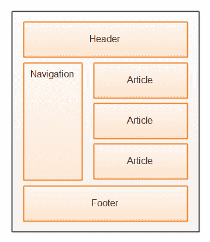

# HTML5 语义元素

> 原文：<https://jenkov.com/tutorials/html5/semantic-elements.html>

HTML5 有一组添加了语义的新元素。这些元素被称为语义元素。这篇文章将向你概述这些语义元素。以下是本文涵盖的主题列表:

普通的 HTML4 元素通常用于表示目的——例如，绘制表格、将文本分成段落、创建标题等。换句话说，HTML 元素通常用于控制 HTML 页面的格式和结构。

HTML4 元素没有说明元素内部内容的含义。浏览器和网络爬虫(搜索引擎)无法辨别表格或段落中的文本是文章、博客文章、导航部分等的一部分。这就是 HTML5 中加入语义元素的原因。

语义元素用来告诉 HTML5 页面中内容的语义含义。元素仍然可以通过 CSS 进行样式化，但是元素本身不包含任何样式。

## 博客和文章网站

很多网站都有博客文章或文章。或者，在物品形状中包含关于例如产品、服务或公司的信息。此类页面的结构通常如下:

|  |
| 新 HTML5 语义元素旨在解决的通用 HTML 页面结构。 |

HTML5 中添加了四个新元素来标记 HTML 页面的这些部分。这些要素是:

*   页眉
*   页脚
*   文章
*   航行

这些元素将在下面简要介绍，更详细的内容将在它们自己的页面上提供。

## 页眉和页脚

添加的前两个语义元素是`header`和`footer`元素。这些元素用于标记:

*   页面的页眉和页脚部分
*   页面上的单个博客帖子的页眉和页脚部分。

页面的页眉和页脚部分通常是页面的顶栏(页眉)和底栏(页脚)。

## 航行

元素用来标记页面的导航部分。一个页面可以有多个导航部分。例如，页面可以在页面标题(顶部栏)中包含一个高级菜单，在页面左侧包含一个与页面内容相关的子菜单。

## 文章

`article`元素用于标记页面的主要内容。例如，如果一个页面包含一篇博客文章，那么博客文章的标题和文本将包含在一个`article`元素中。

如果一个页面包含多个博客文章或评论，那么每个博客文章或评论都可以包含在自己的`article`元素中。

## 时间

元素用于向用户显示日期和时间信息。

`time`元素还包含一个名为`datetime`的属性，您可以在其中指定机器可读版本的显示日期和时间。浏览器和网络爬虫可以使用机器可读版本来提取与页面上的内容相关的日期和时间信息。

在关于 [HTML5 时间元素](time.html)的文本中更详细地介绍了`time`元素。