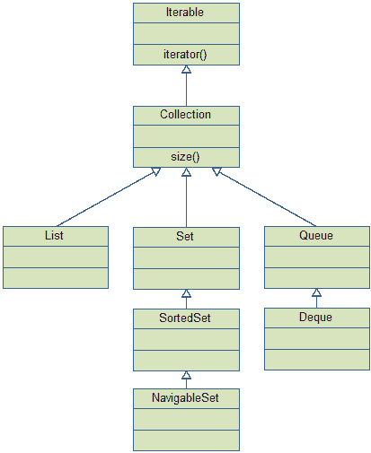
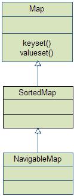

# Java 集合-概述

> 原文：<https://jenkov.com/tutorials/java-collections/overview.html>

为了理解和有效地使用 Java Collections API，对它包含的接口有一个概述是很有用的。这就是我将在这里提供的。

有两组接口:`Collection`和`Map`

以下是`Collection`界面层级的图形概述:

这里是`Map`界面层次的图形概述:

您可以在本页右上角的子菜单中找到大多数(如果不是全部)这些接口和实现的解释链接。这个顶级菜单存在于这条线索的所有页面上。