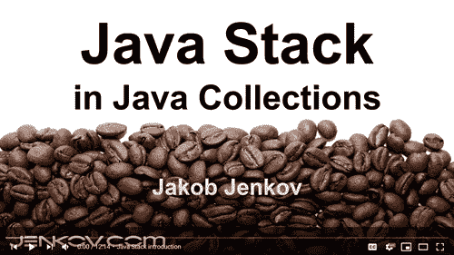

# Java 堆栈

> 原文：<https://jenkov.com/tutorials/java-collections/stack.html>

Java 栈类`java.util.Stack`，是一个经典的栈数据结构。你可以将元素推到一个 *Java* *栈*的顶部，并再次弹出它们，这意味着从栈顶读取并移除元素。

Java `Stack`类实际上实现了 [Java List](list.html) 接口，但是您很少使用`Stack`作为`List`——除非您需要检查当前存储在堆栈中的所有元素。

请注意，Java Stack 类是 Vector 的子类，Vector 是一个较老的 Java 类，它是同步的。这种同步增加了对堆栈所有方法的调用的少量开销。此外，Vector 类使用了 Java 的几个旧的(不再推荐)部分，比如被[迭代器](iterator.html)接口取代的 Enumeration。如果你想避免这些问题，你可以使用一个 [Java 队列](deque.html)作为堆栈。

## Java 堆栈教程视频

如果你更喜欢视频，我这里有一个 Java Stack 教程视频: [Java Stack 教程视频](https://www.youtube.com/watch?v=13uQ8dgqbno&list=PLL8woMHwr36HmQfxqqqxns5GexTNmxFqK&index=7&t=0s)。

[](https://www.youtube.com/watch?v=13uQ8dgqbno&list=PLL8woMHwr36HmQfxqqqxns5GexTNmxFqK&index=7&t=0s "Java Stack Video Tutorial")

## Java 堆栈基础

一个`Stack`是一个数据结构，你可以在栈顶添加元素，也可以从栈顶移除元素。这也被称为“后进先出(LIFO)”原则。相比之下， [Java 队列](queue.html)使用“先进先出(FIFO)”原则，其中元素被添加到队列的末尾，并从队列的开头移除。

## 创建堆栈

要使用 Java `Stack`，您必须首先创建一个`Stack`类的实例。下面是一个创建 Java `Stack`实例的例子:

```
Stack stack = new Stack();

```

## 创建具有泛型类型的堆栈

您可以在堆栈上设置泛型类型，指定堆栈实例可以包含的对象类型。在声明堆栈变量时指定堆栈类型。下面是一个使用泛型类型创建 Java 堆栈的示例:

```
Stack<String> stack = new Stack<String>();

```

上面创建的堆栈只能包含字符串实例。

建议在堆栈实例上使用泛型类型，因为它简化了代码(访问堆栈上的对象时不需要强制转换)，并降低了将错误类型的对象推送到堆栈上的风险。

## 将元素推入堆栈

一旦有了 Java `Stack`实例，就可以将元素推到`Stack`的顶部。推送到`Stack`上的元素必须是 Java 对象。因此，您实际上将对象推送到`Stack`。

您使用 Java 的`push()`方法将元素推送到 Java `Stack`上。下面是一个将元素(对象)推送到 Java `Stack`上的例子:

```
Stack<String> stack = new Stack<String>();

stack.push("1");

```

这个 Java 示例将带有文本`1`的 [Java 字符串](/java/strings.html)推送到`Stack`上。然后字符串`1`被存储在`Stack`的顶部。

## 从堆栈中弹出元素

一旦一个元素被推送到 Java `Stack`上，您就可以再次从`Stack`中弹出该元素。一旦一个元素从`Stack`弹出，该元素就从`Stack`中移除。然后，`Stack`的顶部元素就是在元素弹出之前被推到`Stack`上的任何元素。

使用`pop()`方法从 Java `Stack`中弹出一个元素。下面是一个使用`pop()`方法从`Stack`中弹出一个元素的例子:

```
Stack<String> stack = new Stack<String>();

stack.push("1");

String topElement = stack.pop();

```

一旦一个元素从`Stack`中弹出，这个元素就不再出现在`Stack`中。

## 查看堆栈的顶部元素

Java `Stack`类有一个名为`peek()`的方法，该方法使您能够看到`Stack`上的顶部元素是什么，而无需弹出该元素。下面是一个偷看 Java `Stack`顶部的例子:

```
Stack<String> stack = new Stack<String>();

stack.push("1");

String topElement = stack.peek();

```

运行这个 Java 示例后，`topElement`变量将包含 String 对象`1`，该对象在调用`peek()`之前被推送到`Stack`上。在调用`peek()`之后，字符串对象仍然出现在`Stack`上。

## 搜索堆栈

您可以使用`search()`方法在堆栈上搜索一个对象来获取它的索引。对`Stack`上的每个对象调用对象的`equals()`方法，以确定搜索的对象是否出现在`Stack`上。您得到的索引是从`Stack`的**顶部**开始的索引，这意味着`Stack`顶部的元素的索引为 1。

以下是如何在`Stack`中搜索对象:

```
Stack<String> stack = new Stack<String>();

stack.push("1");
stack.push("2");
stack.push("3");

int index = stack.search("3");     //index = 3

```

## 堆栈大小

您可以通过 Stack `size()`方法获得 Java 堆栈的大小，即当前存储在堆栈中的元素数量。下面是一个通过其`size()`方法获得 Java 堆栈大小的例子:

```
Stack<String> stack = new Stack<String>();

stack.push("1");
stack.push("2");
stack.push("3");

int size = stack.size();

```

运行这段代码后,`size`变量将包含值 3，因为示例中的堆栈在调用其`size()`方法时包含 3 个元素。

## 迭代堆栈的元素

您可以通过从`Stack`获取一个 [Java 迭代器](iterator.html)来迭代 Java `Stack`的元素。通过调用`Stack` `iterator()`方法获得一个迭代器。下面是一个从 Java `Stack`获得`Iterator`并迭代它的例子:

```
Stack<String> stack = new Stack<String>();

stack.push("123");
stack.push("456");
stack.push("789");

Iterator iterator = stack.iterator();
while(iterator.hasNext()){
    Object value = iterator.next();
}

```

## 使用流的进程堆栈

也可以通过 [Java 流 API](/java-functional-programming/streams.html) 处理 Java `Stack`上的元素。首先通过`stream()`方法从`Stack`中获得一个`Stream`来实现。

一旦从`Stack`中获得了`Stream`，就可以处理流中的元素了。下面是一个从`Stack`获取`Stream`并处理元素的例子:

```
Stack<String> stack = new Stack<String>();
stack.push("A");
stack.push("B");
stack.push("C");

Stream stream = stack.stream();

stream.forEach((element) -> {
    System.out.println(element);  // print element
});

```

注意，这个例子使用了一个 [Java Lambda](/java/lambda-expressions.html) 作为`Stream.forEach()`方法的参数。lambda 只是将元素打印到`System.out`

## 使用堆栈反转列表

你可以使用一个 Java `Stack`来反转一个 [Java 列表](list.html)。通过将所有元素从`List`推到`Stack`上，从索引为 0 的元素开始，然后是 1，依此类推。每个元件从`List`上取下，然后推到`Stack`上。一旦所有的元素都在`Stack`上，你就一个接一个地弹出这些元素，并将它们添加回空列表。下面是一个使用 Java `Stack`反转 Java `List`的例子:

```
List<String> list = new ArrayList<String>();
list.add("A");
list.add("B");
list.add("C");
System.out.println(list);

Stack<String> stack = new Stack<String>();
while(list.size() > 0) {
    stack.push(list.remove(0));
}

while(stack.size() > 0){
    list.add(stack.pop());
}

System.out.println(list);

```

## 使用 Java 队列作为堆栈

正如在这篇 Java 栈教程的顶部提到的，你也可以使用一个 [Java 队列](deque.html)作为一个栈。 [Java Deque 教程](deque.html)也展示了如何做到这一点——但我在这里也将展示一个简短的例子:

```
Deque<String> dequeAsStack = new ArrayDeque>String>();

dequeAsStack.push("one");
dequeAsStack.push("two");
dequeAsStack.push("three");

String one   = dequeAsStack.pop();
String two   = dequeAsStack.pop();
String three = dequeAsStack.pop();

```

如您所见，它看起来非常类似于使用常规的 Java 堆栈。

## 堆栈用例

对于某些类型的数据处理来说，`Stack`非常方便，例如，如果您使用 [SAX](/java-xml/sax.html) 或 [StAX](/java-xml/stax.html) 解析 XML 文件。例如，请参见我的 Java XML 教程中的 [Java SAX 示例](/java-xml/sax-example.html)。