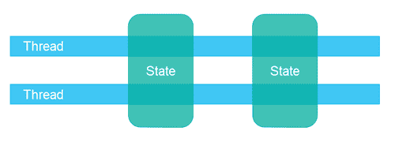
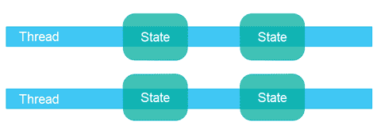
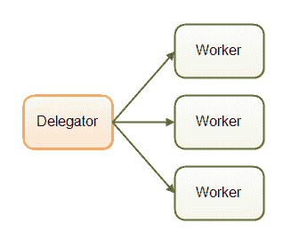
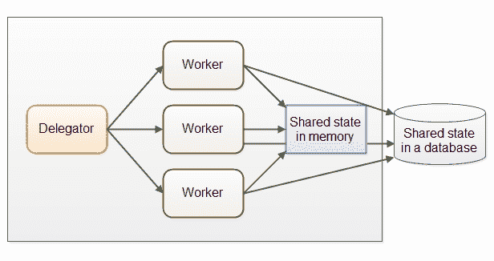
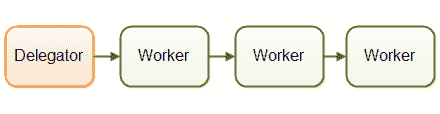
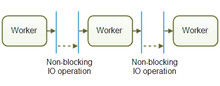
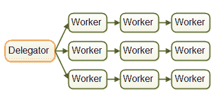
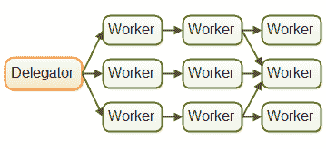
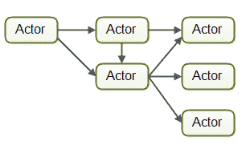
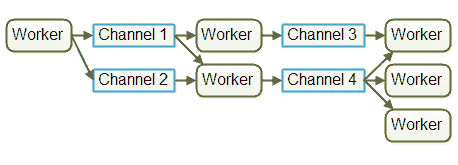

# 并发模型

> 原文：<https://jenkov.com/tutorials/java-concurrency/concurrency-models.html>

并发系统可以使用不同的*并发模型*来实现。一个*并发模型*指定了系统中的线程如何协作完成分配给它们的任务。不同的并发模型以不同的方式划分任务，线程可以以不同的方式进行通信和协作。本并发模型教程将深入探讨撰写本文时(2015 - 2019 年)最流行的并发模型。

## 并发模型和分布式系统的相似性

本文中描述的并发模型类似于分布式系统中使用的不同体系结构。在并发系统中，不同的线程相互通信。在分布式系统中，不同的进程相互通信(可能在不同的计算机上)。线程和进程在本质上非常相似。这就是为什么不同的并发模型通常看起来类似于不同的分布式系统架构。

当然，分布式系统面临着额外的挑战，比如网络可能出现故障，或者远程计算机或进程出现故障等等。但是，如果 CPU 故障、网卡故障、磁盘故障等，运行在大型服务器上的并发系统可能会遇到类似的问题。失败的概率可能会低一些，但理论上还是可以发生的。

因为并发模型类似于分布式系统架构，所以它们经常可以互相借鉴。例如，在工作人员(线程)之间分配工作的模型通常类似于分布式系统中的[负载平衡模型。日志记录、故障转移、任务等幂等错误处理技术也是如此。](/software-architecture/load-balancing.html)

## 共享状态与分离状态

并发模型的一个重要方面是，组件和线程是被设计成在线程之间共享状态，还是具有从不在线程之间共享的单独状态。

*共享状态*意味着系统中的不同线程将在它们之间共享某种状态。*状态*是指一些数据，通常是一个或多个对象或类似物。当线程共享状态时，会出现类似[竞争条件](race-conditions-and-critical-sections.html)和[死锁](deadlock.html)等问题。可能发生。当然，这取决于线程如何使用和访问共享对象。

*分离状态*意味着系统中的不同线程之间不共享任何状态。在不同线程需要通信的情况下，它们或者通过在它们之间交换不可变对象，或者通过在它们之间发送对象(或数据)的副本来进行通信。因此，当没有两个线程写入同一个对象(数据/状态)时，您可以避免大多数常见的并发问题。

使用单独的状态并发设计通常可以使代码的某些部分更容易实现和推理，因为您知道只有一个线程会写入给定的对象。您不必担心对该对象的并发访问。然而，您可能需要在应用程序设计的大背景下更加努力地思考，以使用单独的状态并发。我觉得这是值得的。我个人更喜欢独立状态并发设计。

## 平行工人

第一个并发模型是我所谓的*并行工作者*模型。引入的工作被分配给不同的工人。下图说明了并行工作者并发模型:

在并行工作者并发模型中，委托者将传入的作业分配给不同的工作者。每个工人完成全部工作。这些工人并行工作，在不同的线程中运行，并且可能在不同的 CPU 上运行。

如果平行工人模型在汽车工厂实施，每辆汽车将由一名工人生产。工人将得到要制造的汽车的规格，并将从头到尾制造一切。

parallel workers 并发模型是 Java 应用程序中最常用的并发模型(尽管这种情况正在发生变化)。 [java.util.concurrent Java 包](/java-util-concurrent/index.html)中的许多并发实用程序都是为使用该模型而设计的。在 Java 企业版应用服务器的设计中，也可以看到这种模式的痕迹。

并行工作器并发模型可以设计为使用共享状态或单独状态，这意味着工作器要么可以访问某些共享状态(共享对象或数据)，要么没有共享状态。

## 平行工人优势

并行工作者并发模型的优点是易于理解。要提高应用程序的并行化水平，只需添加更多的工作线程。

例如，如果您正在实现一个 web crawler，您可以使用不同数量的工作线程来抓取一定数量的页面，并查看哪个数量的工作线程的总抓取时间最短(意味着最高的性能)。由于 web 爬行是一项 IO 密集型工作，您的计算机中每个 CPU /内核可能会有几个线程。每个 CPU 一个线程太少了，因为在等待数据下载时，它会有很多时间处于空闲状态。

## 平行工人劣势

然而，并行工作者并发模型有一些隐藏在简单表面下的缺点。我将在接下来的部分解释最明显的缺点。

### 共享状态可能会变得复杂

如果共享工作者需要访问某种共享数据，无论是在内存中还是在共享数据库中，管理正确的并发访问会变得复杂。下图显示了这如何使并行工作并发模型变得复杂:

这种共享状态的一部分存在于像作业队列这样的通信机制中。但是这种共享状态的一部分是业务数据、数据缓存、数据库连接池等。

一旦共享状态潜入并行工作者并发模型，它就开始变得复杂。线程需要以某种方式访问共享数据，以确保一个线程的更改对其他线程可见(被推送到主内存，而不仅仅停留在执行线程的 CPU 的 CPU 缓存中)。线程需要避免[竞争条件](race-conditions-and-critical-sections.html)、[死锁](deadlock.html)和许多其他共享状态并发问题。

此外，当线程在访问共享数据结构时相互等待时，部分并行化会丢失。许多并发数据结构是阻塞的，这意味着一个或有限的一组线程可以在任何给定的时间访问它们。这可能会导致对这些共享数据结构的争用。高度争用本质上将导致访问共享数据结构的代码部分的执行的一定程度的串行化(消除并行化)。

现代的[非阻塞并发算法](non-blocking-algorithms.html)可能会减少争用并提高性能，但是非阻塞算法很难实现。

持久数据结构是另一种选择。持久数据结构在被修改时总是保留其自身的先前版本。因此，如果多个线程指向同一个持久数据结构，并且一个线程修改了它，则修改线程获得对新结构的引用。所有其他线程保持对旧结构的引用，该旧结构仍未改变，因此是一致的。Scala 标准 API 包含几个持久数据结构。

虽然持久化数据结构是并发修改共享数据结构的一个很好的解决方案，但是持久化数据结构往往不能很好地执行。

例如，一个持久化列表会将所有新元素添加到列表的头部，并返回一个对新添加元素的引用(然后该引用指向列表的其余部分)。所有其他线程仍然保持对列表中先前第一个元素的引用，并且对于这些线程，列表看起来没有改变。他们看不到新添加的元素。

这样的持久列表被实现为链表。不幸的是，链表在现代硬件上执行得不是很好。列表中的每个元素都是一个独立的对象，这些对象可以分布在计算机的整个内存中。现代 CPU 在顺序访问数据方面要快得多，因此在现代硬件上，您将从在阵列顶部实现的列表中获得更高的性能。数组按顺序存储数据。CPU 缓存可以一次将更大的阵列块加载到缓存中，并在加载后让 CPU 直接访问 CPU 缓存中的数据。对于元素分散在整个内存中的链表来说，这是不可能的。

### 无国籍工人

共享状态可以被系统中的其他线程修改。因此，工作人员必须在每次需要时重新读取状态，以确保他们使用的是最新的副本。无论共享状态是保存在内存中还是外部数据库中，都是如此。一个不在内部保存状态(而是在每次需要时重新读取状态)的工作者被称为*无状态*。

每次需要时重新读取数据会变得很慢。尤其是当状态存储在外部数据库中时。

### 作业排序是不确定的

并行工作者模型的另一个缺点是作业执行顺序不确定。没有办法保证哪些作业先执行或后执行。作业 A 可能在作业 B 之前交给工人，而作业 B 可能在作业 A 之前执行。

并行工作者模型的不确定性使得很难推断系统在任何给定时间点的状态。这也使得保证一项任务先于另一项任务完成变得更加困难(如果不是不可能的话)。然而，这并不总是会引起问题。这取决于系统的需求。

## 装配线

第二个并发模型是我所说的*流水线*并发模型。我选择这个名字只是为了适应前面的“并行工作者”比喻。其他开发人员根据平台/社区使用其他名称(如反应式系统或事件驱动系统)。下图展示了装配线并发模型:

工人们像工厂装配线上的工人一样被组织起来。每个工人只完成全部工作的一部分。当该部分完成时，该工人将工作转交给下一个工人。

使用装配线并发模型的系统通常被设计为使用非阻塞 IO。非阻塞 IO 意味着当一个工作者开始一个 IO 操作(例如，从网络连接读取文件或数据)时，该工作者不等待 IO 调用完成。IO 操作很慢，所以等待 IO 操作完成是浪费 CPU 时间。与此同时，CPU 可能在做其他事情。当 IO 操作完成时，IO 操作的结果(例如，数据读取或数据写入的状态)被传递给另一个工作者。

对于非阻塞 IO，IO 操作决定了工作线程之间的界限。一个工作线程尽可能地工作，直到它必须开始一个 IO 操作。然后它放弃对作业的控制。当 IO 操作完成时，装配线上的下一个工人继续工作，直到该工人也必须开始 IO 操作，等等。

实际上，工作可能不会沿着单一的装配线流动。由于大多数系统可以执行不止一个作业，因此作业会根据接下来需要执行的作业部分在不同的工作人员之间流动。实际上，可能有多条不同的虚拟装配线同时运行。这是装配线系统中作业流的实际情况:

作业甚至可以转发给多个工人进行并发处理。例如，作业可以被转发给作业执行器和作业记录器。此图说明了所有三条装配线如何通过将其任务转发给同一名工人(中间装配线的最后一名工人)来完成:

装配线可能比这更复杂。

### 反应式事件驱动系统

使用流水线并发模型的系统有时也被称为*反应式系统*，或者*事件驱动系统*。系统的工作人员对系统中发生的事件做出反应，这些事件要么是从外部世界接收的，要么是由其他工作人员发出的。事件的例子可以是传入的 HTTP 请求，或者某个文件已经加载到内存中，等等。

在撰写本文时，有许多有趣的反应式/事件驱动平台可用，将来还会有更多。一些比较流行的似乎是:

*   [绿色. x](/vert.x/index.html)
*   阿卡
*   节点。JS

就我个人而言，我觉得 Vert.x 非常有趣(尤其是对于像我这样的 Java / JVM 恐龙来说)。

### 演员与频道

参与者和渠道是装配线(或反应/事件驱动)模型的两个相似的例子。

在 actor 模型中，每个工人被称为一个 *actor* 。演员可以直接互相发送消息。消息是异步发送和处理的。如前所述，Actors 可以用于实现一个或多个作业处理装配线。下面是一个说明执行元模型的图表:

在渠道模型中，员工之间不直接交流。相反，他们在不同的渠道发布他们的消息(事件)。然后，其他工作人员可以在这些通道上监听消息，而发送者不知道谁在监听。下面是说明渠道模型的图表:

在撰写本文时，我认为渠道模型似乎更加灵活。工人不需要知道什么工人将在装配线上稍后处理该工作。它只需要知道将作业转发到哪个通道(或者将消息发送到哪个通道，等等)。).通道上的侦听器可以订阅和取消订阅，而不会影响向通道写入的工作人员。这使得工作人员之间的耦合稍微松散一些。

## 装配线优势

与并行工人模型相比，装配线并发模型有几个优点。我将在接下来的章节中介绍最大的优势。

### 没有共享状态

工作者不与其他工作者共享状态这一事实意味着它们可以被实现，而不必考虑对共享状态的并发访问可能引起的所有并发问题。这使得实现 workers 变得容易得多。您实现一个 worker，就好像它是执行该工作的唯一线程——本质上是一个单线程实现。

### 状态工人

因为工作者知道没有其他线程修改他们的数据，所以工作者可以是有状态的。我所说的有状态是指它们可以将操作所需的数据保存在内存中，只将更改写回最终的外部存储系统。因此，有状态的工作者通常比无状态的工作者更快。

### 更好的硬件一致性

单线程代码的优势在于它通常更符合底层硬件的工作方式。首先，当您可以假设代码在单线程模式下执行时，您通常可以创建更优化的数据结构和算法。

第二，如上所述，单线程有状态工作线程可以在内存中缓存数据。当数据缓存在内存中时，该数据也很有可能缓存在执行线程的 CPU 的 CPU 缓存中。这使得访问缓存数据更快。

当代码以一种自然受益于底层硬件工作方式的方式编写时，我称之为*硬件一致性*。一些开发者称之为*机械同情*。我更喜欢硬件一致性这个术语，因为计算机只有很少的机械部件，而“同情”这个词在这个上下文中被用作“更好地匹配”的隐喻，我认为“一致性”这个词表达得相当好。无论如何，这是吹毛求疵。使用你喜欢的任何术语。

### 作业排序是可能的

根据装配线并发模型，以保证作业排序的方式实现并发系统是可能的。作业排序使得推断系统在任何给定时间点的状态变得更加容易。此外，您可以将所有传入的作业写入日志。如果系统的任何部分出现故障，这个日志可以用来从头开始重建系统的状态。作业以一定的顺序写入日志，该顺序成为保证的作业顺序。这是这样一个设计的样子:

实现有保证的作业顺序不一定容易，但通常是可能的。如果可以，它会大大简化备份、恢复数据、复制数据等任务。因为这都可以通过日志文件来完成。

## 装配线的缺点

装配线并发模型的主要缺点是，一个作业的执行通常分布在多个工人身上，因此分布在项目中的多个类上。因此，对于给定的作业，很难准确地看到正在执行什么代码。

编写代码也可能更加困难。工作代码有时被写成回调处理程序。拥有许多嵌套回调处理程序的代码可能会导致一些开发人员所说的*回调地狱*。回调地狱只是意味着很难跟踪代码在所有回调中真正做了什么，以及确保每个回调都可以访问它需要的数据。

使用并行工作者并发模型，这往往更容易。您可以打开 worker 代码，从头到尾阅读执行的代码。当然，并行工作者代码也可能分布在许多不同的类中，但是执行顺序通常更容易从代码中读出。

## 功能并行性

功能并行是最近(2015 年)被大量讨论的第三种并发模式。

功能并行的基本思想是使用函数调用来实现程序。功能可以被视为相互发送消息的“代理”或“参与者”，就像在装配线并发模型中一样(也称为反应式或事件驱动系统)。当一个函数调用另一个函数时，这类似于发送消息。

传递给函数的所有参数都被复制，因此接收函数之外的任何实体都不能操作数据。这种复制对于避免共享数据上的竞争情况是必不可少的。这使得函数的执行类似于原子操作。每个函数调用都可以独立于任何其他函数调用执行。

当每个函数调用可以独立执行时，每个函数调用可以在单独的 CPU 上执行。这意味着，在功能上实现的算法可以在多个 CPU 上并行执行。

对于 Java 7，我们得到了包含[forkandjinpool](/java-util-concurrent/java-fork-and-join-forkjoinpool.html)的`java.util.concurrent`包，它可以帮助你实现类似于功能并行的东西。借助 Java 8，我们获得了并行[流](/java-collections/streams.html)，这可以帮助您并行化大型集合的迭代。请记住，有些开发者对`ForkAndJoinPool`持批评态度(你可以在我的`ForkAndJoinPool`教程中找到批评的链接)。

函数并行的难点在于知道哪个函数调用需要并行。跨 CPU 协调函数调用会带来开销。一个函数完成的工作单元需要有一定的大小，才值得这个开销。如果函数调用非常小，尝试并行化它们实际上可能比单线程、单 CPU 执行要慢。

根据我的理解(这一点都不完美)，你可以使用一个反应式的、事件驱动的模型来实现一个算法，并实现一个工作的分解，这与功能并行所实现的类似。使用均匀驱动模型，您可以更好地控制并行化的内容和程度(在我看来)。

此外，将一个任务拆分到多个 CPU 上，并产生协调开销，只有当该任务是程序当前执行的唯一任务时才有意义。然而，如果系统同时执行多个其他任务(例如 web 服务器、数据库服务器和许多其他系统)，尝试并行化单个任务是没有意义的。计算机中的其他 CPU 无论如何都会忙于其他任务，因此没有理由试图用一个较慢的、功能上并行的任务来打扰它们。使用流水线(反应式)并发模型可能更好，因为它的开销更少(在单线程模式下顺序执行),并且更符合底层硬件的工作方式。

## 哪种并发模型最好？

那么，哪种并发模式更好呢？

通常情况下，答案是这取决于你的系统应该做什么。如果您的作业本质上是并行的、独立的，并且不需要共享状态，那么您可能能够使用并行工作者模型来实现您的系统。

然而，许多工作并不是自然平行和独立的。对于这些类型的系统，我相信装配线并发模型利大于弊，比并行工人模型更有优势。

您甚至不必自己编写所有装配线基础设施的代码。像 [Vert.x](/vert.x/index.html) 这样的现代平台已经为你实现了很多。就我个人而言，我将为我的下一个项目探索运行在 Vert.x 等平台之上的设计。我觉得 Java EE 已经没有优势了。