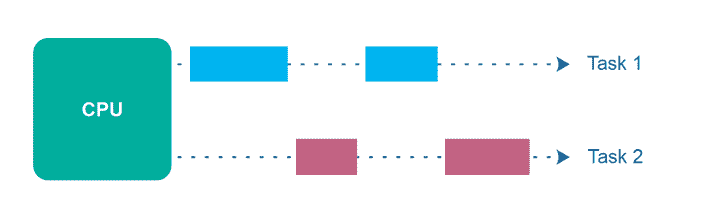
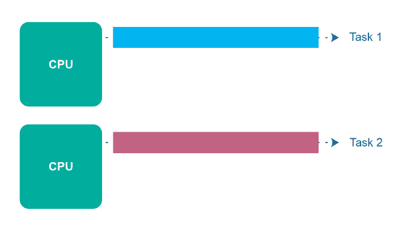
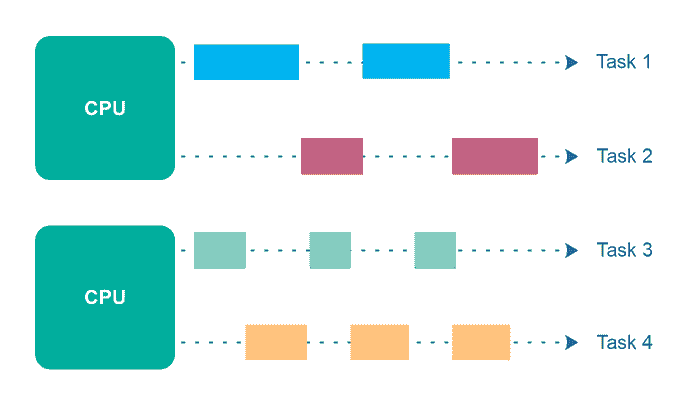
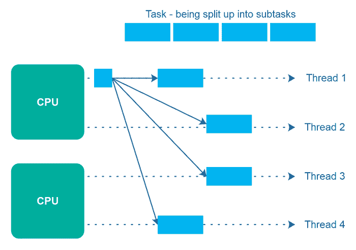

# 并发性与并行性

> 原文：<https://jenkov.com/tutorials/java-concurrency/concurrency-vs-parallelism.html>

术语*并发*和*并行*经常用于多线程程序。乍一看，并发性和并行性似乎是指相同的概念。然而，并发和并行实际上有不同的含义。在这篇并发与并行教程中，我将解释这些概念的含义。

为了明确起见，在本文中，我着眼于单个应用程序——单个进程中的并发性和并行性。而不是在多个应用程序、进程或计算机之间。

## 并发性与并行性教程视频

如果你更喜欢视频，我这里有本教程的视频版:[并发 vs 并行教程视频](https://www.youtube.com/watch?v=Y1pgpn2gOSg&list=PLL8woMHwr36EDxjUoCzboZjedsnhLP1j4&index=9 "Concurrency vs Parallelism Tutorial Video")

[T2】](https://www.youtube.com/watch?v=Y1pgpn2gOSg&list=PLL8woMHwr36EDxjUoCzboZjedsnhLP1j4&index=9 "Concurrency vs Parallelism Tutorial Video")

## 并发

*并发性*意味着一个应用程序同时或者至少看起来同时(并发地)在一个以上的任务上取得进展。

如果计算机只有一个 CPU，应用程序可能不会在完全相同的时间在*进行一个以上的任务，但是在应用程序内部同时进行一个以上的任务。为了在多个任务上同时取得进展，CPU 在执行期间在不同的任务之间切换。下图对此进行了说明:*

## 并行执行

并行执行是指计算机拥有一个以上的 CPU 或 CPU 内核，并且同时在一个以上的任务上取得进展。然而，*并行执行*并不是指与*并行*相同的现象。稍后我将回到并行。并行执行如下所示:

## 并行并发执行

并行执行是可能的，其中线程分布在多个 CPU 中。因此，在同一 CPU 上执行的线程是并发执行的，而在不同 CPU 上执行的线程是并行执行的。下图说明了并行并发执行。

## 平行

术语*并行性*是指一个应用程序将其任务分解成更小的子任务，这些子任务可以并行处理，例如在同一时间在多个 CPU 上处理。因此，并行性并不是指与并行并发执行相同的执行模型——即使它们表面上看起来很相似。

为了实现真正的并行，您的应用程序必须运行不止一个线程，并且每个线程必须运行在独立的 CPU/CPU 内核/图形卡 GPU 内核或类似的内核上。

下图说明了一个更大的任务，它被分成 4 个子任务。这 4 个子任务由 4 个不同的线程执行，它们运行在 2 个不同的 CPU 上。这意味着，这些子任务的一部分是并发执行的(在同一个 CPU 上执行)，一部分是并行执行的(在不同的 CPU 上执行)。

相反，如果这 4 个子任务由运行在各自 CPU 上的 4 个线程执行(总共 4 个 CPU)，那么任务执行将是完全并行的。然而，将一个任务分成与可用 CPU 数量一样多的子任务并不总是容易的。通常，更容易的方法是将一个任务分解成许多子任务，这些子任务自然地适合手头的任务，然后让线程调度器负责在可用的 CPU 之间分配线程。

## 并发和并行组合

概括来说，*并发性*指的是单个 CPU 如何在看似相同的时间(也就是并发地)处理多个任务。

*另一方面，并行性*与应用程序如何并行执行单个任务有关——通常是通过将任务分成可以并行完成的子任务。

这两种执行风格可以在同一个应用程序中结合使用。我将在下面介绍其中的一些组合。

### 并行，不平行

应用程序可以是并发的，但不能是并行的。这意味着它似乎同时(并发地)在一个以上的任务上取得进展，但是应用程序在每个任务的进展之间切换——直到任务完成。并行线程/CPU 中没有真正的任务并行执行。

### 并行，不并发

应用程序也可以是并行的，但不是并发的。这意味着应用程序一次只处理一个任务，并且这个任务被分解成可以并行处理的子任务。但是，每个任务(+子任务)在下一个任务被拆分并并行执行之前完成。

### 既不同时也不平行

此外，应用程序既不能是并发的，也不能是并行的。这意味着它一次只能处理一个任务，并且这个任务永远不会被分解成子任务来并行执行。这可能是小型命令行应用程序的情况，在这种情况下，它只有一个太小而无法并行化的作业。

### 并发和并行

最后，应用程序还可以通过两种方式实现并发和并行:

第一种是简单的并行并发执行。如果应用程序启动多个线程，然后在多个 CPU 上执行，就会发生这种情况。

第二种方式是应用程序同时处理多个任务，并且将每个任务分解为并行执行的子任务。然而，在这种情况下，并发性和并行性的一些好处可能会丢失，因为计算机中的 CPU 已经因为并发性或并行性而相当忙碌。将两者结合起来可能只会带来很小的性能提升，甚至性能损失。在盲目采用并发并行模型之前，一定要进行分析和度量。