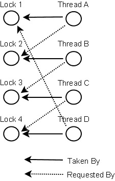

# 死锁预防

> 原文：<https://jenkov.com/tutorials/java-concurrency/deadlock-prevention.html>

在某些情况下，防止死锁是可能的。我将在本文中描述三种技术:

1.  [锁排序](#ordering)
2.  [锁定超时](#timeout)
3.  [死锁检测](#detection)

## 死锁预防教程视频

如果你更喜欢视频，我这里有这个死锁预防教程的视频版:[Java 中的死锁预防](https://www.youtube.com/watch?v=6E3aYf3jXdk&list=PLL8woMHwr36EDxjUoCzboZjedsnhLP1j4&index=17)。

[](https://www.youtube.com/watch?v=6E3aYf3jXdk&list=PLL8woMHwr36EDxjUoCzboZjedsnhLP1j4&index=17)

## GitHub 回购

您可以在下面的 GitHub repo 中看到本教程中讨论的解决方案的代码示例(至少在视频中讨论过):

[https://github.com/jjenkov/java-examples](https://github.com/jjenkov/java-examples)

## 锁定排序

当多个线程需要相同的锁，但以不同的顺序获得它们时，就会发生死锁。

如果您确保任何线程总是以相同的顺序获取所有锁，就不会发生死锁。看看这个例子:

```
Thread 1:

  lock A 
  lock B

Thread 2:

   wait for A
   lock C (when A locked)

Thread 3:

   wait for A
   wait for B
   wait for C

```

如果一个线程，比如线程 3，需要几个锁，它必须按照决定的顺序获取它们。它不能在序列的后面获取锁，直到它获得了前面的锁。

例如，线程 2 或线程 3 都不能锁定 C，除非它们先锁定了 A。因为线程 1 持有锁 A，所以线程 2 和 3 必须首先等待，直到锁 A 被解锁。然后，在尝试锁定 B 或 c 之前，它们必须成功锁定 A。

锁排序是一种简单而有效的死锁预防机制。但是，只有在获取任何锁之前了解所有需要的锁，才能使用它。情况并非总是如此。

## 锁定超时

另一种死锁预防机制是对锁尝试设置超时，这意味着试图获取锁的线程在放弃之前只会尝试这么长时间。如果线程在给定的超时时间内没有成功获取所有必要的锁，它将备份，释放所有获取的锁，等待一段随机的时间，然后重试。等待时间的长短是随机的，这是为了给试图获取相同锁的其他线程一个获取所有锁的机会，从而让应用程序继续运行而不被锁定。

下面是两个线程试图以不同的顺序获取相同的两个锁的示例，其中线程后退并重试:

```
Thread 1 locks A
Thread 2 locks B

Thread 1 attempts to lock B but is blocked
Thread 2 attempts to lock A but is blocked

Thread 1's lock attempt on B times out
Thread 1 backs up and releases A as well
Thread 1 waits randomly (e.g. 257 millis) before retrying.

Thread 2's lock attempt on A times out
Thread 2 backs up and releases B as well
Thread 2 waits randomly (e.g. 43 millis) before retrying.

```

在上面的示例中，线程 2 将在线程 1 之前大约 200 毫秒重试获取锁，因此可能会成功获取两个锁。线程 1 将等待，并试图获取锁 a。当线程 2 完成时，线程 1 也将能够获取这两个锁(除非线程 2 或另一个线程获取这两个锁之间的锁)。

需要记住的一个问题是，锁超时并不一定意味着线程已经死锁。这也可能意味着持有锁的线程(导致另一个线程超时)需要很长时间来完成它的任务。

此外，如果有足够多的线程争用相同的资源，即使超时和备份，它们仍有可能一次又一次地尝试使用同一时间的线程。这可能不会发生在 2 个线程在重试前分别等待 0 到 500 毫秒的情况下，但是在 10 或 20 个线程的情况下，情况会有所不同。那么两个线程在重试之前等待相同时间(或者足够接近而导致问题)的可能性要高得多。

锁超时机制的一个问题是，在 Java 中不可能为进入同步块设置超时。您必须创建一个定制的锁类，或者使用 java.util.concurrency 包中的一个 Java 5 并发结构。编写定制锁并不困难，但这超出了本文的范围。Java 并发跟踪的后续文章将介绍定制锁。

## 死锁检测

死锁检测是一种更强的死锁预防机制，旨在解决锁排序不可行以及锁超时不可行的情况。

每次线程**获取**一个锁时，都会在数据结构(map、graph 等)中记录下来。)的线程和锁。此外，每当一个线程**请求**一个锁时，这也记录在这个数据结构中。

当线程请求锁但请求被拒绝时，该线程可以遍历锁图来检查死锁。例如，如果线程 A 请求锁 7，但是锁 7 被线程 B 持有，那么线程 A 可以检查线程 B 是否请求了线程 A 持有的任何锁(如果有的话)。如果线程 B 请求了锁 1，那么就发生了死锁(线程 A 获取了锁 1，请求锁 7，线程 B 获取了锁 7，请求锁 1)。

当然，死锁场景可能比两个线程互相持有对方的锁要复杂得多。线程 A 可能会等待线程 B，线程 B 等待线程 C，线程 C 等待线程 D，线程 D 等待线程 A。为了让线程 A 检测到死锁，它必须先检查线程 B 请求的所有锁。从线程 B 请求的锁中，线程 A 将到达线程 C，然后到达线程 D，从线程 D 中找到线程 A 自己持有的锁之一。那么它知道发生了死锁。

下面是 4 个线程(A、B、C 和 D)获取和请求的锁的图表。像这样的数据结构可以用来检测死锁。

| 

<center>T2】</center>

 |

那么，如果检测到死锁，线程会做什么呢？

一种可能的操作是释放所有锁，备份，等待一段随机时间，然后重试。这类似于更简单的锁超时机制，除了在实际发生死锁时仅备份线程。不仅仅是因为他们的锁请求超时了。但是，如果许多线程都在竞争同一个锁，那么即使它们备份并等待，也可能会反复陷入死锁。

更好的选择是确定或分配线程的优先级，以便只有一个(或几个)线程进行备份。其余的线程继续获取它们需要的锁，就像没有发生死锁一样。如果分配给线程的优先级是固定的，则相同的线程将总是被赋予更高的优先级。为了避免这种情况，您可以在检测到死锁时随机分配优先级。