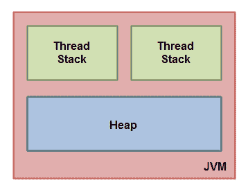
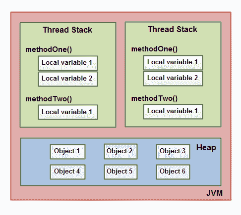
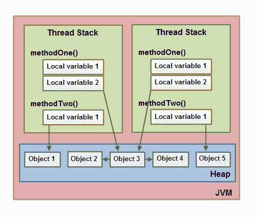
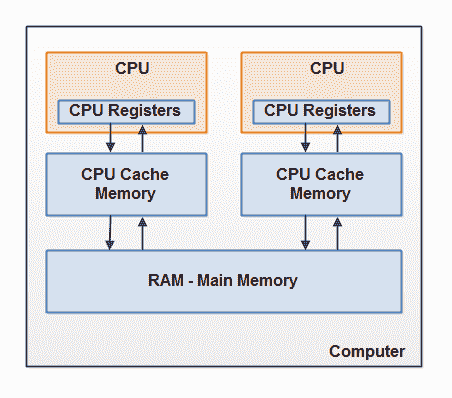
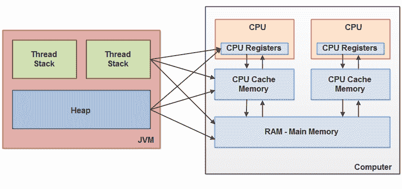
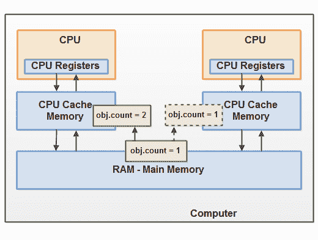
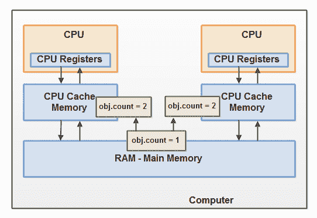

# Java 内存模型

> 原文：<https://jenkov.com/tutorials/java-concurrency/java-memory-model.html>

Java 内存模型指定了 Java 虚拟机如何与计算机的内存(RAM)一起工作。Java 虚拟机是整个计算机的模型，因此这个模型自然包括一个内存模型——也称为 Java 内存模型。

如果你想设计行为正确的并发程序，理解 Java 内存模型是非常重要的。Java 内存模型指定了不同线程如何以及何时可以看到其他线程写入共享变量的值，以及如何在必要时同步对共享变量的访问。

原来的 Java 内存模型不足，所以在 Java 1.5 中修改了 Java 内存模型。这个版本的 Java 内存模型至今仍在 Java 中使用(Java 14+)。

## Java 内存模型教程视频

如果你喜欢视频，我这里有这个教程的视频版本:
[Java 内存模型教程视频](https://www.youtube.com/watch?v=LCSqZyjBwWA&list=PLL8woMHwr36EDxjUoCzboZjedsnhLP1j4&index=4)

[](https://www.youtube.com/watch?v=LCSqZyjBwWA&list=PLL8woMHwr36EDxjUoCzboZjedsnhLP1j4&index=4 "Java Memory Model Tutorial Video")

## 内部 Java 内存模型

JVM 内部使用的 Java 内存模型在线程堆栈和堆之间划分内存。此图从逻辑角度说明了 Java 内存模型:



Java 虚拟机中运行的每个线程都有自己的线程堆栈。线程堆栈包含有关线程调用了哪些方法来到达当前执行点的信息。我将这称为“调用堆栈”。当线程执行其代码时，调用堆栈会发生变化。

线程堆栈还包含正在执行的每个方法的所有局部变量(调用堆栈上的所有方法)。一个线程只能访问它自己的线程堆栈。由一个线程创建的局部变量对于除了创建它的线程之外的所有其他线程都是不可见的。即使两个线程正在执行完全相同的代码，这两个线程仍然会在各自的线程堆栈中创建该代码的局部变量。因此，每个线程都有自己的局部变量版本。

所有原始类型的局部变量(`boolean`、`byte`、`short`、`char`、`int`、`long`、`float`、`double`)都完全存储在线程堆栈中，因此对其他线程不可见。一个线程可以将一个原始变量的副本传递给另一个线程，但是它不能共享原始局部变量本身。

堆包含在 Java 应用程序中创建的所有对象，不管对象是由哪个线程创建的。这包括原语类型的对象版本(如`Byte`、`Integer`、`Long`等)。).不管一个对象是被创建并赋给一个局部变量，还是被创建为另一个对象的成员变量，该对象仍然存储在堆中。

下图说明了存储在线程堆栈上的调用堆栈和局部变量，以及存储在堆上的对象:



局部变量可以是基本类型，在这种情况下，它完全保存在线程堆栈中。

局部变量也可以是对对象的引用。在这种情况下，引用(局部变量)存储在线程堆栈中，而对象本身存储在堆中。

一个对象可能包含方法，而这些方法可能包含局部变量。这些局部变量也存储在线程堆栈中，即使该方法所属的对象存储在堆中。

对象的成员变量与对象本身一起存储在堆中。无论成员变量是基元类型还是引用对象，都是如此。

静态类变量也和类定义一起存储在堆中。

堆上的对象可以由引用该对象的所有线程访问。当一个线程可以访问一个对象时，它也可以访问该对象的成员变量。如果两个线程同时在同一个对象上调用一个方法，它们都可以访问对象的成员变量，但是每个线程都有自己的局部变量副本。

以下图表说明了上述观点:



两个线程有一组局部变量。其中一个局部变量(`Local Variable 2`)指向堆上的一个共享对象(Object 3)。这两个线程对同一对象都有不同的引用。它们的引用是局部变量，因此存储在每个线程的线程堆栈中(在每个线程上)。不过，这两个不同的引用指向堆中的同一个对象。

注意共享对象(对象 3)如何引用对象 2 和对象 4 作为成员变量(由从对象 3 到对象 2 和对象 4 的箭头说明)。通过对象 3 中的这些成员变量引用，两个线程可以访问对象 2 和对象 4。

该图还显示了一个指向堆上两个不同对象的局部变量。在这种情况下，引用指向两个不同的对象(对象 1 和对象 5)，而不是同一个对象。理论上，如果两个线程都引用了对象 1 和对象 5，那么这两个线程都可以访问这两个对象。但是在上面的图表中，每个线程只引用两个对象中的一个。

那么，什么样的 Java 代码会导致上面的内存图呢？嗯，代码就像下面的代码一样简单:

```
public class MyRunnable implements Runnable() {

    public void run() {
        methodOne();
    }

    public void methodOne() {
        int localVariable1 = 45;

        MySharedObject localVariable2 =
            MySharedObject.sharedInstance;

        //... do more with local variables.

        methodTwo();
    }

    public void methodTwo() {
        Integer localVariable1 = new Integer(99);

        //... do more with local variable.
    }
}

```

```
public class MySharedObject {

    //static variable pointing to instance of MySharedObject

    public static final MySharedObject sharedInstance =
        new MySharedObject();

    //member variables pointing to two objects on the heap

    public Integer object2 = new Integer(22);
    public Integer object4 = new Integer(44);

    public long member1 = 12345;
    public long member2 = 67890;
}

```

如果两个线程正在执行`run()`方法，那么前面显示的图将是结果。`run()`方法调用`methodOne()`，`methodOne()`调用`methodTwo()`。

`methodOne()`声明一个原始局部变量(`int`类型的`localVariable1`)和一个作为对象引用的局部变量(`localVariable2`)。

每个执行`methodOne()`的线程将在它们各自的线程堆栈上创建自己的`localVariable1`和`localVariable2`的副本。`localVariable1`变量将彼此完全分离，只存在于每个线程的线程栈中。一个线程看不到另一个线程对它的`localVariable1`副本做了什么改变。

每个执行`methodOne()`的线程也会创建自己的`localVariable2`副本。然而，`localVariable2`的两个不同副本最终都指向堆中的同一个对象。代码设置`localVariable2`指向一个静态变量引用的对象。静态变量只有一个副本，这个副本存储在堆中。因此，`localVariable2`的两个副本都指向静态变量指向的同一个`MySharedObject`实例。`MySharedObject`实例也存储在堆中。它对应于上图中的对象 3。

注意`MySharedObject`类也包含两个成员变量。成员变量本身与对象一起存储在堆中。这两个成员变量指向另外两个`Integer`对象。这些`Integer`对象对应于上图中的对象 2 和对象 4。

还要注意`methodTwo()`如何创建一个名为`localVariable1`的局部变量。这个局部变量是对一个`Integer`对象的对象引用。该方法将`localVariable1`引用设置为指向新的`Integer`实例。`localVariable1`引用将存储在执行`methodTwo()`的每个线程的一个副本中。实例化的两个`Integer`对象将被存储在堆中，但是由于该方法每次执行时都会创建一个新的`Integer`对象，所以执行该方法的两个线程将创建单独的`Integer`实例。在`methodTwo()`内创建的`Integer`对象对应于上图中的对象 1 和对象 5。

还要注意类型`long`的类`MySharedObject`中的两个成员变量，这是一个原始类型。因为这些变量是成员变量，所以它们仍然和对象一起存储在堆中。只有局部变量存储在线程堆栈中。

## 硬件存储器体系结构

现代硬件内存架构与内部 Java 内存模型有些不同。理解硬件内存架构也很重要，要理解 Java 内存模型如何使用它。这一节描述了常见的硬件内存体系结构，后面的一节将描述 Java 内存模型如何使用它。

这是现代计算机硬件架构的简图:



现代计算机通常有两个或更多的中央处理器。其中一些 CPU 可能也有多个内核。关键是，在一台拥有 2 个或更多 CPU 的现代计算机上，有可能同时运行多个线程。每个 CPU 在任何给定时间都能够运行一个线程。这意味着，如果您的 Java 应用程序是多线程的，那么在您的 Java 应用程序中，每个 CPU 可能同时运行一个线程。

每个 CPU 都包含一组寄存器，这些寄存器本质上是 CPU 内存。CPU 在这些寄存器上执行操作的速度比它在主存中执行变量的速度快得多。这是因为 CPU 访问这些寄存器的速度比访问主存的速度快得多。

每个 CPU 也可以有一个 CPU 高速缓冲存储器层。事实上，大多数现代 CPU 都有一定大小的缓存层。CPU 访问其高速缓冲存储器的速度比主存储器快得多，但通常没有访问其内部寄存器的速度快。因此，CPU 缓存的速度介于内部寄存器和主内存之间。一些 CPU 可能有多个缓存层(1 级和 2 级)，但这对于理解 Java 内存模型如何与内存交互并不重要。重要的是知道 CPU 可以有某种类型的缓存层。

计算机还包含一个主存储区(RAM)。所有的 CPU 都可以访问主存。主存储器区域通常比 CPU 的高速缓冲存储器大得多。

通常，当 CPU 需要访问主存时，它会将主存的一部分读入 CPU 缓存。它甚至可以将部分缓存读入其内部寄存器，然后对其执行操作。当 CPU 需要将结果写回主存储器时，它会将值从其内部寄存器刷新到高速缓冲存储器，并在某个时候将值刷新回主存储器。

当 CPU 需要在高速缓冲存储器中存储其他东西时，存储在高速缓冲存储器中的值通常被刷新回主存储器。CPU 缓存可以一次将数据写入其部分内存，一次刷新其部分内存。它不必在每次更新时读/写整个缓存。通常，高速缓存是在称为“高速缓存行”的较小存储块中更新的。可以将一个或多个高速缓存行读入高速缓存存储器，并且可以将一个或多个高速缓存行再次刷新回主存储器。

## 弥合 Java 内存模型和硬件内存架构之间的差距

如前所述，Java 内存模型和硬件内存架构是不同的。硬件内存架构不区分线程堆栈和堆。在硬件上，线程堆栈和堆都位于主内存中。部分线程堆栈和堆有时可能存在于 CPU 缓存和内部 CPU 寄存器中。下图对此进行了说明:



当对象和变量可以存储在计算机的不同存储区域时，可能会出现某些问题。两个主要问题是:

*   共享变量的线程更新(写入)的可见性。
*   读取、检查和写入共享变量时的竞争条件。

这两个问题将在下面的章节中解释。

### 共享对象的可见性

如果两个或多个线程共享一个对象，没有正确使用`volatile`声明或同步，一个线程对共享对象的更新可能对其他线程不可见。

假设共享对象最初存储在主存中。然后，在 CPU 1 上运行的线程将共享对象读入其 CPU 缓存。在那里，它对共享对象进行了更改。只要 CPU 缓存没有被刷新回主内存，共享对象的更改版本对其他 CPU 上运行的线程就不可见。通过这种方式，每个线程都可以拥有自己的共享对象副本，每个副本都位于不同的 CPU 缓存中。

下图说明了这种情况。在左边 CPU 上运行的一个线程将共享对象复制到它的 CPU 缓存中，并将它的`count`变量更改为 2。这种变化对于运行在正确 CPU 上的其他线程是不可见的，因为对`count`的更新还没有被刷新回主内存。



要解决这个问题，你可以使用 Java 的挥发性关键字。关键字`volatile`可以确保一个给定的变量直接从主存中读取，并且在更新时总是写回到主存中。

### 竞赛条件

如果两个或多个线程共享一个对象，并且不止一个线程更新该共享对象中的变量，则可能出现[竞争条件](race-conditions-and-critical-sections.html)。

想象一下，如果线程 A 将一个共享对象的变量`count`读入它的 CPU 缓存。想象一下，线程 B 做了同样的事情，但是是在不同的 CPU 缓存中。现在线程 A 给`count`加一，线程 B 也这样做。现在`var1`已经增加了两次，一次在每个 CPU 缓存中。

如果这些递增是按顺序进行的，变量`count`将递增两次，并将原始值+ 2 写回主存储器。

然而，这两个增量是同时进行的，没有适当的同步。不管线程 A 和 B 中的哪一个将其更新版本的`count`写回到主存储器，更新值将仅比原始值高 1，尽管有两个增量。

下图说明了上述竞争条件问题的发生:



为了解决这个问题，你可以使用一个 [Java 同步块](synchronized.html)。同步块保证在任何给定时间只有一个线程可以进入代码的给定临界区。Synchronized 块还保证在 synchronized 块中访问的所有变量都将从主存中读取，并且当线程退出 synchronized 块时，所有更新的变量都将被再次刷新回主存，而不管该变量是否被声明为 volatile。