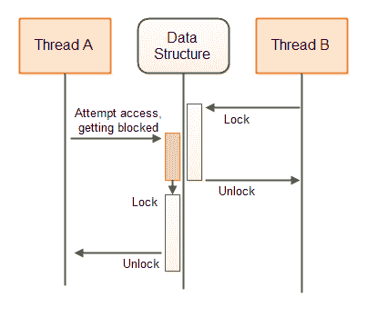
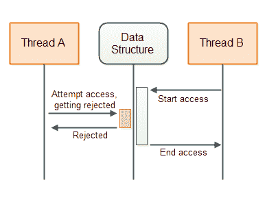
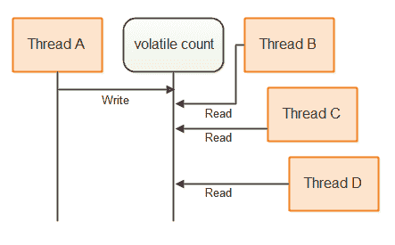
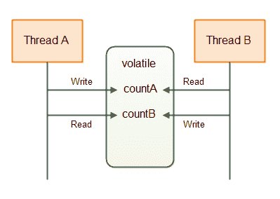
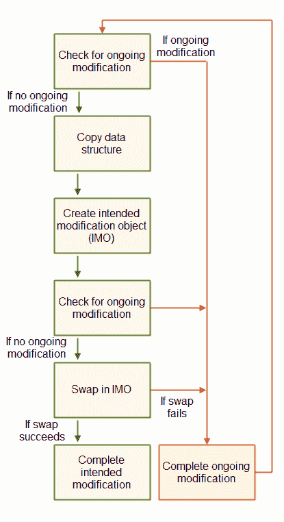
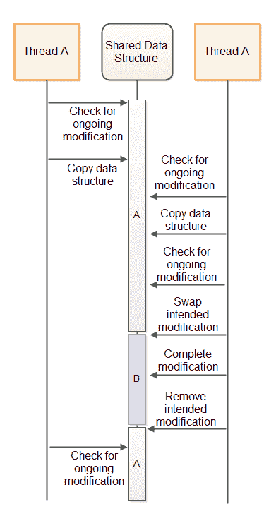

# 非阻塞算法

> 原文：<https://jenkov.com/tutorials/java-concurrency/non-blocking-algorithms.html>

并发上下文中的非阻塞算法是允许线程访问共享状态(或以其他方式协作或通信)而不阻塞所涉及的线程的算法。更一般地说，如果一个线程的挂起不会导致算法中涉及的其他线程的挂起，则称该算法是非阻塞的。

为了更好地理解阻塞和非阻塞并发算法之间的区别，我将从解释阻塞算法开始，然后继续讨论非阻塞算法。

## 阻塞并发算法

阻塞并发算法是这样一种算法:

*   a:执行线程请求的动作——或者
*   b:阻塞线程，直到动作可以安全执行

许多类型的算法和并发数据结构都是阻塞的。例如，[Java . util . concurrent . blocking queue](/java-util-concurrent/blockingqueue.html)接口的不同实现都是阻塞数据结构。如果一个线程试图将一个元素插入到一个`BlockingQueue`中，而队列没有空间，那么这个插入线程将被阻塞(暂停),直到`BlockingQueue`有空间容纳新的元素。

下图说明了保护共享数据结构的阻塞算法的行为:



## 非阻塞并发算法

非阻塞并发算法是这样一种算法:

*   a:执行线程请求的动作——或者
*   b:通知请求线程动作不能被执行

Java 也包含几种非阻塞数据结构。[原子库](/java-util-concurrent/atomicboolean.html)、[原子集成器](/java-util-concurrent/atomicinteger.html)、[原子克隆](/java-util-concurrent/atomiclong.html)和[原子引用](/java-util-concurrent/atomicreference.html)都是非阻塞数据结构的例子。

下图说明了保护共享数据结构的非阻塞算法的行为:



## 非阻塞与阻塞算法

阻塞和非阻塞算法之间的主要区别在于它们行为的第二步，如上面两节所述。换句话说，区别在于当所请求的动作不能被执行时，阻塞和非阻塞算法做什么:

阻塞算法阻塞线程，直到可以执行所请求的动作。非阻塞算法通知请求该动作的线程该动作不能被执行。

使用阻塞算法，线程可能会被阻塞，直到可以执行所请求的动作。通常是另一个线程的动作使得第一个线程能够执行所请求的动作。如果由于某种原因，另一个线程在应用程序中的其他地方被挂起(阻塞),因此无法执行使第一个线程的请求动作成为可能的动作，那么第一个线程将保持阻塞状态——要么无限期地阻塞，要么直到另一个线程最终执行必要的动作。

例如，如果一个线程试图将一个元素插入到一个完整的`BlockingQueue`中，这个线程将会阻塞，直到另一个线程从`BlockingQueue`中取出一个元素。如果由于某种原因，应该从`BlockingQueue`获取元素的线程在应用程序中的其他地方被阻塞(挂起),试图插入新元素的线程仍然被阻塞——要么无限期地阻塞，要么直到获取元素的线程最终从`BlockingQueue`获取元素。

## 非阻塞并发数据结构

在多线程系统中，线程通常通过某种数据结构进行通信。这种数据结构可以是任何东西，从简单的变量到更高级的数据结构，如队列、映射、堆栈等。为了便于多线程对数据结构的正确、并发访问，数据结构必须由某个*并发算法*来保护。保护算法使得数据结构成为一个*并发数据结构*。

如果守护一个并发数据结构的算法是阻塞的(使用线程挂起)，那么它就是一个*阻塞算法*。该数据结构因此被称为是一个*阻塞、并发数据结构*。

如果守护一个并发数据结构的算法是非阻塞的，那么它就是一个*非阻塞算法*。因此，该数据结构被称为是一个*非阻塞、并发数据结构*。

每个并发数据结构都被设计为支持特定的通信方法。因此，您可以使用哪种并发数据结构取决于您的通信需求。我将在接下来的章节中介绍一些非阻塞并发数据结构，并解释在什么情况下可以使用它们。对这些非阻塞数据结构如何工作的解释应该让您了解如何设计和实现非阻塞数据结构。

## 易变变量

[Java volatile 变量](volatile.html)是总是直接从主存中读取的变量。当一个新的值被赋给一个可变变量时，这个值总是被立即写入主存。这保证了 volatile 变量的最新值对于运行在其他 CPU 上的其他线程总是可见的。其他线程每次都将从主存储器中读取 volatile 的值，而不是从例如运行线程的 CPU 的 CPU 缓存中读取。

可变变量是非阻塞的。将值写入可变变量是一个原子操作。它不能被打断。然而，对 volatile 变量执行的读-更新-写序列不是原子的。因此，如果由多个线程执行，该代码仍可能导致[竞争条件](race-conditions-and-critical-sections.html):

```
volatile myVar = 0;

...
int temp = myVar;
temp++;
myVar = temp;

```

首先，可变变量`myVar`的值从主存储器读入一个临时变量。那么临时变量增加 1。然后，temp 变量的值被赋给 volatile `myVar`变量，这意味着它将被写回主内存。

如果两个线程都执行了这段代码，并且都读取了`myVar`的值，给它加 1，并将该值写回主内存，那么就有可能不是给`myVar`变量加 2，而是只加 1(例如，两个线程都读取值 19，递增到 20，然后写回 20)。

您可能认为您不会像上面那样编写代码，但实际上上面的代码相当于:

```
myVar++;

```

执行时，`myVar`的值被读入 CPU 寄存器或本地 CPU 缓存，加 1，然后来自 CPU 寄存器或 CPU 缓存的值被写回主存储器。

### 单身作家案例

在某些情况下，只有一个线程写入一个共享变量，而多个线程读取该变量的值。当只有一个线程在更新一个变量时，无论有多少个线程在读取它，都不会发生争用情况。因此，只要只有一个共享变量的编写器，就可以使用 volatile 变量。

当多个线程对一个共享变量执行读-更新-写操作序列时，就会出现争用情况。如果只有一个线程执行读-更新-写操作序列，而所有其他线程只执行读操作，则不存在争用情况。

下面是一个不使用同步但仍然是并发的单个写入方计数器:

```
public class SingleWriterCounter {

    private volatile long count = 0;

    /**
     * Only one thread may ever call this method,
     * or it will lead to race conditions.
     */
    public void inc() {
        this.count++;
    }

    /**
     * Many reading threads may call this method
     * @return
     */
    public long count() {
        return this.count;
    }
}

```

多个线程可以访问这个计数器的同一个实例，只要只有一个线程调用`inc()`。我不是指一次一根线。我的意思是，只有同一个线程被允许调用`inc()`。多线程可以调用`count()`。这不会导致任何争用情况。

下图说明了线程如何访问 volatile `count`变量:



### 基于可变变量的更高级的数据结构

可以创建使用可变变量组合的数据结构，其中每个可变变量仅由单个线程写入，由多个线程读取。每个 volatile 变量可以由不同的线程编写(但只能由一个线程编写)。使用这样的数据结构，多个线程能够使用易失性变量以非阻塞的方式相互发送信息。

下面是一个简单的双编写器计数器类，展示了它可能的样子:

```
public class DoubleWriterCounter {

    private volatile long countA = 0;
    private volatile long countB = 0;

    /**
     * Only one (and the same from thereon) thread may ever call this method,
     * or it will lead to race conditions.
     */
    public void incA() { this.countA++;  }

    /**
     * Only one (and the same from thereon) thread may ever call this method,
     * or it will lead to race conditions.
     */
    public void incB() { this.countB++;  }

    /**
     * Many reading threads may call this method
     */
    public long countA() { return this.countA; }

    /**
     * Many reading threads may call this method
     */
    public long countB() { return this.countB; }
}

```

如您所见，`DoubleWriterCounter`现在包含两个可变变量，两对 incrementation 和 read 方法。只有一个线程可以调用`incA()`，只有一个线程可以调用`incB()`。但是也可以是不同的线程调用`incA()`和`incB()`。允许很多线程调用`countA()`和`countB()`。这不会导致竞态条件。

`DoubleWriterCounter`可用于例如两个线程通信。这两个计数可以是产生的任务和消耗的任务。下图显示了两个线程通过类似于上面的数据结构进行通信:



聪明的读者会意识到，您可以通过使用两个`SingleWriterCounter`实例来实现`DoubleWriterCounter`的效果。如果需要，您甚至可以使用更多的线程和`SingleWriterCounter`实例。

## 带有比较和交换的乐观锁定

如果你真的需要不止一个线程来写同一个共享变量，一个 volatile 变量是不够的。您将需要某种对变量的独占访问。这是在 Java 中使用[同步块时这种独占访问的样子:](synchronized.html)

```
public class SynchronizedCounter {
    long count = 0;

    public void inc() {
        synchronized(this) {
            count++;
        }
    }

    public long count() {
        synchronized(this) {
            return this.count;
        }
    }
}

```

注意`inc()`和`count()`方法都包含一个同步块。这就是我们想要避免的——同步块和`wait()` - `notify()`调用等等。

我们可以使用 Java 的一个原子变量来代替两个同步块。在本例中为`AtomicLong`。下面是使用一个`AtomicLong`代替的同一个计数器类的样子:

```
import java.util.concurrent.atomic.AtomicLong;

public class AtomicCounter {
    private AtomicLong count = new AtomicLong(0);

    public void inc() {
        boolean updated = false;
        while(!updated){
            long prevCount = this.count.get();
            updated = this.count.compareAndSet(prevCount, prevCount + 1);
        }
    }

    public long count() {
        return this.count.get();
    }
}

```

这个版本和以前的版本一样是线程安全的。这个版本有趣的地方在于`inc()`方法的实现。`inc()`方法不再包含同步块。相反，它包含以下几行:

```
boolean updated = false;
while(!updated){
    long prevCount = this.count.get();
    updated = this.count.compareAndSet(prevCount, prevCount + 1);
}

```

这些行不是原子操作。这意味着，两个不同的线程可能调用`inc()`方法并执行`long prevCount = this.count.get()`语句，从而都获得计数器的先前计数。然而，上面的代码不包含任何竞争条件。

秘密就在`while`循环中两行的第二行。`compareAndSet()`方法调用是一个原子操作。它将`AtomicLong`的内部值与期望值进行比较，如果两个值相等，则为`AtomicLong`设置一个新的内部值。`compareAndSet()`方法通常直接由 CPU 中的比较和交换指令支持。因此，不需要同步，也不需要线程挂起。这节省了线程挂起的开销。

假设`AtomicLong`的内部值是 20。然后两个线程读取该值，并且都试图调用`compareAndSet(20, 20 + 1)`。由于`compareAndSet()`是一个原子操作，线程将顺序执行这个方法(一次一个)。

第一个线程将比较预期值 20(计数器的前一个值)和`AtomicLong`的内部值。由于两个值相等，`AtomicLong`会将其内部值更新为 21 (20 + 1)。`updated`变量将被设置为`true`，并且`while`循环将停止。

现在第二个线程调用`compareAndSet(20, 20 + 1)`。由于`AtomicLong`的内部值不再是 20，这个调用将会失败。`AtomicLong`的内部值不会被设置为 21。`updated`变量将被设置为`false`，线程将围绕`while`循环再旋转一次。这一次，它将读取值 21，并尝试将其更新为 22。如果在此期间没有其他线程调用`inc()`，第二次迭代将成功地将`AtomicLong`更新为 22。

### 为什么叫乐观锁定？

上一节显示的代码叫做*乐观锁定*。乐观锁定不同于传统锁定，有时也称为悲观锁定。传统的锁使用同步块或某种锁来阻止对共享内存的访问。同步的块或锁可能导致线程被挂起。

乐观锁定允许所有线程在没有任何阻塞的情况下创建共享内存的副本。线程然后可以对它们的副本进行修改，并试图将它们的修改版本写回到共享存储器中。如果没有其他线程对共享内存进行任何修改，比较和交换操作允许该线程将其更改写入共享内存。如果另一个线程已经更改了共享内存，该线程将不得不获取一个新的副本，进行更改并尝试再次将它们写入共享内存。

之所以称之为乐观锁定，是因为线程获得了它们想要更改的数据的副本，并应用它们的更改，乐观地假设在此期间没有其他线程对共享内存进行了更改。当这个乐观的假设成立时，线程只是设法更新共享内存而没有锁定。当这个假设为假时，工作被浪费了，但是仍然没有应用锁定。

乐观锁往往在共享内存上的低到中等争用情况下工作得最好。如果共享内存中的内容非常多，线程将会浪费大量的 CPU 周期来复制和修改共享内存，结果却无法将更改写回共享内存。但是，如果你在共享内存上有很多内容，你应该考虑重新设计你的代码来减少争用。

### 乐观锁定是非阻塞的

我在这里展示的乐观锁定机制是非阻塞的。如果一个线程获得了共享内存的一个副本，并且在试图修改它时被阻塞(不管是什么原因),那么没有其他线程被阻塞访问共享内存。

在传统的锁定/解锁范例中，当一个线程锁定一个锁时——该锁对所有其他线程保持锁定，直到拥有该锁的线程再次将其解锁。如果锁定该锁的线程在其他地方被阻塞，那么该锁将在很长一段时间内保持锁定状态——甚至可能是无限期的。

## 不可交换的数据结构

简单的比较和交换乐观锁适用于共享数据结构，在这种情况下，整个数据结构可以在一次比较和交换操作中与一个新的数据结构交换。然而，用修改过的副本交换整个数据结构并不总是可能或可行的。

想象一下，如果共享数据结构是一个队列。每个试图从队列中插入或取出元素的线程都必须复制整个队列，并对副本进行所需的修改。这可以通过`AtomicReference`来实现。复制引用，复制并修改队列，并尝试将`AtomicReference`中指向的引用交换到新创建的队列中。

然而，大数据结构可能需要大量内存和 CPU 周期来复制。这将使你的应用程序花费更多的内存，并在复制上浪费大量的时间。这将影响应用程序的性能，尤其是在数据结构上的争用很高的情况下。此外，一个线程复制和修改数据结构花费的时间越长，其他线程在此期间修改数据结构的可能性就越大。如您所知，如果另一个线程在共享数据结构被复制后修改了它，那么所有其他线程都必须重新开始它们的复制-修改操作。这将进一步增加对性能和内存消耗的影响。

下一节将解释一种实现非阻塞数据结构的方法，这种数据结构可以同时更新，而不仅仅是复制和修改。

## 共享预期修改

线程可以共享其对共享数据结构的*预期修改*，而不是复制和修改整个共享数据结构。线程想要修改共享数据结构的过程变成:

1.  检查另一个线程是否已经提交了对数据结构的预期修改。
2.  如果没有其他线程提交预期的修改，则创建预期的修改(由对象表示)并将该预期的修改提交给数据结构(使用比较和交换操作)。
3.  执行共享数据结构的修改。
4.  移除对预期修改的引用，以向其他线程发信号通知预期修改已经执行。

如您所见，第二步可以阻止其他线程提交预期的修改。因此，第二步有效地充当了共享数据结构的锁。如果一个线程成功地提交了预期的修改，则在第一个预期的修改被执行之前，没有其他线程可以提交预期的修改。

如果一个线程提交了一个预期的修改，然后在做其他工作时被阻塞，那么共享数据结构就被有效地锁定了。共享数据结构不会直接阻塞使用该数据结构的其他线程。其他线程可以检测到它们无法提交预期的修改，并决定提交其他内容。显然，我们需要解决这个问题。

### 可完成的预期修改

为了避免提交的预期修改可能锁定共享数据结构，提交的预期修改对象必须包含足够的信息，以便另一个线程完成修改。因此，如果提交预期修改的线程从未完成修改，另一个线程可以代表它完成修改，并保持共享数据结构可供其他线程使用。

下面是说明上述非阻塞算法蓝图的示意图:



修改必须作为一个或多个比较和交换操作来执行。因此，如果两个线程试图完成预期的修改，则只有一个线程能够执行任何比较和交换操作。一旦比较和交换操作完成，进一步尝试完成该比较和交换操作将会失败。

## A-B-一个问题

上面说明的算法可能遭受 A-B 问题。A-B-A 问题指的是一个变量从 A 变到 B，然后又变回 A 的情况。因此，对于另一个线程，不可能检测到变量确实被改变了。

如果线程 A 检查正在进行的更新、复制数据并被线程调度器挂起，则线程 B 可以同时访问共享数据结构。如果线程 B 执行数据结构的完全更新，并移除其预期的修改，那么它将向线程 A 看，好像自从它复制数据结构以来没有发生任何修改。然而，修改确实发生了。当线程 A 继续基于其现在过时的数据结构副本执行其更新时，该数据结构将使线程 B 的修改撤销。

下图说明了 A-B-上述情况中的一个问题:



### A-B-A 解决方案

A-B 问题的一个常见解决方案是不仅将指针交换到预期的修改对象，而且将指针与计数器组合，并使用单个比较和交换操作来交换指针+计数器。这在像 C 和 C++这样支持指针的语言中是可能的。因此，即使当前修改指针被设置回指向“没有正在进行的修改”，指针+计数器的计数器部分也将被递增，使得更新对其他线程可见。

在 Java 中，不能将引用和计数器合并到一个变量中。相反，Java 提供了 [`AtomicStampedReference`](/java-util-concurrent/atomicstampedreference.html) 类，它可以使用比较和交换操作自动交换引用和标记。

## 非阻塞算法模板

下面是一个代码模板，旨在让您了解非阻塞算法是如何实现的。该模板基于本教程前面给出的描述。

注意:我不是非阻塞算法方面的专家，所以下面的模板很可能有一些错误。不要将您自己的非阻塞算法实现基于我的模板。该模板只是为了让您了解非阻塞算法的代码是什么样子。如果你想实现你自己的非阻塞算法，先学习一些真实的、工作的非阻塞算法实现，以了解更多关于它们在实践中是如何实现的。

```
import java.util.concurrent.atomic.AtomicBoolean;
import java.util.concurrent.atomic.AtomicStampedReference;

public class NonblockingTemplate {

    public static class IntendedModification {
        public AtomicBoolean completed =
                new AtomicBoolean(false);
    }

    private AtomicStampedReference<IntendedModification>
        ongoingMod =
            new AtomicStampedReference<IntendedModification>(null, 0);

    //declare the state of the data structure here.

    public void modify() {
        while(!attemptModifyASR());
    }

    public boolean attemptModifyASR(){

        boolean modified = false;

        IntendedModification currentlyOngoingMod =
        ongoingMod.getReference();
        int stamp = ongoingMod.getStamp();

        if(currentlyOngoingMod == null){
            //copy data structure state - for use
            //in intended modification

            //prepare intended modification
            IntendedModification newMod =
            new IntendedModification();

            boolean modSubmitted = 
                ongoingMod.compareAndSet(null, newMod, stamp, stamp + 1);

            if(modSubmitted){

                //complete modification via a series of compare-and-swap operations.
                //note: other threads may assist in completing the compare-and-swap
                // operations, so some CAS may fail

                modified = true;
            }

        } else {
            //attempt to complete ongoing modification, so the data structure is freed up
            //to allow access from this thread.

            modified = false;
        }

        return modified;
    }
}

```

## 非阻塞算法很难实现

非阻塞算法很难正确设计和实现。在尝试实现您自己的非阻塞算法之前，看看是否有人已经开发出了满足您需求的非阻塞算法。

Java 已经提供了一些非阻塞实现(例如`ConcurrentLinkedQueue`)，并且很可能在未来的 Java 版本中提供更多的非阻塞算法实现。

除了 Java 内置的非阻塞数据结构之外，您还可以使用一些开源的非阻塞数据结构。例如，LMAX Disrupter(一种类似队列的数据结构)，以及 Cliff Click 的非阻塞 HashMap。参见我的 [Java 并发参考页面](references.html)获取更多资源的链接。

## 非阻塞算法的好处

与阻塞算法相比，非阻塞算法有几个好处。本节将描述这些优势。

### 选择

非阻塞算法的第一个好处是，当线程请求的动作无法执行时，线程可以选择做什么。请求线程可以选择做什么，而不只是被阻塞。有时候一根线也做不了什么。在这种情况下，它可以选择阻塞或等待，从而释放 CPU 用于其他任务。但是至少给了请求线程一个选择。

在单 CPU 系统上，暂停一个不能执行预期操作的线程，并让其他可以执行其工作的线程在 CPU 上运行可能是有意义的。但是，即使在单 CPU 系统上，阻塞算法也可能导致类似于[死锁](deadlock.html)、[饥饿](starvation-and-fairness.html)和其他并发问题。

### 没有死锁

非阻塞算法的第二个好处是，一个线程的挂起不会导致其他线程的挂起。这意味着不会出现死锁。两个线程不能在等待对方释放它们想要的锁时被阻塞。由于线程在无法执行其请求的操作时不会被阻塞，因此它们不会被阻塞而相互等待。非阻塞算法仍然可能导致活锁，其中两个线程不断尝试某些操作，但不断被告知这是不可能的(因为另一个线程的操作)。

### 无螺纹悬挂

挂起和重新激活线程的成本很高。是的，随着操作系统和线程库变得越来越高效，挂起和重新激活的成本已经降低了。但是，线程挂起和重新激活仍然要付出很高的代价。

每当线程被阻塞时，它就被挂起，从而导致线程挂起和重新激活的开销。由于线程不会被非阻塞算法挂起，因此不会出现这种开销。这意味着 CPU 可能会花更多的时间来执行实际的业务逻辑，而不是上下文切换。

在多 CPU 系统中，阻塞算法对整体性能的影响更大。运行在 CPU A 上的线程可能会被阻塞，等待运行在 CPU B 上的线程。这降低了应用程序能够实现的并行性水平。当然，CPU A 可以调度另一个线程运行，但是挂起和激活线程(上下文切换)是很昂贵的。需要挂起的线程越少越好。

### 减少线程延迟

在这个上下文中，延迟意味着从请求的动作成为可能到线程实际执行它之间的时间。因为线程在非阻塞算法中不被挂起，所以它们不必支付昂贵、缓慢的重新激活开销。这意味着，当请求的操作成为可能时，线程可以更快地响应，从而减少响应延迟。

非阻塞算法通常通过忙碌等待来获得较低的等待时间，直到所请求的动作变得可能。当然，在非阻塞数据结构上具有高线程争用的系统中，CPU 可能会在这些繁忙的等待期间消耗大量的周期。这是一件需要记住的事情。如果您的数据结构具有高线程争用，非阻塞算法可能不是最好的。然而，通常有一些方法可以重新设计你的应用程序来减少线程争用。