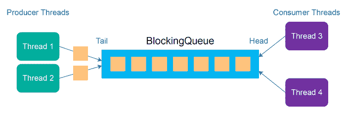
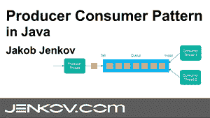
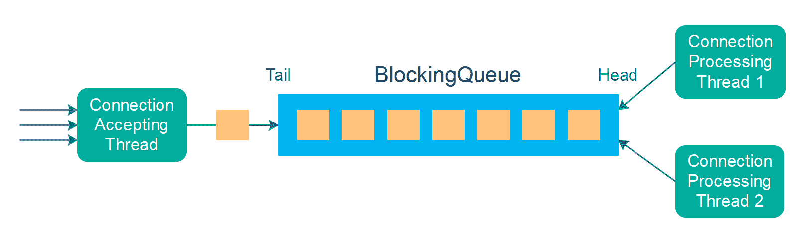
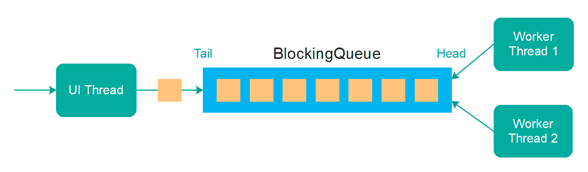

# 生产者消费者模式

> 原文：<https://jenkov.com/tutorials/java-concurrency/producer-consumer.html>

*生产者消费者*模式是一种并发设计模式，其中一个或多个生产者线程产生排队的 对象，然后由一个或多个消费者线程消费。入队的对象 通常代表一些需要完成的工作。 将工作的检测与工作的执行分离意味着你可以控制一次有多少线程参与检测或执行工作。

## 生产者消费者教程视频

如果你更喜欢视频，我这里有这个生产者消费者模式教程的视频版:
[生产者消费者模式——在 Java 中](https://www.youtube.com/watch?v=tEwNXnAmc9c&list=PLL8woMHwr36EDxjUoCzboZjedsnhLP1j4&index=17 "The producer consumer pattern - tutorial video.")。

 

## 用例

生产者消费者设计模式有几种不同的用例。一些最常见的是:

*   减少前台线程延迟。
*   不同线程之间的负载平衡工作。
*   背压管理。

### 减少前台线程延迟

在一些系统中，你有一个与外界通信的前台线程。在服务器中，它可以是接受来自客户端的传入连接的线程。在桌面应用程序中可能是 UI 线程。

为了不使前台线程忙于任务，前台线程从外界接收的任何任务都被卸载到一个或多个后台线程。在服务器中，它可以处理通过入站连接接收的数据。

在桌面应用程序中，前台线程(UI 线程)可以响应用户事件，例如打开文件、下载文件或保存文件等。为了避免 UI 线程被阻塞而导致整个 GUI 无响应，UI 线程可以将长时间运行的任务卸载给后台工作线程。

### 线程之间的负载平衡工作

生产者消费者模式的另一种用例是在一组工作线程之间进行负载平衡。实际上，这种负载平衡几乎是自动发生的，只要工作线程一有时间就从队列中取出新的任务对象进行处理。这将导致工作线程之间的任务负载平衡。

### 背压管理

如果生产者线程和消费者线程之间的队列是一个 [Java BlockingQueue](/java-util-concurrent/blockingqueue.html) ， ，那么你可以使用这个队列进行背压管理。这是 生产者消费者模式的另一个内置特性。

背压意味着，如果生产者线程产生的工作多于消费者线程能够处理的工作，那么任务将在队列中排队。在某一点上，BlockingQueue 将变满，并且生产者线程将被阻止尝试将新的任务/工作对象插入到队列中。这种现象称为*背压*。这个系统向 的制片人施压——在“管道”的开始——阻止更多的作品进来。

背压将从队列中“溢出”，并降低生产者线程的速度。因此，如果在整个管道中有任何更早的步骤，它们也可以将压力传播回工作管道。