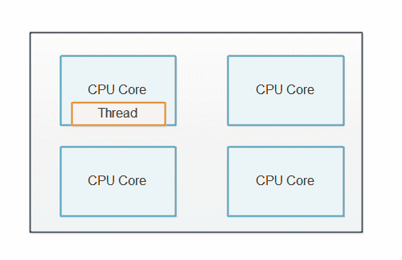
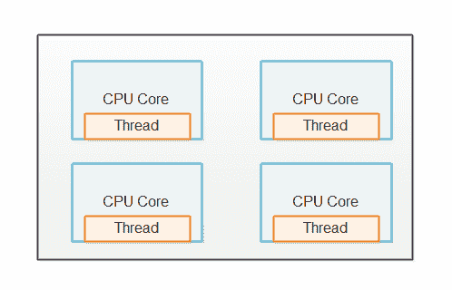
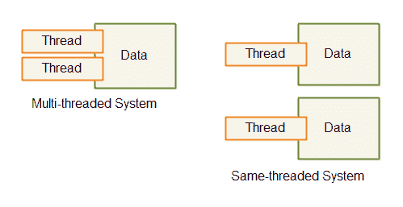
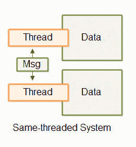
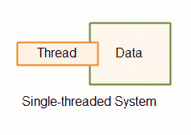
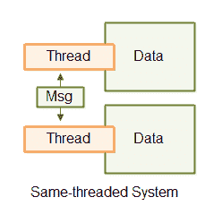

# 相同线程

> 原文：<https://jenkov.com/tutorials/java-concurrency/same-threading.html>

同线程是一种并发模型，其中一个单线程系统可以扩展到 N 个单线程系统。结果是 N 个单线程系统并行运行。

同线程系统不是纯粹的单线程系统，因为它包含多个线程。但是，每个线程都像单线程系统一样运行。因此有了术语*同线程*而不是单线程。

## 单线程和同线程设计教程视频

如果你喜欢视频，我这里有本教程的视频版本:[单线程和同线程设计](https://www.youtube.com/watch?v=QrYIOs1dA3M&list=PLL8woMHwr36EDxjUoCzboZjedsnhLP1j4&index=21 "Single-threaded and Same-threaded Designs")

[T2】](https://www.youtube.com/watch?v=QrYIOs1dA3M&list=PLL8woMHwr36EDxjUoCzboZjedsnhLP1j4&index=21 "Single-threaded and Same-threaded Designs")

## 为什么是单线程系统？

你可能想知道为什么今天有人会设计单线程系统。单线程系统越来越受欢迎，因为它们的并发模型比多线程系统简单得多。单线程系统不与其他线程共享任何状态(对象/数据)。这使得单线程能够使用非并发数据结构，并更好地利用 CPU 和 CPU 缓存。

不幸的是，单线程系统没有充分利用现代 CPU。现代 CPU 通常会多配备 2、4、6、8 个内核。每个内核都是一个独立的 CPU。单线程系统只能利用其中一个内核，如下所示:

## 同线程:单线程横向扩展

为了利用 CPU 中的所有内核，单线程系统可以向外扩展以利用整个计算机。

### 每个 CPU 一个线程

同线程系统通常在计算机的每个 CPU 上运行一个线程。如果一台计算机包含 4 个 CPU，或者一个 CPU 有 4 个内核，那么运行 4 个同线程系统实例(4 个单线程系统)是正常的。下图显示了这一原理:

## 没有共享状态

同线程系统看起来类似于传统的多线程系统，因为同线程系统内部运行着多个线程。但是有一个微妙的区别。

同线程和传统多线程系统的区别在于同线程系统中的线程不共享状态。没有线程同时访问的共享内存。没有并发数据结构等。线程通过它共享数据。这种差异如下所示:

共享状态的缺乏使得每个线程的行为就像单线程系统一样。然而，由于同一个线程系统可以包含不止一个线程，所以它不是真正的“单线程系统”。由于没有更好的名字，我发现称这样的系统为*同线程*系统更准确，而不是“单线程设计的多线程系统”。同线程更容易说，也更容易理解。

同线程基本上意味着数据处理停留在同一个线程中，同一个线程系统中没有线程同时共享数据。有时这也被称为*无共享状态*并发，或*分离状态*并发。

## 负载分布

显然，同线程系统需要在运行的单线程实例之间分担工作负载。如果只有一个线程得到任何工作，那么系统实际上就是单线程的。

具体如何在不同的线程上分配负载取决于系统的设计。我将在接下来的章节中介绍一些。

### 单线程微服务

如果您的系统包含多个微服务，每个微服务都可以在单线程模式下运行。当您将多个单线程微服务部署到同一台机器上时，每个微服务可以在一个 CPU 上运行一个线程。

微服务本质上不共享任何数据，因此微服务是同线程系统的一个很好的用例。

### 具有分片数据的服务

如果您的系统确实需要共享数据，或者至少共享一个数据库，您可以共享数据库。分片意味着数据被划分到多个数据库中。数据通常是分开的，因此所有彼此相关的数据都位于同一个数据库中。例如，属于某个“所有者”实体的所有数据都将被插入到同一个数据库中。不过，分片超出了本教程的范围，所以您必须搜索关于该主题的教程。

## 线程通信

如果同线程系统中的线程需要通信，它们通过消息传递来实现。如果线程 A 想要向线程 B 发送消息，线程 A 可以通过生成消息(一个字节序列)来实现。然后，线程 B 可以复制该消息(字节序列)并读取它。通过复制消息，线程 B 确保在线程 B 读取消息时，线程 A 不能修改消息。一旦复制，线程 a 就无法访问消息副本。

通过消息传递的线程通信如下所示:

线程通信可以通过队列、管道、unix 套接字、TCP 套接字等进行。只要适合你的系统。

## 更简单的并发模型

在同线程系统中，每个运行在自己线程中的系统都可以像单线程系统一样实现。这意味着内部并发模型比线程共享状态要简单得多。您不必担心并发数据结构以及这种数据结构可能导致的所有并发问题。

## 插图

这里有单线程、多线程和同线程系统的图示，因此您可以更容易地了解它们之间的区别。

第一幅插图显示了单线程系统。

第二幅图显示了一个多线程系统，其中线程共享数据。

第三幅图展示了一个具有两个线程的同线程系统，这两个线程使用不同的数据，通过相互传递消息来进行通信。

## Java 线程操作

Thread Ops for Java 是一个开源工具包，旨在帮助您更轻松地实现独立状态的同线程系统。Thread Ops 包含启动和停止单个线程的工具，以及在单个线程内实现某种程度的并发性的工具。如果您对同线程应用程序设计感兴趣，那么您可能会对线程操作感兴趣。你可以在我的【Java 线程操作教程中阅读更多关于线程操作的内容。