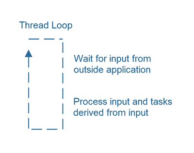
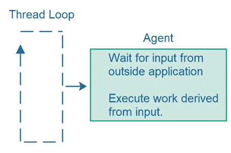
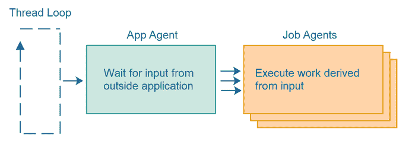
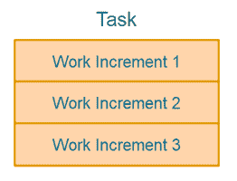
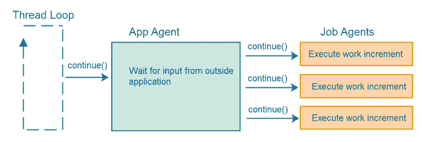
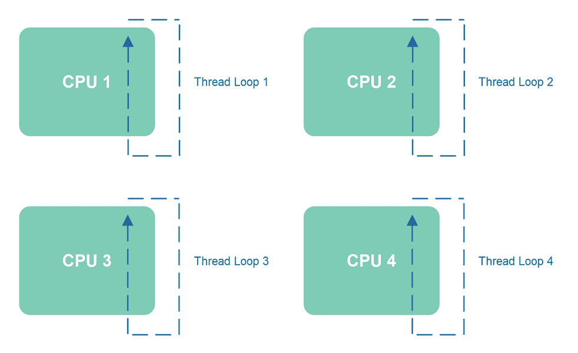
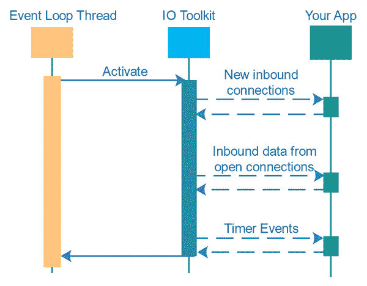
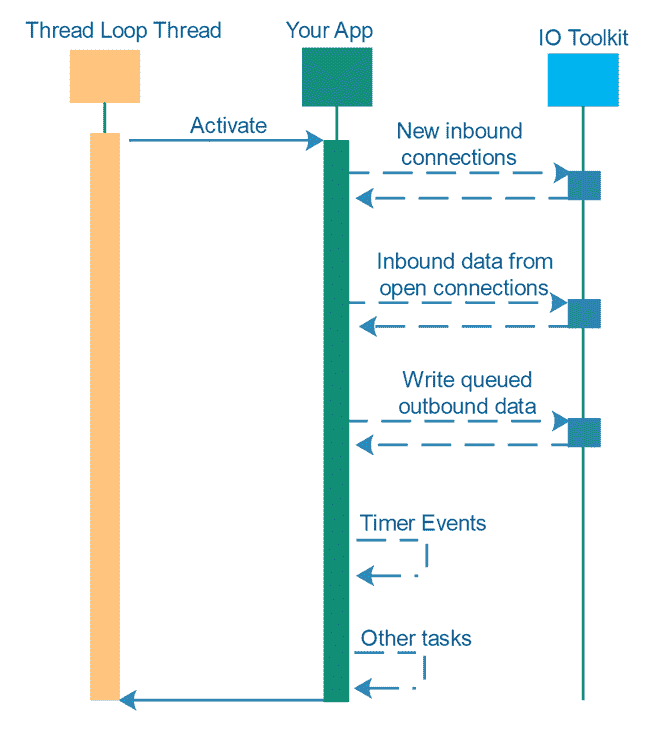

# 单线程并发

> 原文：<https://jenkov.com/tutorials/java-concurrency/single-threaded-concurrency.html>

*单线程并发*意味着在一个线程中同时处理多个任务 。传统上，你会使用多线程一次处理多个任务 ，每个线程处理自己的任务。使用传统的多线程并发 不同任务之间的切换是通过操作系统和 CPU 在不同线程之间的切换来完成的。 然而，使用单线程并发技术，单个线程实际上可以通过在每个任务的进度之间切换来在多个任务上取得进展 。 在这篇单线程并发教程中，我将解释单线程并发是如何工作的， 以及单线程并发设计带来的好处。

## 单线程并发仍然是一个新领域

我开始研究单线程并发设计，同时使用 [Java NIO](/java-nio/index.html) 为单线程服务器设计寻找一个更好的线程模型，用于非阻塞 IO。 Netty、Vert.x、Undertow 等高性能 IO 工具包使用单线程服务器设计。节点。JS 也采用单线程设计。Vert.x 和 Undertow 都在下面使用 Netty(据我所知)， ，因而都受制于 Netty 的线程模型。

Netty 的线程模型以一个叫做事件循环的概念为中心。事件循环是一个在循环中运行的线程——寻找系统中发生的事件。当事件发生时，您的代码会调用，以便您的代码可以响应它。

虽然事件循环线程设计适用于某些类型的系统和工作负载，但也有其他类型的系统和工作负载不太适用。因此，我决定从别处寻找单线程并发设计来满足我的需求。顺便说一下，我将在后面的单线程并发教程中更详细地解释这一切。

在 Netty 和 Node.JS 之外，我没有找到太多关于单线程并发设计的信息。也许它隐藏在付费墙或其他东西后面的科学文章中。或者也许这只是一个没有被深入研究的领域。

由于我没有发现太多关于单线程并发设计的文章，我不得不自己想出一些设计。我在这篇单线程并发教程中介绍了这些设计。然而，我怀疑随着时间的推移，有可能会出现更好的设计(如果不是这样，那就很奇怪了)。如果你有任何想法或参考，我会非常有兴趣了解他们！在一些社交媒体网站上找到我，给我写信！

请注意:本教程仍在进行中。更多将在不久的将来添加！

## 经典多线程并发

在经典的多线程并发架构中，您通常会将每个任务分配给单独的线程来执行。每个线程一次只执行一个任务。在一些设计中，将为每个任务创建一个新线程，因此一旦任务完成，该线程就终止。在其他设计中，线程池保持活动，每次从任务队列中取出一个任务，执行它，然后取出另一个任务，等等。更多信息请参见我的关于线程池的教程。

多线程架构的优势在于，跨多个线程和多个 CPU 分配工作负载相对容易。只需将任务交给一个线程，让操作系统/ CPU 将该线程调度给一个 CPU。

然而，如果正在执行的任务需要共享数据，多线程架构会导致很多并发问题，如[竞争条件](race-conditions-and-critical-sections.html)、 、[死锁](deadlock.html)、 、[饥饿](starvation-and-fairness.html)、[滑落条件](slipped-conditions.html)、 、[嵌套监视器锁定](nested-monitor-lockout.html)等。一般来说，多个线程 共享相同的数据和数据结构越多，发生并发问题的可能性就越大。换句话说，你越需要仔细检查你的设计。

当多个线程试图同时访问同一个数据结构时，经典的多线程架构有时也会导致拥塞。根据给定数据结构实现的好坏，一些线程可能被阻塞等待访问，而其他线程正在访问该数据结构。

## 单线程或同线程并发

传统多线程并发架构的替代方案是单线程或[同线程](same-threading.html)并发架构。在单线程并发 设计中，你必须自己实现任务切换。

您可以将单线程架构扩展到使用多线程，其中每个线程的行为就像是一个单独的、隔离的单线程系统。在这种情况下，我将该架构称为同线程架构。执行任务所需的所有数据仍然隔离在一个线程中——在同一个线程中。

## 单线程并发优势

在我看来，单线程并发设计比多线程并发设计有一些好处。我将论证我认为这些好处是什么。

### 全线程可见性

首先，单线程并发避免了多线程并发可能出现的大部分并发问题。当同一个线程执行多个任务时，您可以避免并发问题，例如线程可见性问题，其中对共享数据结构的更新对其他线程不可见。

使用多线程并发，您将确保使用同步、可变变量和/或并发数据结构的正确组合，以保证对由多个任务共享的数据结构的更新对其他线程是可见的。

更多关于 Java 线程可见性问题的 信息，参见我的教程关于 [Java 内存模型](/java-concurrency/java-memory-model.html)和 [Java 发生在保证之前](/java-concurrency/java-happens-before-guarantee.html)。

### 没有竞争条件

当只有一个线程访问多个任务共享的数据结构时(因为所有的任务都是由同一个线程执行的)，就避免了竞争条件的问题。当多个线程在没有任何保证的线程访问顺序的情况下访问同一个临界区时，可能会发生争用情况。你可以在我的关于[竞赛条件和临界区](/java-concurrency/race-conditions-and-critical-sections.html)的教程中读到更多关于这些问题的内容。

### 任务切换控制

当你自己在任务之间转换时，你可以控制转换发生的时间。您可以确保共享资源在切换之前处于合理的状态，并且您可以决定在切换之前执行多大的工作增量(块)是有意义的。

在切换到另一个任务之前，能够决定要执行多大的工作块(增量)可以让您更好地控制如何利用 CPU。小的工作增量导致更多的任务转换。较大的工作增量导致较少的任务切换。任务切换是您希望最小化的开销。从一个任务暂停到恢复另一个任务所花费的 CPU 周期被浪费了。CPU 时间本身不会为您的应用程序产生任何有用的工作。也许你根本不希望某个规模以下的任务是可中断的——以避免不必要的任务切换。

能够决定工作增量的大小也使你能够优先处理一个任务。如果您在两个任务之间切换，您可以决定一个任务一次只允许执行 1 个工作增量，而另一个任务一次允许执行 2 个或更多的工作增量。因此，第二个任务将比第一个任务获得更多的 CPU 时间。您可以自己控制这项任务的优先级。

### 对任务优先级的控制

以某种方式实现单线程任务切换是可能的，这样您可以将一些任务优先于其他任务，这意味着给一些任务比其他任务更多的 CPU 时间。我将在本教程的后面回到这个问题。

## 单线程并发挑战

使用单线程并发设计也带来了一些挑战。我将在下面描述其中的一些挑战。

有可能在不失去单线程并发架构的简单性优势的情况下克服这些挑战，并且不会使整体设计过于复杂。

### 需要实施

必须自己实现任务切换要求您学习如何实现这样的设计，以及实际实现它们。这是一个挑战。这也给你的代码库增加了一点开销(尽管我认为不会太多)。幸运的是，创建单线程任务切换设计是可能的，它可以跨应用程序重用，因此您可以最小化实现开销。

### 阻塞操作必须避免或在后台线程中处理

如果一个任务需要执行阻塞 IO 操作，那么该任务和线程将保持阻塞状态，直到该 IO 操作完成。在等待阻塞 IO 操作完成时，线程无法切换到另一个任务。

由于这种阻塞 IO 操作的限制，有必要在它们自己的后台线程中执行这些任务——从而回复到用于这些任务的经典多线程设计。

### 一个线程只能使用一个 CPU

一个线程只能使用一个 CPU。如果您的应用程序运行在具有多个 CPU 或 CPU 内核的计算机上，并且您希望充分利用它们，那么您必须将单线程设计升级为同线程设计。这是可能做到的，尽管需要做一些工作。

## 单线程并发设计

现在，让我们来看看一些提供我前面提到的功能的单线程设计，这样您就可以亲眼看到它们是如何工作的，并了解它们的优缺点。

## 线程循环

大多数长时间运行的应用程序在某种循环中执行，其中主应用程序线程等待来自应用程序外部的输入，处理该输入，然后返回等待。

这种线程循环既用于服务器应用程序(web 服务、服务等)。)和 GUI 应用程序。有时候这个线程循环对你是隐藏的。有时候不会。

### 暂停线程循环

您可能想知道一个线程在一个紧循环中反复执行是否会浪费大量的 CPU 时间。如果线程在没有任何实际工作要做的情况下运行，那么是的，这可能会浪费大量的 CPU 时间。然而，如果执行循环的线程估计休眠几毫秒没问题，那么它可以自由地“休眠”。这样可以减少 CPU 时间的浪费。

## 代理人

线程循环通常调用执行应用程序工作的某个组件。我将这个组件称为*代理*。代理是一个类似工作的组件，由 执行工作。

代理的寿命可能会有所不同。代理可以:

*   在应用程序的整个生命周期内运行。
*   运行一个运行时间更长的作业——最终完成。
*   运行一次性任务——它很快完成。

因此，代理可以执行应用程序的长时间运行的逻辑、由许多较小的任务组成的单个但长时间运行的作业，或者几乎立即完成的单个一次性任务。所以，*代理* 这个术语涵盖了多种规模的任务和责任。

我更喜欢“代理人”这个术语，而不是“T2”工作或“T4”任务，因为代理人的生命周期、责任和能力可能会超出我们通常认为的单一 工作或任务。我认为代理是执行作业和任务的组件。它本身并不是一项工作或任务——尽管在某些情况下看起来是这样。

## 线程循环调用代理

线程循环通常会重复调用代理组件，将应用程序的实际责任交给代理。这种设计在线程循环和代理之间划分了责任，如下所示:

线程循环负责循环(重复对代理的调用)并检测代理何时终止，从而终止线程循环。代理负责执行应用程序逻辑本身，但不负责循环。

使用这种设计，您可以创建不同类型的线程循环，这些循环可以与不同种类的代理结合使用。这是这个设计的样子:

## 代理可以呼叫其他代理

一个代理可以将它的工作分配给其他代理。因此，代理具有不同级别的责任。下图说明了单个应用程序级代理和多个作业级代理之间的责任划分:

## 单线程任务切换

如果上一节图表中所示的作业代理执行的一些作业需要很长时间才能完成，该怎么办？如果作业代理在第一次被应用程序代理调用时只是执行了全部工作，那么当第一个作业代理完成其全部工作时，整个系统(线程循环+代理)将被阻止处理任何其他作业或任务。

为了能够同时处理多个任务，处理任务的线程必须能够在任务之间切换。这也被称为*任务切换*。 当你只有一个线程可用时，你需要通过你的 代码设计使任务切换成为可能。

为了使任务切换在单个线程中成为可能，每个任务必须分成一个或多个*增量*，如下图所示:

每当一个代理被调用时，它将执行一个或多个工作增量。迟早所有的工作增量都会被执行，整个任务也就完成了。

一遍又一遍地调用代理的循环，让它们每次执行一个工作增量，如下所示:

## 增量大小平衡

如果单个线程能够在多个任务之间切换，那么这些任务不能被分成太大的增量。换句话说，帮助确保任务之间执行时间的公平划分是每个任务的责任。正确的大小取决于具体的任务和您的应用程序。

## 优先执行

可以将一些任务的执行优先于其他任务。您可以通过在调用代理时传递一个参数来实现这一点，该参数告诉代理要执行多少个工作增量。因此，一些代理可能被指示仅执行 1 个工作增量，而其他代理可能被指示执行 2 个或更多工作增量。这将导致一些任务获得比其他任务更多的 CPU 执行时间，因此它们将更快地完成。

## 代理停车

如果代理正在等待某个异步操作完成，例如来自远程服务器的回复，则代理将无法再进行任何操作，直到它所等待的异步操作完成。在这种情况下，仅仅为了让代理立即意识到它无法取得任何进展并立即将控制权返回给调用线程而一遍又一遍地调用该代理可能没有意义。

在这种情况下，代理能够“暂留”自己以便不再被呼叫可能是有意义的。当异步操作完成时，代理可以被解除暂留并重新插入到活动代理中，这些活动代理被连续调用以取得进展。当然，为了能够解除代理的驻留，系统的某个其他部分必须检测到异步操作已经完成，并确定要解除哪个代理的驻留。

## 扩展单线程并发

显然，如果您的应用程序中只有一个线程在执行，您就不能利用多个 CPU。解决方案是启动多个线程。通常，每个 CPU 一个线程——这取决于线程需要执行什么样的任务。如果您有需要执行阻塞 IO 工作的任务，比如从文件系统或网络读取，那么您可能需要每个 CPU 不止一个线程。在等待阻塞 IO 操作完成时，每个线程都将被阻塞，什么也不做。

当您将单线程架构扩展到多个单线程子系统时，它在技术上不再是*单线程*。然而，每个单线程子系统通常会被设计为 ，并且表现为单线程系统。我曾经把多线程单线程系统称为 [同线程](same-threading.html)系统，尽管我不确定这是否是最准确的术语。我们可能需要重新审视这些不同的设计，并在未来为它们想出更具描述性的术语。

## 事件循环与线程循环

在本单线程并发教程的开始，我提到了 Netty 等工具包的事件循环与我在本教程中建议使用的线程循环不同。为了说明区别，我在下面的两个图中总结了事件循环和线程循环设计的控制流。

下面的第一张图显示了一个事件循环。执行事件循环的线程首先调用事件循环，然后在各种事件发生时调用您的应用程序代码。事件之间的时间由事件循环代码控制。您的应用程序不能利用这一点。

下面的第二张图显示了一个线程循环。执行线程循环的线程首先调用您的应用程序，然后应用程序调用 IO 工具包来检查新的入站连接，或者任何已经打开的连接上的新的传入数据，或者计时器事件。

在线程循环设计中，检测到的事件之间的任何可用时间都可以被应用程序用于它想要的任何目的。例如，应用程序可以使用单线程任务切换继续处理一组尚未完成的任务。

此外，如果应用程序有大量工作要做，它可以选择不检查新的入站连接，或者不从打开的连接中读取传入数据——通过这种方式对网络实施反压力。然后，应用程序可以专注于执行当前正在进行的任务。

这种选择何时检查事件以及如何处理事件之间的时间的自由是我更喜欢线程循环设计而不是事件循环设计的原因。当然，设计上的差异是微妙的，这需要您编写更多的代码，但是它也给了您更大的控制和灵活性。