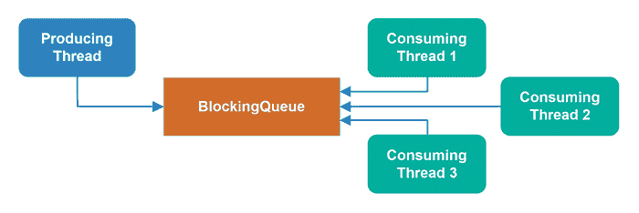
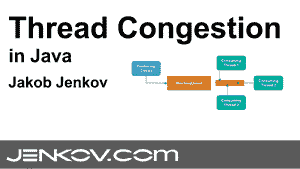
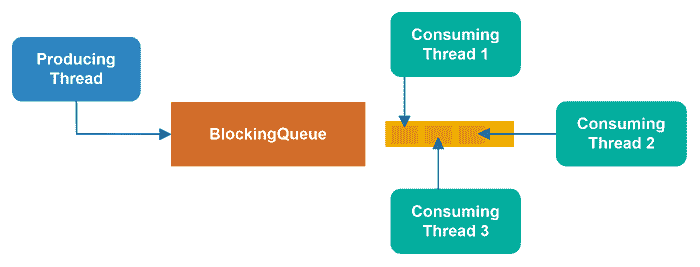
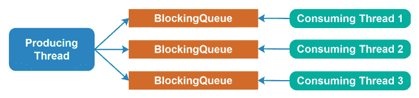

# Java 中的线程拥塞

> 原文：<https://jenkov.com/tutorials/java-concurrency/thread-congestion.html>

*线程* *拥塞*当两个或多个线程试图同时访问同一个 守护的数据结构时就会发生。我说的“保护”是指使用 同步块或并发数据结构(锁、阻塞队列等)来保护数据结构。)以便数据结构 是线程安全的。由此产生的线程拥塞意味着试图访问共享的 数据结构的线程花费大量时间排队等待访问数据结构——在等待中浪费了 宝贵的执行时间。

## 线程拥塞教程视频

如果你喜欢视频，我这里有这个线程拥塞教程的视频版本:[Java 中的线程拥塞](https://www.youtube.com/watch?v=DqpPRxCmxrM&list=PLL8woMHwr36EDxjUoCzboZjedsnhLP1j4&index=22" "Thread Congestion in Java")

## 线程阻塞数据结构可能会导致线程拥塞

一个阻止线程访问它的数据结构——取决于其他线程当前正在访问它——可能会导致线程拥塞。如果一个以上的线程同时访问这样的数据结构，则一个或多个线程可能排队等待访问该数据结构。

这种排队在您的代码中是不可见的。排队发生在 Java VM 内部。因此，仅仅通过查看代码是不容易发现线程拥塞的。您可能需要分析工具来检测线程拥塞——或者，您需要了解预测哪里会发生线程拥塞。

## 被阻塞的线程会损失执行时间

当一个线程在尝试执行阻塞数据结构时被阻塞，它不能做任何事情。因此，当被阻塞时，线程失去了可能的执行时间。线程被阻塞的时间越长，它损失的潜在执行时间就越多。

## 线程越多，拥塞程度越高

尝试访问共享的、阻塞的数据结构的线程越多，发生线程拥塞的风险就越高，拥塞程度也可能越高(排队等待访问数据结构的线程数量)。

## 缓解线程拥塞

为了减轻线程拥塞，您必须减少同时尝试访问阻塞数据结构的线程数量。有几种方法可以做到这一点。

### 多重数据结构

减轻线程拥塞的一种方法——至少在阻塞队列周围——是给每个消费线程一个自己的队列，并让生产线程在这些阻塞队列中分配对象(例如任务)。这样，只有两个线程访问每个队列:生产线程和消费线程。

### 非阻塞并发算法

另一种方法是使用[非阻塞并发算法](non-blocking-algorithms.html)，其中访问数据结构的线程 永远不会被阻塞。非阻塞并发算法和数据结构通常比阻塞并发算法或数据结构浪费更少的线程潜在执行时间。