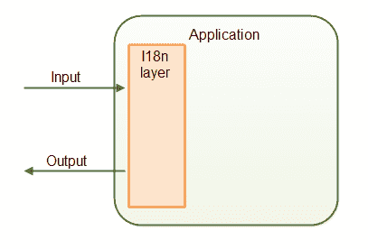
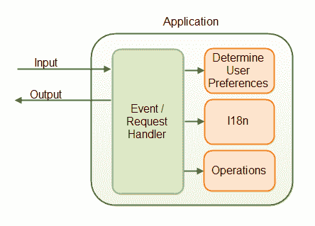

# Java 国际化:概述

> 原文：<https://jenkov.com/tutorials/java-internationalization/overview.html>

国际化 Java 应用程序通常意味着使应用程序能够处理多种语言、数字格式、日期格式等。这篇文章给了你这些方面的概述。

基本上，您的应用程序应该能够处理国际输入、输出和操作。换句话说，您的应用程序应该能够适应特定于不同位置和用户偏好的输入、输出和操作。

|  |
| 你的应用程序应该能够处理国际输入和输出。 |

输入和输出是应用程序需要处理的粗粒度分类。以下是您的应用程序需要涵盖的问题，更详细一些:

## 处理国际输入

输入是您的应用程序从用户那里接收到的一切，或者直接通过用户界面，通过服务调用(例如 SOAP 或 REST 调用)发送给它，或者从文件导入等等。输入包括:

*   表单输入包括
    *   文本(语言+字符编码)
    *   数字格式
    *   日期和时间格式及计算
*   收到的文件
*   收到的服务呼叫

## 处理国际输出

输出是您的应用程序在安装过程或一般使用过程中向用户显示或发送的所有内容。输出包括:

*   文本(语言+字符编码)
*   数字和货币格式
*   日期和时间格式及计算
*   字符比较
*   字符串比较

您的应用程序需要能够处理多少这些方面取决于您的应用程序。

请记住，如果用户可以让应用程序显示文本等。用他们自己的语言，他们也可能期望得到支持、发送给他们的电子邮件、论坛、帮助文本等。用他们自己的语言。

## 调整操作

除了适应输入和输出之外，您的应用程序可能需要使某些内部操作适应用户的位置和偏好。例如，一个网上商店可能需要根据买家居住的国家，对销售增加不同数额的增值税。投资计算器可能必须考虑不同的法律和税率等。

## 需要用户信息

为了将您的应用程序正确地本地化给用户，您可能需要以下一项或多项:

*   首选语言
*   侨居国
*   当前位置
*   首选时区

用户应该能够说出他或她喜欢应用程序使用哪种语言。不要只是假设生活在某个国家的用户希望应用程序本地化为该语言。例如，我来自丹麦，但我更喜欢应用程序是英文的，所以我可以和世界各地的人谈论它的功能，而不必翻译功能名称等。让用户决定。

用户居住的国家可能会影响用户可以使用哪些功能，以及这些功能如何工作。例如，YouTube 不允许任何人成为 YouTube 的合作伙伴。只有居住在某些国家的用户才被允许进入该程序。

对于某些应用程序，特别是对于所有基于位置的应用程序，知道当前位置可能是有意义的。该应用可以基于用户的位置采取行动。

有些应用程序，如共享日历，可能需要知道用户的时区才能正常工作。上午 10 点的约会——用户所在国家的时间是几点？应用服务器运行所在的时区是几点？用户暂时不在国内，需要显示临时所在地时区的所有约会吗？

## 应用国际化层

为了处理输入和输出的国际化，您的应用程序将有一种国际化层。下图说明了:

|  |
| **一个应用国际化层。** |

国际化层负责用户语言和格式以及应用程序内部使用的语言和格式之间的转换。例如，字符串以 UTF-16 格式保存在 JVM 的内存中。国际化层应该从输入的任何编码字符(ascii、UTF-8 等)进行转换。)和 UTF-16。

国际化层可能看起来不像是位于应用程序内部和外部组件之间的抽象层。相反，它最有可能是一组对能够进行转换和翻译的国际化组件的 API 调用。接收输入数据的应用程序层将调用这个国际化 API，并将转换后的值传递给核心操作。

为了正确地转换输入数据，国际化层必须收集关于用户的必要信息。即语言、字符编码、数字格式、日期格式、时区转换等。输入数据的。

当应用程序需要输出数据时，过程是相似的。应用程序决定输出什么，并调用国际化层将输出转换成适合用户的格式。这同样包括语言、字符编码、数字格式、日期格式、时区转换等。

实际上，您的应用程序可能更像这样:

|  |
| **应用程序中的 Java 国际化组件。** |

事情大概是这样的:

1.  输入(事件或请求)到达应用程序中的输入处理程序(事件处理程序/请求处理程序)。
2.  输入处理器确定本地化所需的用户设置。
3.  输入处理器调用 I18n 组件来获取本地化的文本、数字、日期等。
4.  输入处理器调用应用程序操作。如果需要用户首选项来执行操作，它们将被传递给应用程序操作。

您的应用程序的国际化可能与此稍有不同。别担心。这里没有设计的对错。

## 为什么是国际化组件？

使用国际化层或组件的原因是将国际化代码与应用程序的其余部分分开。你可以选择使用 Java 内置的国际化特性，也可以使用另一个 API，比如 [ICU4J](http://site.icu-project.org/) 。通过将您的国际化代码封装在一个`I18n`组件中，您可以更改其中使用的 API，而不会影响应用程序的其他部分。

## Java 的国际化类

Java 有一组内置的类，可以帮助您处理应用程序的国际化。这些类别是:

| 班级 | 描述 |
| 现场 | `Locale`类代表一种语言和一个国家或地区。一个`Locale`也可以代表某种类型的格式——例如日期或数字格式。 |
| ResourceBundle | `ResourceBundle`类可以包含本地化的文本或组件(对象)。您为一个特定的`Locale`获得一个`ResourceBundle`，从而获得本地化到那个`Locale`的文本或对象。 |
| 数字格式 | `NumberFormat`类用于根据某个`Locale`格式化数字。 |
| 十进制格式 | `DecimalFormat`类用于根据定制的格式化模式格式化数字。这些模式也是`Locale`敏感的。 |
| 日期格式 | `DateFormat`类用于根据特定的`Locale`来格式化日期。 |
| 简单日期格式 | `SimpleDateFormat`类用于根据定制的格式模式解析和格式化日期。这些模式也是`Locale`敏感的。 |

这些类中的每一个都将在后面的文章中详细介绍。