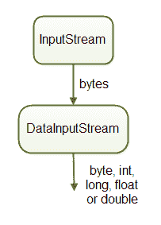

# Java 数据输入流

> 原文：<https://jenkov.com/tutorials/java-io/datainputstream.html>

*Java**data inputstream*类`java.io.DataInputStream`，使您能够读取 Java 原语(int、float、long 等。)而不仅仅是原始字节。你将一个`InputStream`包装在一个`DataInputStream`中，然后你可以通过`DataInputStream`读取 Java 原语。这就是它被称为 *DataInputStream* 的原因——因为它读取数据(数字)而不仅仅是字节。



如果需要读取的数据由大于一个字节的 Java 原语组成，比如 int、long、float、double 等，那么`DataInputStream`就很方便。`DataInputStream`期望多字节原语以网络字节顺序写入(大端字节序-最高有效字节优先)。

通常你会使用一个 Java DataInputStream 来读取一个 [Java DataOutputStream](dataoutputstream.html) 写的数据。

Java DataInputStream 类是 InputStream 的一个子类，因此 DataInputStream 也有基本的读取方法，使您能够在需要时从底层 InputStream 读取单个字节或字节数组。在这篇 Java DataInputStream 教程中，我将只介绍 DataInputStream 拥有的额外方法。

在读取原始数据类型时要记住的一个问题是，没有办法区分有效的 int 值-1 和正常的流结束标记。这基本上意味着，如果已经到达流尾，就不能从返回的原始值中看到。因此，您必须提前知道要读取什么数据类型，以及以什么顺序读取。换句话说，您需要提前知道可以从 DataInputStream 中读取哪些数据。

## Java 数据输入流示例

下面是一个 Java `DataInputStream`的例子:

```
DataInputStream dataInputStream = new DataInputStream(
                            new FileInputStream("binary.data"));

int    aByte   = input.read();
int    anInt   = input.readInt();
float  aFloat  = input.readFloat();
double aDouble = input.readDouble();
//etc.

input.close();

```

首先创建一个`DataInputStream`，用一个`FileInputStream`作为它的数据源。其次，Java 原语是从`DataInputStream`中读取的。

## 创建数据输入流

通过构造函数创建 Java DataInputStream。当您这样做时，您传递一个 InputStream 作为参数，从中读取原始数据类型。下面是一个创建 Java 数据输入流的示例:

```
DataInputStream dataInputStream =
        new DataInputStream(
                new FileInputStream("data/data.bin"));

```

## 将 DataInputStream 与 DataOutputStream 一起使用

如前所述，`DataInputStream`类通常与`DataOutputStream`一起使用。因此，我只想给你看一个例子，先用一个`DataOutputStream`写数据，然后用一个`DataInputStream`再次读取数据。以下是 Java 代码示例:

```
import java.io.*;

public class DataInputStreamExample {

    public static void main(String[] args) throws IOException {
        DataOutputStream dataOutputStream =
                new DataOutputStream(
                        new FileOutputStream("data/data.bin"));

        dataOutputStream.writeInt(123);
        dataOutputStream.writeFloat(123.45F);
        dataOutputStream.writeLong(789);

        dataOutputStream.close();

        DataInputStream dataInputStream =
                new DataInputStream(
                        new FileInputStream("data/data.bin"));

        int   int123     = dataInputStream.readInt();
        float float12345 = dataInputStream.readFloat();
        long  long789    = dataInputStream.readLong();

        dataInputStream.close();

        System.out.println("int123     = " + int123);
        System.out.println("float12345 = " + float12345);
        System.out.println("long789    = " + long789);
    }
}

```

这个例子首先创建一个`DataOutputStream`，然后将一个`int`、`float`和一个`long`值写入一个文件。其次，该示例创建了一个从同一个文件中读取`int`、`float`和`long`值的`DataInputStream`。

## 读取布尔值

您可以使用 Java 的`readBoolean()`方法从 DataInputStream 中读取 Java `boolean`。下面是一个使用`readBoolean()`从 Java DataInputStream 中读取布尔值的例子:

```
boolean myBoolean = dataInputStream.readBoolean();

```

## 读取字节

您可以使用 Java 的`readByte()`方法从 DataInputStream 中读取 Java `byte`。下面是一个使用`readByte()`从 Java DataInputStream 中读取一个字节的例子:

```
byte myByte = dataInputStream.readByte();

```

## 读取无符号字节

您可以使用其`readUnsignedByte()`方法从 DataInputStream 中读取一个 Java 无符号的`byte`(仅正值)。无符号字节作为`int`返回，因为大于 127 的字节值不适合有符号的`byte`数据类型。下面是一个使用`readUnsignedByte()`从 Java DataInputStream 中读取无符号字节的例子:

```
int myUnsignedByte = dataInputStream.readUnsignedByte();

```

## 读取字符

您可以使用 Java 的`readChar()`方法从 DataInputStream 中读取 Java `char`。下面是一个使用`readChar()`从 Java DataInputStream 中读取字符的例子:

```
char myChar = dataInputStream.readChar();

```

## 双重阅读

您可以使用 Java 的`readDouble()`方法从 DataInputStream 中读取 Java `double`。下面是一个使用`readDouble()`从 Java DataInputStream 读取 double 的例子:

```
double myDouble = dataInputStream.readDouble();

```

## 读取浮点

您可以使用 Java 的`readFloat()`方法从 DataInputStream 中读取 Java `float`。下面是一个使用`readFloat()`从 Java DataInputStream 中读取浮点数的例子:

```
float myFloat = dataInputStream.readFloat();

```

## 简短阅读

您可以使用 Java 的`readShort()`方法从 DataInputStream 中读取 Java `short`。下面是一个使用`readShort()`从 Java DataInputStream 中读取短文的例子:

```
short myShort = dataInputStream.readShort();

```

## 读取无符号短整型

您可以使用其`readUnsignedShort()`方法从 DataInputStream 中读取一个 Java 无符号的`short`(仅正值)。无符号短整型作为`int`返回，因为大于 32767 的短整型值不适合有符号的`short`数据类型。下面是一个使用`readUnsignedShort()`从 Java DataInputStream 中读取一个无符号 short 的例子:

```
int myUnsignedShort = dataInputStream.readUnsignedShort();

```

## 阅读

您可以使用 Java 的`readInt()`方法从 DataInputStream 中读取 Java `int`。下面是一个使用`readInt()`从 Java DataInputStream 读取 int 的例子:

```
int   myInt = dataInputStream.readInt();

```

## 长时间阅读

您可以使用 Java 的`readLong()`方法从 DataInputStream 中读取 Java `long`。下面是一个使用`readLong()`从 Java DataInputStream 读取 int 的例子:

```
long   myLong = dataInputStream.readLong();

```

## 阅读 UTF

您可以使用 Java 的`readUTF()`方法从 DataInputStream 中读取 Java `String`。该数据预计将被编码为 UTF-8，以便通过该方法读取。下面是一个使用`readUTF()`从 Java DataInputStream 中读取字符串的例子:

```
String   myString = dataInputStream.readUTF();

```

## 关闭 DataInputStream

当你从`DataInputStream`中读取完数据后，你应该记得关闭它。关闭一个`DataInputStream`也会关闭`DataInputStream`正在读取的`InputStream`实例。

关闭一个`DataInputStream`是通过调用它的`close()`方法完成的。下面是关闭一个`DataInputStream`的样子:

```
dataInputStream.close();

```

您还可以使用 Java 7 中引入的 [try-with-resources](/java-exception-handling/try-with-resources.html) 构造。以下是如何使用 try-with-resources 构造来使用和关闭`DataInputStream`外观:

```
InputStream input = new FileInputStream("data/data.bin");

try(DataInputStream dataInputStream =
    new DataInputStream(input)){

    int data = dataInputStream.readInt();

    int   int123     = dataInputStream.readInt();
    float float12345 = dataInputStream.readFloat();
    long  long789    = dataInputStream.readLong();
}

```

注意不再有任何显式的`close()`方法调用。try-with-resources 构造负责这一点。

还要注意，第一个`FileInputStream`实例不是在 try-with-resources 块中创建的。这意味着 try-with-resources 块不会自动关闭这个`FileInputStream`实例。然而，当`DataInputStream`关闭时，它也会关闭它所读取的`InputStream`实例，所以当`DataInputStream`关闭时，`FileInputStream`实例也会关闭。