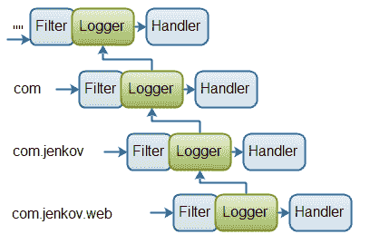
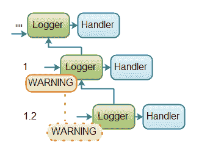
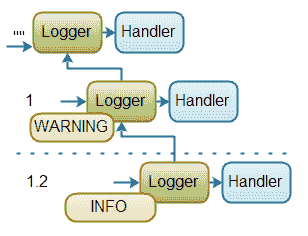

# Java 日志记录:记录器层次结构

> 原文：<https://jenkov.com/tutorials/java-logging/logger-hierarchy.html>

应用程序中使用的`Logger`通常被组织成一个层次结构，正如本教程中其他地方提到的。本文将仔细研究这个`Logger`层次结构是如何工作的。

当你创建一个`Logger`时，你传递一个名字给`Logger.getLogger()`方法。这里有一个例子:

```
Logger logger  = Logger.getLogger("com.jenkov.web");

```

在本例中，创建的`Logger`的名称是`com.jenkov.web`。

该名称表示`Loggers`的层级。每个。名称中的(点)标记层次结构中的一个级别。(注意:这些级别与记录的消息的日志级别不同。).名字为`com.jenkov.web`的`Logger`有 3 个父母，他们的名字是:

```
""
"com"
"com.jenkov"

```

下图展示了完整的层次结构:

|  |
| **Java 记录器层级示例** |

如果您调用上面例子中创建的`Logger`上的`getParent()`，您将获得名为`com.jenkov`的`Logger`。如果你在那个`Logger`上调用`getParent()`，你将得到名字为`com`的`Logger`。层次的根是名称为空字符串的`Logger`(`""`)。

需要注意的一点是，在它们存在之前，您需要在层次结构中创建`Loggers`。所以，如果你像这样创建一个`Logger`:

```
Logger logger  = Logger.getLogger("com.jenkov.web");

```

...并且调用`getParent()`方法，你会得到名字为`""`的`Logger`。其原因是，层次结构中没有任何中间的`Logger`被创建。您需要执行以下操作来实例化层次结构中的所有`Logger`:

```
Logger logger  = Logger.getLogger("");
Logger logger1 = Logger.getLogger("com");
Logger logger2 = Logger.getLogger("com.jenkov");
Logger logger3 = Logger.getLogger("com.jenkov.web");

```

现在，如果你在`logger3`上调用`getParent()`，你将得到名为`com.jenkov`的`Logger`。那个`Logger`的父名叫`com`等。

## 记录器层次结构中的过滤器和处理程序

当一条消息被传递到`Logger`时，如果`Logger`设置了`Filter`，则该消息通过`Logger`的`Filter`传递。`Filter`可以接受或拒绝该消息。如果消息被接受，则消息被转发到`Logger`上的`Handler`设置。如果没有设置`Filter`，消息总是被接受。

如果消息被`Filter`接受，该消息也会被转发给父`Logger`的`Handler`。但是，当消息沿层级向上传递时，消息是通过父`Logger`的`Filter`传递的*而不是*。只有当消息直接传递给`Logger`时，而不是当消息来自子`Logger`时，才会要求`Filter`接受该消息。

下图说明了消息在`Logger`层级中的传播:

|  |
| **Java 记录器层级示例** |

为了向您展示这一点，我将使用几个代码示例来说明它。

首先，这里有一个在层次结构中创建 3 个记录器的示例。A `ConsoleHandler`被分配给其中的 2 个。默认情况下，根`Logger`有一个`Handler`，因此没有必要在其上添加一个`Handler`。然后记录 3 条消息。通过层级中的每个`Logger`发送一条消息。代码如下:

```
Logger logger      = Logger.getLogger("");
Logger logger1     = Logger.getLogger("1");
Logger logger1_2   = Logger.getLogger("1.2");

logger1    .addHandler(new ConsoleHandler());
logger1_2  .addHandler(new ConsoleHandler());

logger     .info("msg:");
logger1    .info("msg: 1");
logger1_2  .info("msg: 1.2");

```

这段代码的日志(控制台)中的输出是:

```
14-01-2012 10:32:41 java.util.logging.LogManager$RootLogger log
INFO: msg:
14-01-2012 10:32:42 logging.LoggingExamples main
INFO: msg: 1
14-01-2012 10:32:42 logging.LoggingExamples main
INFO: msg: 1
14-01-2012 10:32:42 logging.LoggingExamples main
INFO: msg: 1.2
14-01-2012 10:32:42 logging.LoggingExamples main
INFO: msg: 1.2
14-01-2012 10:32:42 logging.LoggingExamples main
INFO: msg: 1.2

```

注意第一条消息是如何被根节点`Logger`只记录一次的。

第二条消息被记录了两次:一次由`1` `Logger`记录，一次由根`Logger`记录。

第三条消息被记录三次:一次由`1.2` `Logger`，一次由`1` `Logger`，一次由根`Logger`。

现在，让我们尝试在层次结构的中间`Logger`添加一个过滤器，名为`1`的`Logger`。下面是添加了`Filter`的代码:

```
Logger logger      = Logger.getLogger("");
Logger logger1     = Logger.getLogger("1");
Logger logger1_2   = Logger.getLogger("1.2");

logger1.addHandler  (new ConsoleHandler());
logger1_2.addHandler(new ConsoleHandler());

logger1.setFilter(new Filter() {
    public boolean isLoggable(LogRecord record) {
    return false;
    }
    });

logger     .info("msg:");
logger1    .info("msg: 1");
logger1_2  .info("msg: 1.2");

```

中间的`Logger`设置了`Filter`拒绝所有消息，记录的输出如下:

```
14-01-2012 11:33:21 java.util.logging.LogManager$RootLogger log
INFO: msg:
14-01-2012 11:33:21 logging.LoggingExamples main
INFO: msg: 1.2
14-01-2012 11:33:21 logging.LoggingExamples main
INFO: msg: 1.2
14-01-2012 11:33:21 logging.LoggingExamples main
INFO: msg: 1.2

```

请注意，第一条消息仍然记录了一次，第三条消息仍然记录了三次，由层次结构中的每个`Logger`记录一次。

而第二条消息，发送到中间`Logger`的消息根本没有被记录。设置在中间的`Logger`上的`Filter`总是返回 false(意味着它从不接受任何消息)，过滤掉通过此`Logger`记录的所有消息。因此，第二条消息永远不会被记录，也不会沿着`Logger`层级向上传播。

请注意，从名为`1.2`的`Logger`沿层次结构向上传播的消息仍然由中间的`Logger`记录，并且仍然向上转发到根`Logger`。设置在中间`Logger`的`Filter`不接触传播的消息。

## 层次结构中记录器的日志级别

正如在本教程的其他地方提到的，您可以为每个`Logger`单独设置要记录的消息的日志级别。如果某个`Logger`设置了某个日志级别，那么所有重要性低于设置的日志级别的消息都会被忽略。此外，设置日志级别以下的所有级别都不会沿`Logger`层级向上传播。这与`Filter`的行为不同。

下面是一个代码示例，展示了一个包含 3 个`Logger`的`Logger`层次结构，中间的日志记录器(名为`1`)的最小日志级别为`WARNING`。

```
Logger logger      = Logger.getLogger("");
Logger logger1     = Logger.getLogger("1");
Logger logger1_2   = Logger.getLogger("1.2");

logger1  .setLevel(Level.WARNING);

logger     .info("msg:");
logger1    .info("msg: 1");
logger1_2  .info("msg: 1.2");

```

这样做的结果是，没有比`WARNING`更不重要的消息被记录到中间的记录器中，也没有沿着层级向上传播。日志级别`INFO`没有`WARNING`重要，所以记录到中间日志记录器的`INFO`消息被忽略，不会传播到根日志记录器。

上面代码的另一个奇特的结果是，传递给底层`Logger`(名为`1.2`)的`INFO`消息也被忽略，并且不被传播。其原因是，底部的`Logger`没有设置日志级别，因此继承了在`Logger`层次结构中其父级上设置的级别。换句话说，底部的`Logger`继承了中间`Logger`设置的日志级别。

上面的代码示例如下图所示:

|  |
| **日志层次结构中日志级别工作方式的示例。** |

以下是上述代码记录的输出:

```
14-01-2012 13:25:32 java.util.logging.LogManager$RootLogger log
INFO: msg:

```

实际上只记录了直接通过根`Logger`记录的消息。

为了使所有的`INFO`消息能够从底部的`Logger`(名为`1.2`)被记录，即使中间的`Logger`的日志级别为`WARNING`，我们在代码中添加了以下内容(粗体):

```
Logger logger      = Logger.getLogger("");
Logger logger1     = Logger.getLogger("1");
Logger logger1_2   = Logger.getLogger("1.2");

logger1  .setLevel(Level.WARNING);
logger1_2.setLevel(Level.INFO);

logger     .info("msg:");
logger1    .info("msg: 1");
logger1_2  .info("msg: 1.2");

```

这段代码的结果是记录在底层`Logger`(名为`1.2`)上的`INFO`消息现在被记录，但是它仍然没有向上传播。是的，它是，但是中间的`Logger`把它过滤掉了，因为中间的`Logger`有一个`WARNING`设置的日志级别。因此，消息不会被中间的`Logger`记录，也不会向上传播。

上面的代码示例如下图所示:

|  |
| **日志层次结构中日志级别工作方式的示例。** |

底部和中间的虚线`Logger`象征着，只有`WARNING`或更高重要性的消息被向上传播。

以下是上述代码记录的输出:

```
14-01-2012 13:30:27 java.util.logging.LogManager$RootLogger log
INFO: msg:
14-01-2012 13:30:27 logging.LoggingExamples main
INFO: msg: 1.2

```

记录到底部`Logger`的`INFO`消息被记录，但不被传播。

记录到中间`Logger`的`INFO`消息既不被记录，也不被传播。

记录到根`Logger`的`INFO`消息被记录。

具体的日志级别在[日志级别](levels.html)的文本中有更详细的介绍。这里的覆盖范围仅用于解释日志级别如何影响`Logger`层次结构中的消息传播。