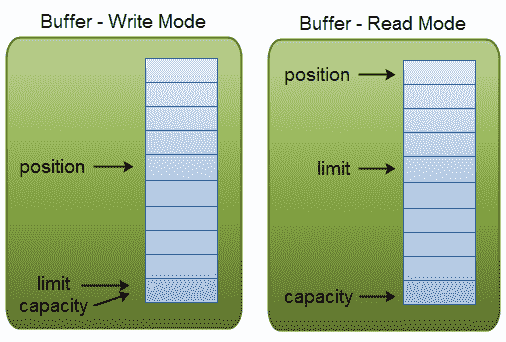

# Java NIO 缓冲区

> 原文：<https://jenkov.com/tutorials/java-nio/buffers.html>

Java NIO 缓冲区在与 NIO 通道交互时使用。如您所知，数据从通道读入缓冲区，再从缓冲区写入通道。

缓冲区本质上是一个可以写入数据的内存块，以后可以再次读取这些数据。这个内存块被包装在一个 NIO Buffer 对象中，该对象提供了一组方法，使得使用内存块变得更加容易。

## 基本缓冲区使用

使用`Buffer`读取和写入数据通常遵循以下 4 个小步骤:

1.  将数据写入缓冲区
2.  呼叫`buffer.flip()`
3.  从缓冲区中读取数据
4.  呼叫`buffer.clear()`或`buffer.compact()`

当您将数据写入缓冲区时，缓冲区会跟踪您写入了多少数据。一旦需要读取数据，就需要使用`flip()`方法调用将缓冲区从写模式切换到读模式。在读取模式下，缓冲区允许您读取写入缓冲区的所有数据。

一旦你读取了所有的数据，你需要清空缓冲区，让它准备好再次写入。你可以通过两种方式来实现:调用`clear()`或者调用`compact()`。`clear()`方法清空整个缓冲区。`compact()`方法仅清除您已经读取的数据。任何未读数据都被移动到缓冲区的开头，现在数据将在未读数据之后写入缓冲区。

下面是一个简单的`Buffer`用法示例，写、翻转、读和清除操作以粗体显示:

```
RandomAccessFile aFile = new RandomAccessFile("data/nio-data.txt", "rw");
FileChannel inChannel = aFile.getChannel();

//create buffer with capacity of 48 bytes
ByteBuffer buf = ByteBuffer.allocate(48);

int bytesRead = inChannel.read(buf); //read into buffer.
while (bytesRead != -1) {

  buf.flip();  //make buffer ready for read

  while(buf.hasRemaining()){
      System.out.print((char) buf.get()); // read 1 byte at a time
  }

  buf.clear(); //make buffer ready for writing
  bytesRead = inChannel.read(buf);
}
aFile.close();

```

## 缓冲容量、位置和极限

缓冲区本质上是一个可以写入数据的内存块，以后可以再次读取这些数据。这个内存块被包装在一个 NIO Buffer 对象中，该对象提供了一组方法，使得使用内存块变得更加容易。

为了理解一个`Buffer`如何工作，你需要熟悉一个`Buffer`的三个属性。这些是:

*   容量
*   位置
*   限制

`position`和`limit`的含义取决于`Buffer`是处于读模式还是写模式。无论缓冲模式如何，容量总是相同的。

这是写和读模式下的容量、位置和限制的图示。插图后的章节中有解释。

<center>

|  |
| **写入和读取模式下的缓冲容量、位置和限制。** |

</center>

### 容量

作为一个内存块，`Buffer`有一定的固定大小，也称为其“容量”。你只能写`capacity`字节，长，字符等。进入缓冲区。一旦缓冲区满了，就需要清空它(读取数据或清除数据)，然后才能向其中写入更多数据。

### 位置

当您将数据写入`Buffer`时，您是在某个位置这样做的。最初位置是 0。当一个字节，长等。已经被写入`Buffer`中，位置前进到指向缓冲区中要插入数据的下一个单元。地位可以最大限度地成为`capacity - 1`。

当你从一个`Buffer`读取数据时，你也从一个给定的位置读取数据。当您将`Buffer`从写入模式切换到读取模式时，该位置将重置回 0。当你从`Buffer`读取数据时，你从`position`开始，并且`position`前进到下一个位置进行读取。

### 限制

在写入模式下，`Buffer`的限制是您可以写入缓冲区的数据量的限制。在写入模式下，极限等于`Buffer`的容量。

当将`Buffer`翻转到读取模式时，限制意味着您可以从数据中读取多少数据的限制。因此，当将`Buffer`翻转到读取模式时，限制被设置为写入模式的写入位置。换句话说，您可以读取写入的字节数(限制设置为写入的字节数，由位置标记)。

## 缓冲类型

Java NIO 附带了以下**缓冲区**类型:

*   ByteBuffer
*   MappedByteBuffer
*   载入缓冲区
*   双缓冲器
*   浮动缓冲器
*   IntBuffer
*   朗布尔
*   短缓冲区

如您所见，这些`Buffer`类型代表不同的数据类型。换句话说，它们允许你以 char、short、int、long、float 或 double 的形式处理缓冲区中的字节。

`MappedByteBuffer`有点特殊，将在它自己的文本中介绍。

## 分配缓冲区

要获得一个`Buffer`对象，你必须首先分配它。每个`Buffer`类都有一个`allocate()`方法来做这件事。下面的例子显示了一个容量为 48 字节的`ByteBuffer`的分配:

```
ByteBuffer buf = ByteBuffer.allocate(48);

```

下面是一个为`CharBuffer`分配 1024 个字符空间的例子:

```
CharBuffer buf = CharBuffer.allocate(1024);

```

## 将数据写入缓冲区

您可以用两种方式将数据写入`Buffer`:

1.  将数据从一个`Channel`写入一个`Buffer`
2.  通过缓冲区的`put()`方法，自己将数据写入`Buffer`。

下面的例子展示了`Channel`如何将数据写入`Buffer`:

```
int bytesRead = inChannel.read(buf); //read into buffer.

```

下面是一个通过`put()`方法将数据写入`Buffer`的例子:

```
buf.put(127);    

```

还有许多其他版本的`put()`方法，允许您以许多不同的方式将数据写入`Buffer`。例如，在特定位置写入，或者将字节数组写入缓冲区。有关具体的缓冲区实现的更多细节，请参见 JavaDoc。

## 翻转()

`flip()`方法将`Buffer`从写模式切换到读模式。调用`flip()`将`position`设置回 0，并将`limit`设置到刚才的位置。

换句话说，`position`现在标记了读取位置，而`limit`标记了多少字节、字符等。被写入缓冲区——多少字节，字符等的限制。可以阅读。

## 从缓冲区读取数据

有两种方法可以从`Buffer`中读取数据。

1.  将数据从缓冲区读入通道。
2.  使用 get()方法之一，自己从缓冲区读取数据。

下面是一个如何将数据从缓冲区读入通道的示例:

```
//read from buffer into channel.
int bytesWritten = inChannel.write(buf);

```

下面是一个使用 get()方法从`Buffer`读取数据的例子:

```
byte aByte = buf.get();    

```

还有许多其他版本的`get()`方法，允许您以许多不同的方式从`Buffer`中读取数据。例如，在特定位置读取，或者从缓冲区读取字节数组。有关具体的缓冲区实现的更多细节，请参见 JavaDoc。

## 倒带()

`Buffer.rewind()`将`position`设置回 0，因此您可以重新读取缓冲区中的所有数据。`limit`保持不变，因此仍然标记有多少元素(字节、字符等)。)可以从`Buffer`中读取。

## 清晰()和紧凑()

一旦你完成从`Buffer`中读取数据，你必须使`Buffer`准备好再次写入。你可以打电话给`clear()`或`compact()`来确认。

如果你调用`clear()`，那么`position`被设置回 0，`limit`被设置回`capacity`。换句话说，`Buffer`被清除了。`Buffer`中的数据未被清除。只有标记告诉您可以将数据写入`Buffer`的位置。

当您调用`clear()`时，如果`Buffer`中有任何未读数据，该数据将被“遗忘”，这意味着您不再有任何标记来告知哪些数据已被读取，哪些数据未被读取。

如果`Buffer`中还有未读的数据，你想以后再读，但是你需要先写一些东西，调用`compact()`而不是`clear()`。

`compact()`将所有未读数据复制到`Buffer`的开头。然后在最后一个未读元素之后设置`position`。`limit`属性仍然被设置为`capacity`，就像`clear()`一样。现在`Buffer`已经准备好写入，但是您不会覆盖未读的数据。

## 标记()和重置()

您可以通过调用`Buffer.mark()`方法来标记`Buffer`中的给定位置。稍后，您可以通过调用`Buffer.reset()`方法将位置重置回标记的位置。这里有一个例子:

```
buffer.mark();

//call buffer.get() a couple of times, e.g. during parsing.

buffer.reset();  //set position back to mark.    

```

## equals()和 compareTo()

可以使用`equals()`和`compareTo()`比较两个缓冲器。

### 等于()

两个缓冲区相等，如果:

1.  它们属于同一类型(字节、字符、整数等)。)
2.  它们有相同数量的剩余字节、字符等。在缓冲区。
3.  所有剩余的字节、字符等。是平等的。

如您所见，equals 只比较了部分的`Buffer`，而不是其中的每一个元素。事实上，它只是比较了`Buffer`中剩余的元素。

### 比较()

`compareTo()`方法比较剩余的元素(字节、字符等)。)中，用于例如分类程序。在以下情况下，一个缓冲区被认为比另一个缓冲区“小”:

1.  与另一个缓冲器中的对应元素相等的第一个元素小于另一个缓冲器中的元素。
2.  所有元素都是相等的，但是第一个缓冲区在第二个缓冲区之前用完了元素(它的元素较少)。