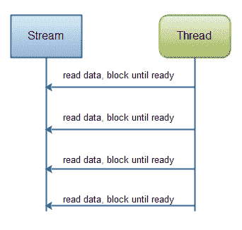
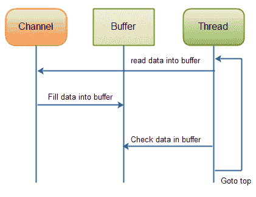
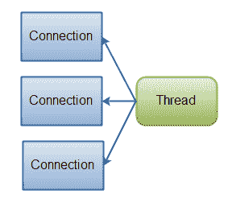
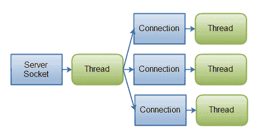

# Java NIO 与 IO

> 原文：<https://jenkov.com/tutorials/java-nio/nio-vs-io.html>

在研究 Java NIO 和 IO API 时，一个问题很快浮现在脑海中:

什么时候应该使用 IO，什么时候应该使用 NIO？

在本文中，我将尝试阐明 Java NIO 和 IO 之间的区别、它们的用例，以及它们如何影响代码的设计。

## Java NIO 和 IO 的主要区别

下表总结了 Java NIO 和 IO 之间的主要区别。我将在表格后面的章节中更详细地介绍每个差异。

| **IO** |  |
| 面向流 | 面向缓冲区 |
| 阻塞 IO | 非阻塞 IO |
|   | 选择器 |

## 面向流与面向缓冲区

Java NIO 和 IO 的第一大区别是 IO 是面向流的，而 NIO 是面向缓冲区的。那是什么意思？

面向流的 Java IO 意味着你一次从一个流中读取一个或多个字节。如何处理读取的字节由您决定。它们不会缓存在任何地方。此外，您不能在流中的数据中来回移动。如果您需要在从流中读取的数据中来回移动，您需要首先将它缓存在缓冲区中。

Java NIO 的面向缓冲区的方法略有不同。数据被读入一个缓冲区，随后进行处理。您可以根据需要在缓冲区中来回移动。这为您在处理过程中提供了更多的灵活性。但是，您还需要检查缓冲区是否包含您需要的所有数据，以便完全处理它。而且，您需要确保在将更多数据读入缓冲区时，不会覆盖缓冲区中尚未处理的数据。

## 阻塞与非阻塞 IO

Java IO 的各种流都在阻塞。这意味着，当一个线程调用一个`read()`或`write()`时，该线程被阻塞，直到有一些数据要读取，或者数据被完全写入。在此期间，线程不能做任何其他事情。

Java NIO 的非阻塞模式使线程能够请求从通道中读取数据，并且只获取当前可用的数据，或者如果当前没有可用的数据，则不获取任何数据。线程可以继续做其他事情，而不是一直被阻塞直到数据可供读取。

非阻塞写入也是如此。线程可以请求将一些数据写入通道，但不等待数据完全写入。线程可以继续运行，同时做其他事情。

当线程在 IO 调用中没有被阻塞时，它们把空闲时间花在了什么上面，通常是同时在其他通道上执行 IO。也就是说，单个线程现在可以管理多个输入和输出通道。

## 选择器

Java NIO 的选择器允许单线程监控多个输入通道。您可以使用选择器注册多个通道，然后使用单线程来“选择”具有可用于处理的输入的通道，或者选择准备写入的通道。这种选择器机制使得单线程管理多个通道变得很容易。

## NIO 和 IO 如何影响应用程序设计

无论您选择 NIO 还是 IO 作为您的 IO 工具包，都可能影响应用程序设计的以下方面:

1.  API 调用 NIO 或 IO 类。
2.  数据的处理。
3.  用于处理数据的线程数量。

### API 调用

当然，使用 NIO 时的 API 调用看起来与使用 IO 时不同。这并不奇怪。除了从`InputStream`中一个字节一个字节地读取数据之外，数据必须首先被读入缓冲区，然后在那里被处理。

### 数据的处理

与 IO 设计相比，使用纯 NIO 设计时，数据处理也会受到影响。

在 IO 设计中，您从`InputStream`或`Reader`中逐字节读取数据。假设您正在处理一个基于行的文本数据流。例如:

```
Name: Anna
Age: 25
Email: anna@mailserver.com
Phone: 1234567890

```

这个文本行流可以这样处理:

```
InputStream input = ... ; // get the InputStream from the client socket

BufferedReader reader = new BufferedReader(new InputStreamReader(input));

String nameLine   = reader.readLine();
String ageLine    = reader.readLine();
String emailLine  = reader.readLine();
String phoneLine  = reader.readLine();

```

注意处理状态是如何由程序执行的程度决定的。换句话说，一旦第一个`reader.readLine()`方法返回，您肯定知道已经读取了一整行文本。这就是为什么`readLine()`会阻塞，直到一整行被读取。你也知道这一行包含了名字。类似地，当第二个`readLine()`调用返回时，您知道这一行包含年龄等。

如您所见，程序只有在有新数据要读取时才会进行，并且您知道每一步的数据是什么。一旦执行线程已经读取了代码中的某段数据，线程就不会在数据中后退(大多数情况下不会)。该原理也在该图中进行了说明:

<center>

|  |
| Java IO:从阻塞流中读取数据。 |

</center>

NIO 实现看起来会有所不同。下面是一个简化的例子:

```
ByteBuffer buffer = ByteBuffer.allocate(48);

int bytesRead = inChannel.read(buffer);

```

注意从通道读取字节到`ByteBuffer`的第二行。当方法调用返回时，您不知道是否所有需要的数据都在缓冲区中。你只知道缓冲区包含一些字节。这使得处理有些困难。

想象一下，在第一次`read(buffer)`调用之后，读入缓冲区的全部内容是半行。比如“名:安”。你能处理这些数据吗？不完全是。在处理任何数据有意义之前，您需要等待，直到至少一整行数据已经进入缓冲区。

那么，您如何知道缓冲区是否包含足够的数据来进行处理呢？你不知道。找出答案的唯一方法是查看缓冲区中的数据。结果是，在知道是否所有数据都在缓冲区中之前，您可能必须检查几次缓冲区中的数据。这不仅效率低下，而且在程序设计方面会变得混乱。例如:

```
ByteBuffer buffer = ByteBuffer.allocate(48);

int bytesRead = inChannel.read(buffer);

while(! bufferFull(bytesRead) ) {
    bytesRead = inChannel.read(buffer);
}

```

`bufferFull()`方法必须跟踪有多少数据被读入缓冲区，并根据缓冲区是否已满返回`true`或`false`。换句话说，如果缓冲区准备好进行处理，就认为它已满。

`bufferFull()`方法扫描整个缓冲区，但是必须让缓冲区保持与调用`bufferFull()`方法之前相同的状态。否则，下一个读入缓冲区的数据可能不会在正确的位置读入。这并非不可能，但这是另一个需要注意的问题。

如果缓冲区已满，则可以对其进行处理。如果它没有满，您也许能够部分处理那里的任何数据，如果这在您的特定情况下有意义的话。在许多情况下，事实并非如此。

is-data-in-buffer-ready 循环如图所示:

<center>

|  |
| Java NIO:从通道中读取数据，直到所有需要的数据都在缓冲区中。 |

</center>

## 摘要

NIO 允许您仅使用一个(或几个)线程来管理多个通道(网络连接或文件),但代价是解析数据可能比从阻塞流中读取数据更复杂。

如果您需要同时管理数千个打开的连接，每个连接只发送少量数据，例如一个聊天服务器，那么在 NIO 中实现服务器可能是一个优势。类似地，如果您需要保持与其他计算机的大量开放连接，例如在 P2P 网络中，使用单线程来管理所有出站连接可能是一个优势。下图显示了这种单线程多连接设计:

<center>

|  |
| Java NIO:管理多个连接的单线程。 |

</center>

如果您有很少的高带宽连接，一次发送大量数据，那么经典的 IO 服务器实现可能是最合适的。下图展示了一个典型的 IO 服务器设计:

<center>

|  |
| Java IO:一种经典的 IO 服务器设计——一个线程处理一个连接。 |

</center>