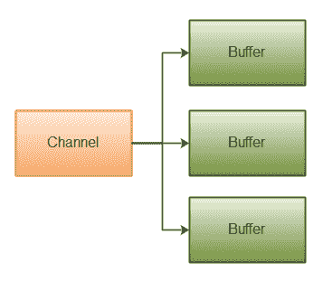
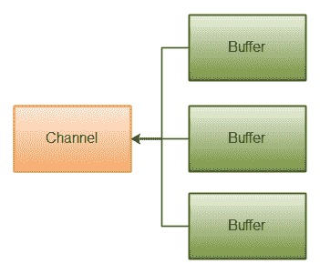

# Java NIO 分散/聚集

> 原文：<https://jenkov.com/tutorials/java-nio/scatter-gather.html>

Java NIO 带有内置的分散/聚集支持。分散/聚集是用于从通道读取和向通道写入的概念。

从通道分散读取是将数据读入多个缓冲区的读取操作。因此，通道将来自通道的数据“分散”到多个缓冲器中。

通道收集写入是将数据从多个缓冲区写入单个通道的写入操作。因此，通道将来自多个缓冲区的数据“收集”到一个通道中。

分散/聚集在需要分别处理传输数据的各个部分的情况下非常有用。例如，如果一个消息由一个头和一个体组成，你可以把头和体放在不同的缓冲区中。这样做可能会使您更容易分别处理标题和正文。

## 分散读取

“分散读取”将数据从单个通道读取到多个缓冲区。下面是该原则的一个示例:

下面是对`Scatter`原则的一个说明:

<center>

|  |
| **Java NIO:散射读取** |

</center>

下面是一个代码示例，展示了如何执行分散读取:

```
ByteBuffer header = ByteBuffer.allocate(128);
ByteBuffer body   = ByteBuffer.allocate(1024);

ByteBuffer[] bufferArray = { header, body };

channel.read(bufferArray);

```

注意缓冲区是如何首先被插入到一个数组中的，然后数组作为参数传递给`channel.read()`方法。然后，`read()`方法按照缓冲区在数组中出现的顺序从通道写入数据。一旦一个缓冲区满了，通道就继续填充下一个缓冲区。

分散读取在移动到下一个缓冲区之前填满了一个缓冲区，这意味着它不适合动态大小的消息部分。换句话说，如果你有一个头和一个主体，并且头的大小是固定的(例如 128 字节)，那么分散读取就可以了。

## 收集写入

“收集写入”将数据从多个缓冲区写入单个通道。下面是该原则的一个示例:

<center>

|  |
| **Java NIO:采集写** |

</center>

下面是一个代码示例，展示了如何执行收集写入:

```
ByteBuffer header = ByteBuffer.allocate(128);
ByteBuffer body   = ByteBuffer.allocate(1024);

//write data into channel

ByteBuffer[] bufferArray = { header, body };

channel.write(bufferArray);

```

缓冲区数组被传递给`write()`方法，该方法按照在数组中遇到的顺序写入缓冲区的内容。仅写入缓冲器位置和极限之间的数据。因此，如果缓冲区的容量为 128 字节，但只包含 58 字节，则只有 58 字节从该缓冲区写入通道。因此，与分散读取相比，聚集写入可以很好地处理动态大小的消息部分。