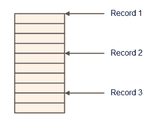
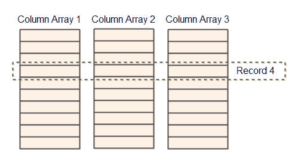

# 面向性能的内存管理

> 原文：<https://jenkov.com/tutorials/java-performance/memory-management.html>

这篇内存管理教程解释了一组广泛适用的、易于重用的内存管理技术，这些技术有可能提高 Java 应用程序的性能。

在许多 Java 应用程序中，大量的时间都花在读写内存上。有时，很多时间甚至花在分配和释放内存上(例如实例化和垃圾收集对象)。简单地改变你如何读、写、分配和释放内存会影响你的应用程序的性能。

## Java 对象实例化和垃圾回收真的很快吗？

作为 Java 开发人员，我们经常被告知:

*   对象实例化很快
*   垃圾收集速度很快

的确，每一个 Java 版本的对象实例化和垃圾收集都会变得更快。但是，在某些情况下，您自己管理这些方面仍然可以做得更好，因为您可以根据应用程序使用内存的方式来定制内存管理。

## Java 对象访问快吗？

在 Java 中，你不能控制你实例化的对象在内存中的位置。正如[现代硬件教程](modern-hardware.html)中所解释的，顺序访问内存比任意访问要快。因此，访问分散在整个内存中的对象集合比访问彼此相邻的对象集合要慢。

此外，对象可能包含对其他对象的引用(例如字符串)，这将进一步使您的对象分散在整个内存中。

为了从顺序内存访问中获得加速，您必须自己控制对象存储。我将在本教程的后面解释一些方法来做到这一点。

这个问题可以在 Java 10 中用值类型来解决，但是在撰写本文时，我们还只是在 Java 8 中。

## 内存管理方面

内存管理有两个方面:

*   内存分配和释放策略
*   数据结构设计

在接下来的小节中，我将讨论这两个内存管理方面。

## 存储器分配

Java 对象分配的一个问题是，您无法控制 JVM 是通过回收现有的、已释放的对象来分配新对象，还是 JVM 在新位置分配新对象。

因为您不能控制以前释放的对象的重用，所以您不能控制 JVM 将使用的最大内存。是的，我知道 JVM 标志，但是它们是一种变通方法——不是一个可靠的解决方案。当您控制对象分配、取消分配和重新分配时，您可以进行限制，例如，一次在内存中最多存储 10.000 条消息。在释放一些消息对象之前，不会分配新的消息对象。您不能用 JVM 标志来控制如此细粒度的内存分配。

## 对象池

控制对象分配和释放的显而易见的解决方案是使用对象池。是的，我知道人们说你不会得到任何加速，你甚至可能会失去速度，但我仍然要看到支持它的基准。无论如何，如果没有对象池，您就无法控制分配的对象数量，从而无法控制最大内存使用量。

对象池要求您知道何时再次释放对象。这并不总是可能知道的，因为对象可能被传递给许多不同的组件，并且您可能不知道在您的应用程序中哪个组件是最后一个使用特定对象的。

## 数据结构设计

当你设计数据结构时，你应该考虑一起使用的数据应该一起放在内存中。这通常意味着您不能使用对象来表示这些数据。

另一种方法是使用原语数组来表示数据。您可以将原始数组包装在一个`Navigator`对象中，该对象可以访问存储在原始数组中的字段，而不是让一个对象将数据包含为字段。

您可以为原始数组选择两种模型:

*   唱片商店
*   列存储

## 唱片商店

记录存储实际上是一个长字节数组。每个记录由几个字段组成，这些字段依次存储在字节数组中。每个字段可以由一个或多个字节组成。

要导航记录存储，您需要某种类型的`Navigator`组件，它可以在记录之间导航，还可以定位每个记录中的每个字段。

如果您需要一次遍历一条记录并处理它的所有字段，那么记录存储是一个不错的选择。由于记录的所有字段都位于内存中的每个字段之后，因此访问这些字段的速度很快。类似地，由于所有记录在内存中是一个接一个的，所以从一个记录到另一个记录的迭代也很快。

如果您需要根据字段子集的内容在记录中进行搜索，那么记录存储就不那么好了。当您仅基于 1 或 2 个字段进行搜索时，您必须跳过所有未使用的字段。你不再尽可能按顺序访问内存。对于搜索用例，列存储可能更合适。

## 列存储

列存储类似于记录存储，因为它包含字段存储在数组中的记录。但是，列存储不是将记录的所有字段依次存储在同一个数组中，而是每列(字段)使用一个数组。这就是为什么它被称为*列存储*的原因。

使用列存储可以非常快速地搜索列值与给定标准匹配的记录。您可以在列数组中扫描您想要搜索的列。这比在记录库中搜索要快，因为您不必跳过未使用的字段。

记录的字段在所有列数组中以相同的索引存储。这意味着，当您在一个列数组中找到一个与您搜索的条件相匹配的列值时，您可以很容易地找到同一记录的所有其他字段的值。您只需读取存储在所有其他列数组中相同索引处的值。

列存储还有一个额外的优点，那就是您可以为每一列使用不同的原语类型。在记录存储中，你不得不使用一个字节数组来确保你能支持所有类型的字段。使用列存储，一列可以是一个由`short`、`int`、`long`等组成的数组。或者任何你需要的东西。

