# 微量配料

> 原文：<https://jenkov.com/tutorials/java-performance/micro-batching.html>

*微批处理*是一种技术，即将执行的传入任务分组为小批，以实现批处理的一些性能优势，而不会过多增加每个任务完成的延迟。微批处理通常应用于传入任务数量可变的系统中。该系统将抓取已经接收到的任何传入任务，并成批执行它们。这个过程被重复执行。

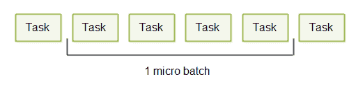

因此，批量大小可以从 1 变化到系统设定的最大上限，例如 64、128、1024 或任何适合系统的最大批量大小。通常最大批量很小，原因我将在下面解释——因此有术语*微量配料*。

## 微量配料视频教程

以下是本教程的视频版本:

<iframe width="560" height="315" src="https://www.youtube.com/embed/bozAoSIoQpU" frameborder="0" allowfullscreen=""><h2>延迟与吞吐量的权衡</h2> 
面向服务的系统通常需要低延迟和高吞吐量。然而这并不总是可能的。一些减少延迟的技术也会降低吞吐量，而一些增加吞吐量的技术也会增加延迟。在接下来的部分中，我将对此进行更详细的解释。
 <h3>潜伏</h3> 
延迟是对系统中时间延迟的度量。在客户机-服务器系统中，延迟可能意味着几件事。网络延迟是指客户端发送的消息到达服务器所需的时间。服务器延迟是服务器处理请求并生成响应所花费的时间。两种类型的延迟如下所示:
 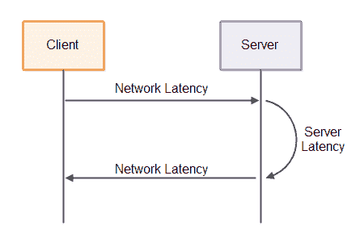 
单个请求到客户端收到响应的完整往返时间将是
 <pre class="codeBox"> network latency + server latency + network latency = 2 * network latency + server latency </pre> 
首先，请求必须发送到服务器，然后服务器必须处理请求并生成响应，然后响应必须通过网络发送回客户端。
 
对于具有快速响应时间的系统，网络延迟和服务器延迟都必须很低。具体的“快”和“慢”响应时间，或者“高”和“低”延迟取决于具体的系统。对于某些系统，响应时间少于 1 秒是好的。对于一些系统来说，它必须小于 10 毫秒才是好的。
 <h3>吞吐量</h3> 
吞吐量是对系统在给定时间间隔内可以执行多少工作的度量。在客户端-服务器系统的情况下，服务器吞吐量测量服务器在每个时间间隔(通常是每秒)可以处理多少请求。这个数字意味着服务器每秒可以处理的来自所有连接的客户端的请求总数，而不仅仅是来自一个客户端的请求。
 
客户端看到的吞吐量意味着特定客户端在每个时间间隔内可以发送和接收多少请求响应。两种类型的吞吐量如下图所示:
 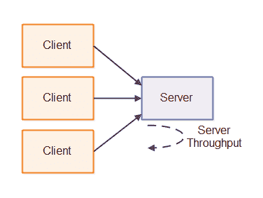 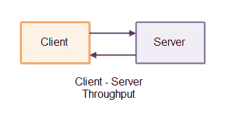 <h2>定量</h2> 
批处理是一种增加系统吞吐量的技术。不是单独执行每个任务，而是将任务分组为大批量，一起执行。
 
在与执行每个任务相关的开销很高的情况下，批处理是有意义的——如果这种开销可以通过批处理执行来减少。要了解具体情况，让我们看一个例子:
 
假设一个客户机需要向服务器发送 10 个请求。客户端可以一次发送一个请求，接收一个响应，然后发送下一个请求。处理这些消息所需的总时间为:
 <pre class="codeBox"> 10 * (network latency + server latency + network latency) = 20 * network latency + 10 * server latency </pre> 
相反，如果客户端在一条消息中向服务器发送所有 10 个请求，服务器按顺序处理它们，并发回 10 个响应，则处理这些请求所需的总时间将为:
 <pre class="codeBox"> network latency + 10 * server latency + network latency = 2 * network latency + 10 * server latency </pre> 
如您所见，批处理大大降低了处理 10 个请求所涉及的网络延迟——从 20 倍的网络延迟降低到仅仅 2 倍的网络延迟。这意味着客户端看到的客户端-服务器系统的总吞吐量增加了。
 
批处理的缺点是收集要批处理的任务所花费的时间。如果客户机花了 2 个小时来收集这 10 个任务，那么整个系统的延迟会变得相当高。第一个任务需要等待 2 个小时，然后才有足够的任务来发送一个批处理，这意味着从收集第一个任务到客户端收到响应需要 2 个小时。
 
类似地，一旦批处理被发送，它需要服务器 10 *服务器延迟来处理该批处理。这进一步增加了第一个请求的等待时间，因为在第一个请求的响应被接收之前，它必须等待所有 10 个请求被处理。
 
如您所见，批处理是一种增加吞吐量的技术，但也会增加延迟。
 <h2>微量配料拯救世界</h2> 
微批处理是批处理的一种变体，它试图在延迟和吞吐量之间取得比批处理更好的折衷。微批处理实现这一点的方式是，在处理任务之前，等待很短的时间间隔来批处理任务。我将这个间隔称为<i>批量周期</i>。这种短批量周期原理如下所示:
 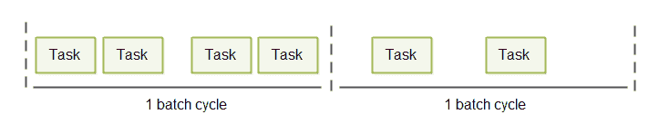 
批量循环的持续时间取决于系统。对于某些系统，1 秒钟可能就足够了。对于其他系统，50 - 100 毫秒可能就可以了。对于其他系统甚至更少。
 
如果系统负载较高，它将在每个批处理周期内接收更多准备处理的任务。因此，随着系统负载的增加，批量也会增加，吞吐量也会增加。当批量增加时，延迟增加的代价是很小的。
 <h3>可变持续时间批量循环</h3> 
对于要求低响应时间的系统，即使 50 毫秒的批处理周期持续时间也可能太长。这样的系统可能需要使用可变的批量周期长度来代替。
 
为了实现更低的延迟，同时允许发生微批处理，您可以在输入通道(入站网络连接、目录等)上循环。)并检查它们是否有传入的任务(请求、消息等)。).无论你发现什么样的任务，你都可以在一个微批处理中执行。通过该循环的每次迭代成为单个批处理周期。
 
一旦执行了微批处理，就立即重复这个循环。这意味着每个批处理周期之间的时间完全取决于输入任务的数量。对于低负荷，批量较小，因此批量周期较短。对于高负荷，批量将增加，因此批量周期将增加。
 
可变持续时间批量循环如下所示:
 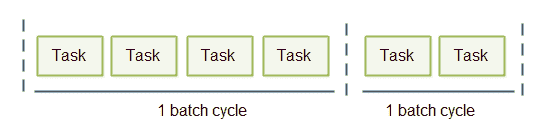 <h2>微批处理用例</h2> 
微批处理可以用在许多可以使用批处理的情况下，但是需要更短的响应时间。我将在接下来的章节中讨论其中的一些用例，但是这些用例并不是唯一的。从这些用例中，您应该能够了解总体情况，并能够确定微批处理何时在您自己的系统中有用。
 <h3>文件持久性</h3> 
将数据写入磁盘通常会带来很大的开销。如果您的系统需要为执行的每个任务向磁盘写入一个数据块，总开销可能会很大。
 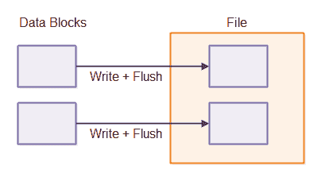 
如果批量写入，因此只将组合数据块写入磁盘，则与写入更大数据块相关的开销通常小于单独写入的组合开销。结果是系统可以处理更大的吞吐量(每单位时间写入更多数据)。
 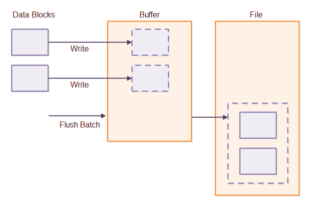 
使用微批处理实现文件持久性通常要求系统的其余部分也设计为使用微批处理。如果数据块一次一个地到达文件持久性组件，将它们分组为批次的唯一方法是在将它们写入磁盘之前等待一小段时间间隔。如果数据块以微批处理的形式到达，因为它们是其他地方的微批处理的结果，那么将它们分组到微批处理中以便将它们写入磁盘要容易得多。
 <h3>线程间通信</h3> 
当线程通信时，它们通常通过并发数据结构来进行。为此，一种常用的结构是并发队列。这里举例说明了这一点:
 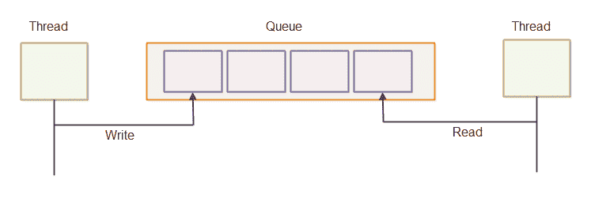 
一次一个元素地读取和写入队列中的元素通常与读取或写入一批元素相比，每个元素的开销更高。你可以在我的教程中读到更多关于 Java 环形缓冲区的内容。环形缓冲区也可以用作队列。通过队列发送批量消息如下所示:
 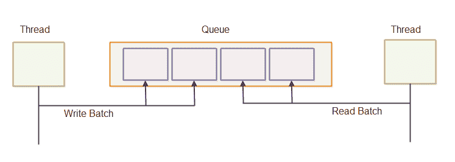 <h3>进程间通信</h3> 
进程间通信在许多方面类似于线程间通信。当进程通信时，经常会有与向进程外发送数据相关的开销——例如向磁盘、unix 套接字或网络套接字发送数据。因此，将发送到进程之外的数据批量化以最小化每个数据块(例如，每个请求、消息、任务等)的开销可能是有益的。).
 
在本教程的前面，我已经解释了批处理如何在客户端-服务器场景中发挥作用，这是进程间通信的常见情况。
 
作为这一事实的另一个证明，数据库批量更新通常比单独向数据库发送每个更新要快得多。通过批量更新，更多的更新通过网络批量发送，数据库也可能有机会将更新作为批量操作写入磁盘。
 <h3>单线程服务器</h3> 
由于单线程服务器架构非常简单的并发模型(所有东西都在同一个线程中运行),因此在许多情况下，它比多线程并发模型更好地利用了 CPU 缓存，因此单线程服务器架构近来重新受到欢迎。这一点在我关于<a href="/java-concurrency/concurrency-models.html">并发模型</a>的教程中也有提及。
 
单线程服务器通常会轮询所有打开的入站连接以获取要读取的数据。如果入站连接有入站数据，则读取并处理该数据。
 
单线程服务器可以从微批处理中获益。单线程服务器不是一次从一个连接中读取并处理一条消息，而是从所有入站连接中读取所有完整的消息，并对它们进行批处理。
 
在单线程服务器中使用微批处理设计使得该系统的其他部分(在同一服务器中运行)也可以更容易地使用微批处理。
 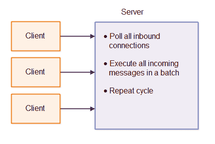 <h3>遍历大型数据结构</h3> 
一些应用程序可能需要遍历存储在内存或磁盘上的大型数据结构。例如，数据库表或树结构。遍历大型数据结构会带来一定的开销。对于基于内存的数据结构，数据必须从主内存放入 CPU L1 缓存；对于基于磁盘的数据结构，数据必须从磁盘放入主内存，然后从主内存放入 L1 缓存。
 
而不是遍历整个数据结构来服务于一个“请求”(任务、消息等)。)您可以批量处理一些请求或任务。当遍历数据结构时，数据结构中的每个“记录”或“节点”可以根据一批请求来检查，而不仅仅是单个请求。
 
如果这些请求中的任何一个对数据结构进行了更改，那么这些请求应该以从客户端接收到的相同顺序来访问数据结构。这样，即使请求 1 还没有完全完成对整个数据结构的更新，请求 2 也会看到请求 1 已经离开的数据结构的每个记录/节点。
 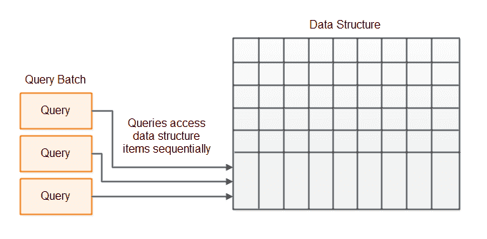 </body> </html></iframe>