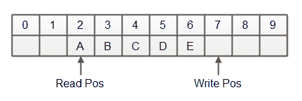
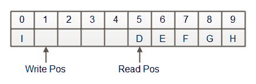

# Java 环形缓冲区

> 原文：<https://jenkov.com/tutorials/java-performance/ring-buffer.html>

*环形缓冲区*是一个用作队列的数组。环形缓冲器具有读位置和写位置，写位置标记从环形缓冲器读取和向环形缓冲器写入的下一个位置。当写位置到达数组的末尾时，写位置被设置回 0。读取位置也是如此。

当读取和写入位置到达数组的末尾时，将它们设置回零有时也称为“回绕”。正是这种行为将数组变成了环形缓冲区。当读取和写入位置到达数组的末尾时，它们从数组的开头继续，就像数组是一个环一样。因此得名环形缓冲区。

这个环形缓冲区教程将解释环形缓冲区是如何工作的，并展示两个 Java 环形缓冲区的实现。

## 环形缓冲区如何工作

环形缓冲区是一个固定大小的数组，就像一个有界队列。该数组包含存储在环形缓冲区中的元素。

除了包含元素的数组之外，环形缓冲区还包含一个写位置，它指向数组中要插入下一个元素的位置。

环形缓冲区还需要跟踪读取位置——数组中读取元素的下一个位置。

环形缓冲区还需要跟踪元素数组中的空闲和已用空间。当写入位置未回绕时，已用空间位于写入位置和读取位置之间。剩下的都是自由空间。下图说明了这种情况下的环形缓冲区:



当写入位置已经环绕时，情况就不同了。突然之间，自由空间是写位置和读位置之间的空间。剩下的都是用过的空间。下图显示了写入位置回绕后的同一个环形缓冲区:



有不同的方法来跟踪环形缓冲区中的读取位置(以及已用和空闲空间)。在本教程的后面，我将解释用 Java 实现环形缓冲区的两种不同方法。

## 环形缓冲区很快

环形缓冲区是实现类似队列结构的一种快速方法。我说的“快”是指它们相当容易实现，并且它们执行得相当好。

## 环形缓冲区用例

环形缓冲区对于实际队列(如消息队列)或产生数据(以后以类似流的方式使用)都很有用。

当您需要环形缓冲区(队列中)可以容纳多少数据的硬上限时，环形缓冲区特别有用。

如果您不希望队列结构有上限，那么您可能应该使用一个链表，或者一个可以调整自身大小的环形缓冲区(当它满的时候分配一个新的更大的数组，并将所有元素移动到该数组中)。

在本教程中，我将只关注有界环形缓冲区的实现。

## 环形缓冲区实现技术

有许多方法可以实现环形缓冲区。在这个环形缓冲区教程中，我将向你展示两个实现环形缓冲区的最简单的技术。这些技术是:

*   使用填充计数
*   使用翻转标记

我将在接下来的章节中解释这两种技术。

## 使用填充计数的环形缓冲区

跟踪环形缓冲区中的写位置、读位置和元素数量的一种方法是使用写位置和填充计数。写入位置标记环形缓冲区中要写入元素的下一个位置。填充计数表明缓冲区中当前存储了多少元素。

当向环形缓冲区写入元素时，它只需检查填充计数，看它是否已满。如果它未满，则该元素可以被插入到写位置，并且写位置前进到下一个空闲槽。

类似地，当从环形缓冲区读取元素时，它只需检查填充计数以查看环形缓冲区是否为空。通过从写位置减去填充计数来计算读位置。如果计算的结果是负的，那么写位置已经回绕，您需要将缓冲区(数组)的大小添加到读位置，以获得正确的读位置。

下面是一个使用填充计数的环形缓冲区实现。请注意，它并不明确跟踪读取位置，而是根据写入位置和填充计数来计算读取位置。还要注意，填充计数字段被称为`available`(不是`fillCount`)。

```
public class RingBufferFillCount {
    public Object[] elements = null;

    private int capacity  = 0;
    private int writePos  = 0;
    private int available = 0;

    public RingBufferFillCount(int capacity) {
        this.capacity = capacity;
        this.elements = new Object[capacity];
    }

    public void reset() {
        this.writePos = 0;
        this.available = 0;
    }

    public int capacity() { return this.capacity; }
    public int available(){ return this.available; }

    public int remainingCapacity() {
        return this.capacity - this.available;
    }

    public boolean put(Object element){

        if(available < capacity){
            if(writePos >= capacity){
                writePos = 0;
            }
            elements[writePos] = element;
            writePos++;
            available++;
            return true;
        }

        return false;
    }

    public Object take() {
        if(available == 0){
            return null;
        }
        int nextSlot = writePos - available;
        if(nextSlot < 0){
            nextSlot += capacity;
        }
        Object nextObj = elements[nextSlot];
        available--;
        return nextObj;
    }
}

```

## 使用翻转标记的环形缓冲区

跟踪读位置、写位置以及缓冲器中有多少元素的另一种选择是除了写位置之外简单地保持读位置。

缓冲区中有多少元素是根据写入和读取位置计算的。计算结果取决于写入位置是否翻转(回绕)。

如果写位置没有回绕，你可以简单地从写位置中减去读位置来知道缓冲区中有多少元素。如果写位置已经回绕(翻转)，则可用空间等于容量减去读位置加上写位置。

为了跟踪写入位置是否翻转，使用了特殊的“翻转标记”。这就是实现名称的由来。实际上，在大多数情况下，您可以只检查写位置是大于还是小于读位置，以检测写位置是否已经回绕。但是，当写位置和读位置相等时(环形缓冲区要么完全满了，要么完全空了)，这是行不通的。

下面是一个使用翻转标记和读取位置的环形缓冲区的实现。

```
public class RingBufferFlipMarker {

    public Object[] elements = null;

    public int capacity = 0;
    public int writePos = 0;
    public int readPos  = 0;
    public boolean flipped = false;   //the flip marker

    public RingBufferFlipMarker(int capacity) {
        this.capacity = capacity;
        this.elements = new Object[capacity];
    }

    public void reset() {
        this.writePos = 0;
        this.readPos  = 0;
        this.flipped  = false;
    }

    public int available() {
        if(!flipped){
            return writePos - readPos;
        }
        return capacity - readPos + writePos;
    }

    public int remainingCapacity() {
        if(!flipped){
            return capacity - writePos;
        }
        return readPos - writePos;
    }

    public boolean put(Object element){
        if(!flipped){
            if(writePos == capacity){
                writePos = 0;
                flipped = true;

                if(writePos < readPos){
                    elements[writePos++] = element;
                    return true;
                } else {
                    return false;
                }
            } else {
                elements[writePos++] = element;
                return true;
            }
        } else {
            if(writePos < readPos ){
                elements[writePos++] = element;
                return true;
            } else {
                return false;
            }
        }
    }

    public Object take() {
        if(!flipped){
            if(readPos < writePos){
                return elements[readPos++];
            } else {
                return null;
            }
        } else {
            if(readPos == capacity){
                readPos = 0;
                flipped = false;

                if(readPos < writePos){
                    return elements[readPos++];
                } else {
                    return null;
                }
            } else {
                return elements[readPos++];
            }
        }
    }
}

```

## 环形缓冲性能

我的基准测试表明，使用填充计数的环形缓冲区比使用翻转标记的环形缓冲区要快一点。但是——差别很小，几乎可以忽略不计。

### 批处理模式

我已经为两个环形缓冲区实现实现了批处理模式`put()`和`take()`操作。本教程稍后将列出批处理操作的实现。一次放入和获取几个元素比一次放入和获取一个元素要快得多。

我的基准测试表明，批处理`put()`和`take()`操作一次可以提供 4 倍于放入和取出单个元素的吞吐量。具体多少取决于批量大小。较大的批处理比较小的批处理产生更高的吞吐量，因为在紧密的数组复制循环中花费了更多的时间。

使用读取位置+翻转标记的环形缓冲区实现的批处理操作比使用填充计数的环形缓冲区的批处理操作快大约 15%。

### 并发

上面显示的两个实现都不是线程安全的。它们只能在同一个线程中使用。

我的印象是，对于单个读取器、单个写入器的情况，使用读取位置和翻转标记的实现在线程安全版本中更容易实现。单个读取器、单个写入器的情况意味着只有一个线程将元素放入环形缓冲区。我是说只有一根线。不是同时。只有一根相同的线。同样的原则也适用于写作思路。只有同一个线程会写入环形缓冲区。但是，读线程不必与写线程相同。

我还没有实现任何单个读取器、单个写入器版本的环形缓冲区，所以我实际上不知道。如果有一天我会更新这个教程。

## 使用填充计数的环形缓冲区-包括批处理操作

这里是一个使用填充计数的环形缓冲区的实现，包括批处理`put()`和`take()`操作。

```
public class RingBufferFillCount {
    public Object[] elements = null;

    public int capacity  = 0;
    public int writePos  = 0;
    public int available = 0;

    public RingBufferFillCount(int capacity) {
        this.capacity = capacity;
        this.elements = new Object[capacity];
    }

    public void reset() {
        this.writePos = 0;
        this.available = 0;
    }

    public int remainingCapacity() {
        return this.capacity - this.available;
    }

    public boolean put(Object element){

        if(available < capacity){
            if(writePos >= capacity){
                writePos = 0;
            }
            elements[writePos] = element;
            writePos++;
            available++;
            return true;
        }

        return false;
    }

    public int put(Object[] newElements){
        return put(newElements, newElements.length);
    }

    public int put(Object[] newElements, int length){
        int readPos = 0;
        if(this.writePos > this.available){
            //space above writePos is all empty

            if(length <= this.capacity - this.writePos){
                //space above writePos is sufficient to insert batch

                for(;  readPos < length; readPos++){
                    this.elements[this.writePos++] = newElements[readPos];
                }
                this.available += readPos;
                return length;

            } else {
                //both space above writePos and below writePos is necessary to use
                //to insert batch.

                int lastEmptyPos = writePos - available;

                for(; this.writePos < this.capacity; this.writePos++){
                    this.elements[this.writePos] = newElements[readPos++];
                }

                //fill into bottom of array too.
                this.writePos = 0;

                int endPos = Math.min(length - readPos, capacity - available - readPos);
                for(;this.writePos < endPos; this.writePos++){
                    this.elements[this.writePos] = newElements[readPos++];
                }
                this.available += readPos;
                return readPos;
            }
        } else {
            int endPos = this.capacity - this.available + this.writePos;

            for(; this.writePos < endPos; this.writePos++){
                this.elements[this.writePos] = newElements[readPos++];
            }
            this.available += readPos;

            return readPos;
        }

    }

    public Object take() {
        if(available == 0){
            return null;
        }
        int nextSlot = writePos - available;
        if(nextSlot < 0){
            nextSlot += capacity;
        }
        Object nextObj = elements[nextSlot];
        available--;
        return nextObj;
    }

    public int take(Object[] into){
        return take(into, into.length);
    }

    public int take(Object[] into, int length){
        int intoPos = 0;

        if(available <= writePos){
            int nextPos= writePos - available;
            int endPos   = nextPos + Math.min(available, length);

            for(;nextPos < endPos; nextPos++){
                into[intoPos++] = this.elements[nextPos];
            }
            this.available -= intoPos;
            return intoPos;
        } else {
            int nextPos = writePos - available + capacity;

            int leftInTop = capacity - nextPos;
            if(length <= leftInTop){
                //copy directly
                for(; intoPos < length; intoPos++){
                    into[intoPos] = this.elements[nextPos++];
                }
                this.available -= length;
                return length;

            } else {
                //copy top
                for(; nextPos < capacity; nextPos++){
                    into[intoPos++] = this.elements[nextPos];
                }

                //copy bottom - from 0 to writePos
                nextPos = 0;
                int leftToCopy = length - intoPos;
                int endPos = Math.min(writePos, leftToCopy);

                for(;nextPos < endPos; nextPos++){
                    into[intoPos++] = this.elements[nextPos];
                }

                this.available -= intoPos;

                return intoPos;
            }
        }
    }
}

```

## 使用翻转标记的环形缓冲区-包括批处理操作

这里是一个使用读取位置和翻转标记的环形缓冲区的实现，包括批处理`put()`和`take()`操作。

```
public class RingBufferFlip {

    public Object[] elements = null;

    public int capacity = 0;
    public int writePos = 0;
    public int readPos  = 0;
    public boolean flipped = false;

    public RingBufferFlip(int capacity) {
        this.capacity = capacity;
        this.elements = new Object[capacity];
    }

    public void reset() {
        this.writePos = 0;
        this.readPos  = 0;
        this.flipped  = false;
    }

    public int available() {
        if(!flipped){
            return writePos - readPos;
        }
        return capacity - readPos + writePos;
    }

    public int remainingCapacity() {
        if(!flipped){
            return capacity - writePos;
        }
        return readPos - writePos;
    }

    public boolean put(Object element){
        if(!flipped){
            if(writePos == capacity){
                writePos = 0;
                flipped = true;

                if(writePos < readPos){
                    elements[writePos++] = element;
                    return true;
                } else {
                    return false;
                }
            } else {
                elements[writePos++] = element;
                return true;
            }
        } else {
            if(writePos < readPos ){
                elements[writePos++] = element;
                return true;
            } else {
                return false;
            }
        }
    }

    public int put(Object[] newElements, int length){
        int newElementsReadPos = 0;
        if(!flipped){
            //readPos lower than writePos - free sections are:
            //1) from writePos to capacity
            //2) from 0 to readPos

            if(length <= capacity - writePos){
                //new elements fit into top of elements array - copy directly
                for(; newElementsReadPos < length; newElementsReadPos++){
                    this.elements[this.writePos++] = newElements[newElementsReadPos];
                }

                return newElementsReadPos;
            } else {
                //new elements must be divided between top and bottom of elements array

                //writing to top
                for(;this.writePos < capacity; this.writePos++){
                    this.elements[this.writePos] = newElements[newElementsReadPos++];
                }

                //writing to bottom
                this.writePos = 0;
                this.flipped  = true;
                int endPos = Math.min(this.readPos, length - newElementsReadPos);
                for(; this.writePos < endPos; this.writePos++){
                    this.elements[writePos] = newElements[newElementsReadPos++];
                }

                return newElementsReadPos;
            }

        } else {
            //readPos higher than writePos - free sections are:
            //1) from writePos to readPos

            int endPos = Math.min(this.readPos, this.writePos + length);

            for(; this.writePos < endPos; this.writePos++){
                this.elements[this.writePos] = newElements[newElementsReadPos++];
            }

            return newElementsReadPos;
        }
    }

    public Object take() {
        if(!flipped){
            if(readPos < writePos){
                return elements[readPos++];
            } else {
                return null;
            }
        } else {
            if(readPos == capacity){
                readPos = 0;
                flipped = false;

                if(readPos < writePos){
                    return elements[readPos++];
                } else {
                    return null;
                }
            } else {
                return elements[readPos++];
            }
        }
    }

    public int take(Object[] into, int length){
        int intoWritePos = 0;
        if(!flipped){
            //writePos higher than readPos - available section is writePos - readPos

            int endPos = Math.min(this.writePos, this.readPos + length);
            for(; this.readPos < endPos; this.readPos++){
                into[intoWritePos++] = this.elements[this.readPos];
            }
            return intoWritePos;
        } else {
            //readPos higher than writePos - available sections are
            //top + bottom of elements array

            if(length <= capacity - readPos){
                //length is lower than the elements available at the top
                //of the elements array - copy directly
                for(; intoWritePos < length; intoWritePos++){
                    into[intoWritePos] = this.elements[this.readPos++];
                }

                return intoWritePos;
            } else {
                //length is higher than elements available at the top of the elements array
                //split copy into a copy from both top and bottom of elements array.

                //copy from top
                for(; this.readPos < capacity; this.readPos++){
                    into[intoWritePos++] = this.elements[this.readPos];
                }

                //copy from bottom
                this.readPos = 0;
                this.flipped = false;
                int endPos = Math.min(this.writePos, length - intoWritePos);
                for(; this.readPos < endPos; this.readPos++){
                    into[intoWritePos++] = this.elements[this.readPos];
                }

                return intoWritePos;
            }
        }
    }
}

```