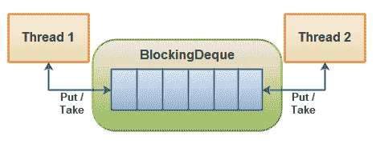

# 阻塞队列

> 原文：<https://jenkov.com/tutorials/java-util-concurrent/blockingdeque.html>

`java.util.concurrent`类中的`BlockingDeque`接口表示一个 deque，它是线程安全的，可以放入和取出实例。在这篇文章中，我会告诉你如何使用这个`BlockingDeque`。

`BlockingDeque`类是一个`Deque`类，它阻塞线程尝试插入或删除队列中的元素，以防无法插入或删除队列中的元素。

A `deque`是“双端队列”的简称。因此，`deque`是一个队列，您可以从两端插入和取出元素。

## 阻止请求使用

如果线程既产生又消耗同一队列的元素，则可以使用`BlockingDeque`。如果生产线程需要在队列的两端插入，而消费线程需要从队列的两端移除，也可以使用它。下面是一个例子:

|  |
| **一个阻塞队列——线程可以从队列的两端放入和取出。** |

一个线程将产生元素并将它们插入队列的任意一端。如果队列当前已满，插入线程将被阻塞，直到移除线程从队列中取出一个元素。如果队列当前为空，则移除线程将被阻塞，直到插入线程将元素插入到队列中。

### 阻塞请求方法

A `BlockingDeque`有 4 组不同的方法来插入、删除和检查队列中的元素。在不能立即执行所请求的操作的情况下，每组方法的行为是不同的。下面是这些方法的表格:

|   | **抛出异常** | **特殊值** | **块** | **超时** |
| **插入** | `addFirst(o)` | `offerFirst(o)` | `putFirst(o)` | `offerFirst(o, timeout, timeunit)` |
| **移除** | `removeFirst(o)` | `pollFirst(o)` | `takeFirst(o)` | `pollFirst(timeout, timeunit)` |
| **检查** | `getFirst(o)` | `peekFirst(o)` |  |  |

|   | **抛出异常** | **特殊值** | **块** | **超时** |
| **插入** | `addLast(o)` | `offerLast(o)` | `putLast(o)` | `offerLast(o, timeout, timeunit)` |
| **移除** | `removeLast(o)` | `pollLast(o)` | `takeLast(o)` | `pollLast(timeout, timeunit)` |
| **检查** | `getLast(o)` | `peekLast(o)` |  |  |

4 种不同的行为意味着:

1.  **抛出异常** :
    如果尝试的操作不能立即执行，抛出异常。
2.  **特殊值** :
    如果尝试的操作不能立即执行，则返回一个特殊值(通常为真/假)。
3.  **阻塞** :
    如果尝试的操作不可能立即执行，方法调用会阻塞，直到它成功。
4.  **超时** :
    如果尝试的操作不能立即执行，方法调用会一直阻塞，但等待时间不会超过给定的超时时间。返回一个特殊值，表明操作是否成功(通常为真/假)。

## BlockingQueue 扩展 blocking queue

`BlockingDeque`接口扩展了`BlockingQueue`接口。这意味着你可以用一个`BlockingDeque`作为一个`BlockingQueue`。如果这样做，各种插入方法会将元素添加到 dequee 的末尾，而移除方法会从 dequee 的开头移除元素。`BlockingQueue`接口的插入和移除方法，即。

下面是一个表格，显示了`BlockingQueue`的方法在`BlockingDeque`实现中的作用:

| **阻塞队列** | **阻塞队列** |
| 添加() | addLast() |
| 出价()x 2 | offerLast() x 2 |
| 放() | putLast() |
|   |   |
| 移除() | removeFirst() |
| 投票()x 2 | 民意优先() |
| 采取() | takeFirst() |
|   |   |
| 元素() | getFirst() |
| peek() | peekFirst() |

## 阻塞队列实现

由于`BlockingDeque`是一个接口，你需要使用它的许多实现中的一个来使用它。`java.util.concurrent`包有以下`BlockingDeque`接口的实现:

*   [链接阻塞队列](linkedblockingdeque.html)

## 阻塞请求代码示例

下面是一个如何使用`BlockingDeque`方法的小代码示例:

```
BlockingDeque<String> deque = new LinkedBlockingDeque<String>();

deque.addFirst("1");
deque.addLast("2");

String two = deque.takeLast();
String one = deque.takeFirst();

```