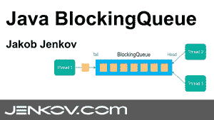
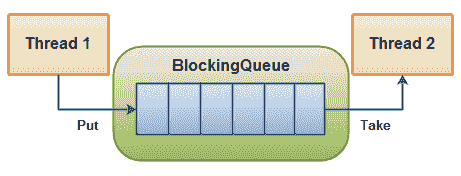

# Java 阻塞队列

> 原文：<https://jenkov.com/tutorials/java-util-concurrent/blockingqueue.html>

*Java* 换句话说，多个线程可以并发地从一个 Java `BlockingQueue`中插入和取出元素，而不会出现任何并发问题。

术语*阻塞* *队列*来源于这样一个事实:Java `BlockingQueue`能够阻塞试图插入或从队列中取出元素的线程。例如，如果一个线程试图获取一个元素，而队列中没有剩余的元素，那么这个线程会被阻塞，直到有一个元素被获取。调用线程是否被阻塞取决于你在`BlockingQueue`上调用了什么方法。稍后将更详细地解释不同的方法。

本文不会讨论如何自己用 Java 实现一个`BlockingQueue`。如果你对此感兴趣，我在我的更理论化的 [Java 并发教程](/java-concurrency/index.html)中有一篇关于[阻塞队列](/java-concurrency/blocking-queues.html)的文章。

## Java BlockingQueue 教程视频

如果你更喜欢视频，我这里有本教程的视频版: [Java BlockingQueue 教程](https://www.youtube.com/watch?v=d3xb1Nj88pw&list=PLL8woMHwr36EDxjUoCzboZjedsnhLP1j4&index=16 "Java BlockingQueue Tutorial Video")

[](https://www.youtube.com/watch?v=d3xb1Nj88pw&list=PLL8woMHwr36EDxjUoCzboZjedsnhLP1j4&index=16 "Java BlockingQueue Tutorial Video")

## 阻塞队列实现

由于`BlockingQueue`是一个接口，你需要使用它的一个实现来使用它。`java.util.concurrent`包有以下`BlockingQueue`接口的实现:

*   [ArrayBlockingQueue](arrayblockingqueue.html)
*   [延迟队列](delayqueue.html)
*   [LinkedBlockingQueue](linkedblockingqueue.html)
*   链接阻塞队列
*   LinkedTransferQueue
*   [优先级阻塞队列](priorityblockingqueue.html)
*   [同步队列](synchronousqueue.html)

单击列表中的链接，阅读有关每个实施的更多信息。

## 阻塞队列使用

一个`BlockingQueue`通常用于让一个线程产生对象，另一个线程消费这些对象。下图说明了这一原理:

|  |
| 一个阻塞队列，一个线程放入其中，另一个线程从中取出。 |

生产线程将继续生产新的对象，并将它们插入到`BlockingQueue`中，直到队列达到它所能容纳的上限。换句话说，它是有限。如果阻塞队列达到了它的上限，生产线程在尝试插入新对象时会被阻塞。它保持阻塞状态，直到一个消费线程从队列中取出一个对象。

消费线程不断从`BlockingQueue`中取出对象来处理它们。如果消费线程试图从空队列中取出一个对象，那么消费线程将被阻塞，直到生产线程将一个对象放入队列中。

### 阻塞队列方法

Java `BlockingQueue`接口有 4 组不同的方法来插入、删除和检查队列中的元素。在不能立即执行所请求的操作的情况下，每组方法的行为是不同的。下面是这些方法的表格:

|   | **抛出异常** | **特殊值** | **块** | **超时** |
| **插入** | `add(o)` | `offer(o)` | `put(o)` | `offer(o, timeout, timeunit)` |
| **移除** | `remove(o)` | `poll()` | `take()` | `poll(timeout, timeunit)` |
| **检查** | `element()` | `peek()` |  |  |

4 种不同的行为意味着:

1.  **抛出异常** :
    如果尝试的操作不能立即执行，抛出异常。
2.  **特殊值** :
    如果尝试的操作不能立即执行，则返回一个特殊值(通常为真/假)。
3.  **阻塞** :
    如果尝试的操作不可能立即执行，方法调用会阻塞，直到它成功。
4.  **超时** :
    如果尝试的操作不能立即执行，方法调用会一直阻塞，但等待时间不会超过给定的超时时间。返回一个特殊值，表明操作是否成功(通常为真/假)。

无法将`null`插入到`BlockingQueue`中。如果您试图插入 null，`BlockingQueue`将抛出一个`NullPointerException`。

也可以访问一个`BlockingQueue`中的所有元素，而不仅仅是开始和结束的元素。例如，假设您已经将一个对象排队等待处理，但是您的应用程序决定取消它。然后，您可以调用`remove(o)`来删除队列中的特定对象。然而，这不是非常有效的，所以你不应该使用这些`Collection`方法，除非你真的有必要。

## Java BlockingQueue 示例

这里有一个 Java `BlockingQueue`的例子。这个例子使用了`BlockingQueue`接口的`ArrayBlockingQueue`实现。

首先是在不同线程中启动一个`Producer`和一个`Consumer`的`BlockingQueueExample`类。`Producer`将字符串插入共享的`BlockingQueue`，然后`Consumer`将它们取出。

```
public class BlockingQueueExample {

    public static void main(String[] args) throws Exception {

        BlockingQueue queue = new ArrayBlockingQueue(1024);

        Producer producer = new Producer(queue);
        Consumer consumer = new Consumer(queue);

        new Thread(producer).start();
        new Thread(consumer).start();

        Thread.sleep(4000);
    }
}

```

这里是`Producer`类。注意它在每次`put()`调用之间是如何休眠的。这将导致`Consumer`阻塞，同时等待队列中的对象。

```
public class Producer implements Runnable{

    protected BlockingQueue queue = null;

    public Producer(BlockingQueue queue) {
        this.queue = queue;
    }

    public void run() {
        try {
            queue.put("1");
            Thread.sleep(1000);
            queue.put("2");
            Thread.sleep(1000);
            queue.put("3");
        } catch (InterruptedException e) {
            e.printStackTrace();
        }
    }
}

```

这里是`Consumer`类。它只是从队列中取出对象，并将它们打印到`System.out`。

```
public class Consumer implements Runnable{

    protected BlockingQueue queue = null;

    public Consumer(BlockingQueue queue) {
        this.queue = queue;
    }

    public void run() {
        try {
            System.out.println(queue.take());
            System.out.println(queue.take());
            System.out.println(queue.take());
        } catch (InterruptedException e) {
            e.printStackTrace();
        }
    }
}

```

## 添加()

如果 BlockingQueue 内部有空间，Java BlockingQueue `add()`方法会将作为参数传递的元素添加到该方法中。如果 BlockingQueue 内部没有空间容纳这个新元素，`add()`方法抛出一个 IllegalStateException。

## 报价()

如果 BlockingQueue 内部有空间，BlockingQueue `offer()`方法会将作为参数传递的元素添加到该方法中。如果 BlockingQueue 内部没有空间容纳这个新元素，`offer()`方法返回`false`。

## 报价(单位时间，单位时间)

BlockingQueue `offer()`方法存在于将超时作为参数的版本中。如果 BlockingQueue 内部有空间，或者空间变得可用，这个版本的`offer()`方法将添加作为参数传递的元素。如果 BlockingQueue 在超时时间内没有为这个新元素获得空间，这个版本的`offer()`方法返回`false`。

## 放()

BlockingQueue `put()`方法将元素插入 BlockingQueue，如果它在内部有空间的话。如果 BlockingQueue 没有空间容纳新元素，`put()`方法将阻塞调用`put()`方法的线程，直到 BlockingQueue 内部有空间容纳新元素。

## 采取()

Java BlockingQueue `take()`方法将删除 BlockingQueue 中的第一个元素。如果 BlockingQueue 不包含任何元素，`take()`方法将阻塞调用`take()`的线程，直到一个元素被插入 BlockingQueue。

## 投票()

BlockingQueue `poll()`方法将删除 BlockingQueue 中的第一个元素。如果 BlockingQueue 不包含任何元素，`poll()`方法将返回`null`。

## 轮询(长时间毫秒，时间单位时间单位)

BlockingQueue `poll(long timeMillis, TimeUnit timeUnit)`方法将删除 BlockingQueue 中的第一个元素。如果 BlockingQueue 不包含任何元素，这个版本的`poll()`方法将在给定的时间内等待一个元素变得可用，该时间作为参数传递给它。如果在给定的超时期限内没有元素可用，该方法返回`null`。

## 移除(对象 o)

BlockingQueue `remove(Object o)`方法将从 lockingQueue 中删除给定元素的单个实例，如果该元素存在于 BlockingQueue 中。`remove()`方法将使用`o.equals(element)`来决定作为参数传递的对象 o 是否匹配 BlockingQueue 中的给定元素。如果 BlockingQueue 包含多个与给定的 o 参数匹配的元素，则这些元素中只有一个将从 BlockingQueue 中删除。如果删除了一个元素，`remove()`方法将返回`true`，否则返回`false`。

## peek()

BlockingQueue `peek()`方法将返回 BlockingQueue 的第一个元素，而不删除它。如果 BlockingQueue 不包含任何元素，`peek()`方法将返回`null`。

## 元素()

BlockingQueue `element()`方法将返回 BlockingQueue 的第一个元素，而不删除它。如果 BlockingQueue 不包含任何元素，`element()`方法将抛出一个 NoSuchElementException。

## 包含(对象 o)

如果 BlockingQueue 包含的对象与作为参数传递给`contains()`方法的对象相匹配，那么 BlockingQueue `contains(Object o)`方法将返回`true`。`Objects.equals(o, element)`语句用于检查参数 object o 是否匹配 BlockingQueue 中的给定元素。如果找到与参数对象匹配的元素，该方法返回`true`。如果没有找到匹配的元素，则返回`false`。

## 收集目的地

`drainTo(Collection dest)`方法将 BlockingQueue 的所有元素放入给定的目标集合中。

## drainTo(集合目标，整数最大元素)

`drainTo(Collection dest, int maxElements)`从 BlockingQueue 到目的地集合中最多排出`maxElements`。

## 大小()

BlockingQueue `size()`方法返回存储在 BlockingQueue 中的元素数量。

## 剩余容量

BlockingQueue `remainingCapacity()`方法返回 BlockingQueue 的剩余(未使用)容量。剩余容量的计算方法是满容量减去存储在 BlockingQueue 中的元素数。