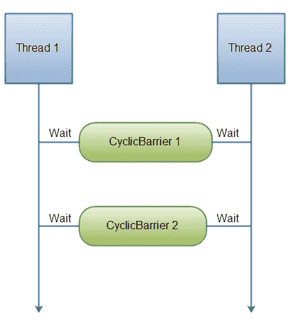

# 环状屏障

> 原文：<https://jenkov.com/tutorials/java-util-concurrent/cyclicbarrier.html>

`java.util.concurrent.CyclicBarrier`类是一种同步机制，可以通过某种算法同步线程进程。换句话说，这是一个所有线程都必须等待的障碍，直到所有线程都到达它，然后任何线程才能继续。下图说明了:

|  |
| **两个线程在 CyclicBarriers 等待对方。** |

线程通过调用`CyclicBarrier`上的`await()`方法来相互等待。一旦 N 个线程在`CyclicBarrier`等待，所有线程都被释放，可以继续运行。

## 创造一个循环屏障

当你创建一个`CyclicBarrier`时，你指定在释放它们之前有多少线程要等待。下面是如何创建一个`CyclicBarrier`:

```
CyclicBarrier barrier = new CyclicBarrier(2);

```

## 在自行车道旁等待

下面是一个线程如何在`CyclicBarrier`等待:

```
barrier.await();

```

您还可以为等待线程指定超时。当超时过去时，线程也被释放，即使不是所有的 N 个线程都在`CyclicBarrier`等待。以下是指定超时的方法:

```
barrier.await(10, TimeUnit.SECONDS);

```

等待线程在`CyclicBarrier`等待，直到:

*   最后一个线程到达(调用 await())
*   该线程被另一个线程中断(另一个线程调用它的 interrupt()方法)
*   另一个等待线程被中断
*   另一个等待线程在`CyclicBarrier`等待时超时
*   某个外部线程调用了`CyclicBarrier.reset()`方法。

## 循环屏障作用

`CyclicBarrier`支持一个 barrier 动作，这是一个`Runnable`，一旦最后一个线程到达就执行。您将`Runnable`屏障动作传递给其构造函数中的`CyclicBarrier`，就像这样:

```
Runnable      barrierAction = ... ;
CyclicBarrier barrier       = new CyclicBarrier(2, barrierAction);

```

## 循环屏障示例

下面是一个代码示例，展示了如何使用`CyclicBarrier`:

```
Runnable barrier1Action = new Runnable() {
    public void run() {
        System.out.println("BarrierAction 1 executed ");
    }
};
Runnable barrier2Action = new Runnable() {
    public void run() {
        System.out.println("BarrierAction 2 executed ");
    }
};

CyclicBarrier barrier1 = new CyclicBarrier(2, barrier1Action);
CyclicBarrier barrier2 = new CyclicBarrier(2, barrier2Action);

CyclicBarrierRunnable barrierRunnable1 =
        new CyclicBarrierRunnable(barrier1, barrier2);

CyclicBarrierRunnable barrierRunnable2 =
        new CyclicBarrierRunnable(barrier1, barrier2);

new Thread(barrierRunnable1).start();
new Thread(barrierRunnable2).start();

```

下面是`CyclicBarrierRunnable`类:

```
public class CyclicBarrierRunnable implements Runnable{

    CyclicBarrier barrier1 = null;
    CyclicBarrier barrier2 = null;

    public CyclicBarrierRunnable(
            CyclicBarrier barrier1,
            CyclicBarrier barrier2) {

        this.barrier1 = barrier1;
        this.barrier2 = barrier2;
    }

    public void run() {
        try {
            Thread.sleep(1000);
            System.out.println(Thread.currentThread().getName() +
                                " waiting at barrier 1");
            this.barrier1.await();

            Thread.sleep(1000);
            System.out.println(Thread.currentThread().getName() +
                                " waiting at barrier 2");
            this.barrier2.await();

            System.out.println(Thread.currentThread().getName() +
                                " done!");

        } catch (InterruptedException e) {
            e.printStackTrace();
        } catch (BrokenBarrierException e) {
            e.printStackTrace();
        }
    }
}

```

下面是执行上述代码的控制台输出。请注意，线程写入控制台的顺序可能会因执行而异。有时`Thread-0`先打印，有时`Thread-1`先打印等等。

```
Thread-0 waiting at barrier 1
Thread-1 waiting at barrier 1
BarrierAction 1 executed
Thread-1 waiting at barrier 2
Thread-0 waiting at barrier 2
BarrierAction 2 executed
Thread-0 done!
Thread-1 done!

```