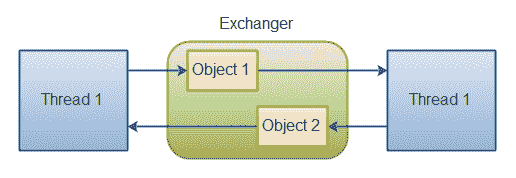

# 交换

> 原文：<https://jenkov.com/tutorials/java-util-concurrent/exchanger.html>

# 交换

`java.util.concurrent.Exchanger`类代表一种两个线程可以交换对象的会合点。下面是这种机制的一个示例:

|  |
| 两个线程通过一个交换器交换对象。 |

通过两种`exchange()`方法中的一种来交换对象。这里有一个例子:

```
Exchanger exchanger = new Exchanger();

ExchangerRunnable exchangerRunnable1 =
        new ExchangerRunnable(exchanger, "A");

ExchangerRunnable exchangerRunnable2 =
        new ExchangerRunnable(exchanger, "B");

new Thread(exchangerRunnable1).start();
new Thread(exchangerRunnable2).start();

```

下面是`ExchangerRunnable`代码:

```
public class ExchangerRunnable implements Runnable{

    Exchanger exchanger = null;
    Object    object    = null;

    public ExchangerRunnable(Exchanger exchanger, Object object) {
        this.exchanger = exchanger;
        this.object = object;
    }

    public void run() {
        try {
            Object previous = this.object;

            this.object = this.exchanger.exchange(this.object);

            System.out.println(
                    Thread.currentThread().getName() +
                    " exchanged " + previous + " for " + this.object
            );
        } catch (InterruptedException e) {
            e.printStackTrace();
        }
    }
}

```

此示例打印出以下内容:

```
Thread-0 exchanged A for B
Thread-1 exchanged B for A

```