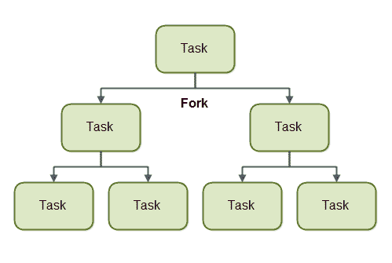
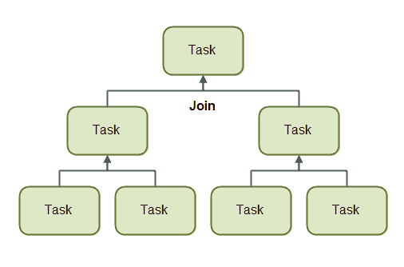

# 使用 ForkJoinPool 的 Java Fork 和 Join

> 原文：<https://jenkov.com/tutorials/java-util-concurrent/java-fork-and-join-forkjoinpool.html>

在 Java 7 中,`ForkJoinPool`被添加到 Java 中。`ForkJoinPool`与 [Java ExecutorService](executorservice.html) 相似，但有一点不同。`ForkJoinPool`使得任务很容易将工作分成更小的任务，然后提交给`ForkJoinPool`。只要需要拆分任务，任务就可以继续将其工作拆分成更小的子任务。这听起来可能有点抽象，所以在这个 fork and join 教程中，我将解释`ForkJoinPool`是如何工作的，以及如何分解任务。

## Fork 和 Join 解释

在我们看`ForkJoinPool`之前，我想解释一下 fork and join 原理一般是如何工作的。

fork and join 原理由递归执行的两个步骤组成。这两个步骤是 fork 步骤和 join 步骤。

### 叉

使用 fork and join 原则的任务可以 *fork* (分裂)成可以并发执行的更小的子任务。下图对此进行了说明:



通过将自身分割成子任务，每个子任务可以由不同的 CPU 或同一 CPU 上的不同线程并行执行。

一项任务只有在分配给它的工作量足够大时才会分解成子任务。将一个任务拆分成子任务是有开销的，所以对于少量的工作来说，这种开销可能比并行执行子任务所获得的加速要大。

将一项任务分解成子任务的时间限制也称为阈值。由每个任务决定一个合理的阈值。这在很大程度上取决于所做的工作类型。

### 加入

当一个任务将自己分割成子任务时，该任务会一直等待，直到子任务执行完毕。

一旦子任务执行完毕，任务就可以*将所有结果合并成一个结果。下图对此进行了说明:*



当然，并非所有类型的任务都可以返回结果。如果任务没有返回结果，那么任务就等待其子任务完成。这时不会发生结果合并。

## 福克琼普尔

`ForkJoinPool`是一个特殊的线程池，它被设计用来很好地处理 fork-and-join 任务分割。`ForkJoinPool`位于`java.util.concurrent`包中，所以完整的类名是`java.util.concurrent.ForkJoinPool`。

### 创建 ForkJoinPool

使用其构造函数创建一个`ForkJoinPool`。作为`ForkJoinPool`构造函数的一个参数，您可以传递您想要的指定并行级别。并行度表示您希望在传递给`ForkJoinPool`的任务上同时处理多少个线程或 CPU。下面是一个`ForkJoinPool`的创作例子:

```
ForkJoinPool forkJoinPool = new ForkJoinPool(4);

```

本例创建了一个并行度为 4 的`ForkJoinPool`。

### 向 ForkJoinPool 提交任务

向`ForkJoinPool`提交任务与向`ExecutorService`提交任务类似。您可以提交两种类型的任务。不返回任何结果的任务(“动作”)，以及返回结果的任务(“任务”)。这两种类型的任务由`RecursiveAction`和`RecursiveTask`类表示。如何使用这两个任务以及如何提交它们将在下面的章节中介绍。

## 递归作用

`RecursiveAction`是一个不返回任何值的任务。它只是做一些工作，例如将数据写入磁盘，然后退出。

一个`RecursiveAction`可能仍然需要把它的工作分成更小的块，这些块可以由独立的线程或 CPU 来执行。

你通过子类化来实现一个`RecursiveAction`。这里有一个`RecursiveAction`的例子:

```
import java.util.ArrayList;
import java.util.List;
import java.util.concurrent.RecursiveAction;

public class MyRecursiveAction extends RecursiveAction {

    private long workLoad = 0;

    public MyRecursiveAction(long workLoad) {
        this.workLoad = workLoad;
    }

    @Override
    protected void compute() {

        //if work is above threshold, break tasks up into smaller tasks
        if(this.workLoad > 16) {
            System.out.println("Splitting workLoad : " + this.workLoad);

            List<MyRecursiveAction> subtasks =
                new ArrayList<MyRecursiveAction>();

            subtasks.addAll(createSubtasks());

            for(RecursiveAction subtask : subtasks){
                subtask.fork();
            }

        } else {
            System.out.println("Doing workLoad myself: " + this.workLoad);
        }
    }

    private List<MyRecursiveAction> createSubtasks() {
        List<MyRecursiveAction> subtasks =
            new ArrayList<MyRecursiveAction>();

        MyRecursiveAction subtask1 = new MyRecursiveAction(this.workLoad / 2);
        MyRecursiveAction subtask2 = new MyRecursiveAction(this.workLoad / 2);

        subtasks.add(subtask1);
        subtasks.add(subtask2);

        return subtasks;
    }

}

```

这个例子非常简单。`MyRecursiveAction`只是将一个虚构的`workLoad`作为其构造函数的参数。如果`workLoad`高于某个阈值，工作就会被分割成子任务，这些子任务也会被调度执行(通过子任务的`.fork()`方法)。如果`workLoad`低于某个阈值，则工作由`MyRecursiveAction`本身执行。

您可以像这样安排一个`MyRecursiveAction`来执行:

```
MyRecursiveAction myRecursiveAction = new MyRecursiveAction(24);

forkJoinPool.invoke(myRecursiveAction);

```

## 递归任务

一个`RecursiveTask`是一个返回结果的任务。它可以将其工作分解成更小的任务，并将这些更小任务的结果合并成一个集合结果。分裂和合并可以在几个层次上进行。这里有一个`RecursiveTask`的例子:

```
import java.util.ArrayList;
import java.util.List;
import java.util.concurrent.RecursiveTask;

public class MyRecursiveTask extends RecursiveTask<Long> {

    private long workLoad = 0;

    public MyRecursiveTask(long workLoad) {
        this.workLoad = workLoad;
    }

    protected Long compute() {

        //if work is above threshold, break tasks up into smaller tasks
        if(this.workLoad > 16) {
            System.out.println("Splitting workLoad : " + this.workLoad);

            List<MyRecursiveTask> subtasks =
                new ArrayList<MyRecursiveTask>();
            subtasks.addAll(createSubtasks());

            for(MyRecursiveTask subtask : subtasks){
                subtask.fork();
            }

            long result = 0;
            for(MyRecursiveTask subtask : subtasks) {
                result += subtask.join();
            }
            return result;

        } else {
            System.out.println("Doing workLoad myself: " + this.workLoad);
            return workLoad * 3;
        }
    }

    private List<MyRecursiveTask> createSubtasks() {
        List<MyRecursiveTask> subtasks =
        new ArrayList<MyRecursiveTask>();

        MyRecursiveTask subtask1 = new MyRecursiveTask(this.workLoad / 2);
        MyRecursiveTask subtask2 = new MyRecursiveTask(this.workLoad / 2);

        subtasks.add(subtask1);
        subtasks.add(subtask2);

        return subtasks;
    }
}

```

这个例子类似于`RecursiveAction`例子，除了它返回一个结果。类`MyRecursiveTask`扩展了`RecursiveTask<Long>`，这意味着任务返回的结果是一个`Long`。

`MyRecursiveTask`示例还将工作分解为子任务，并使用它们的`fork()`方法调度这些子任务的执行。

此外，该示例通过调用每个子任务的`join()`方法接收每个子任务返回的结果。子任务结果被合并成一个更大的结果，然后返回。这种子任务结果的连接/合并可能在几个递归级别上递归发生。

您可以像这样安排一个`RecursiveTask`:

```
MyRecursiveTask myRecursiveTask = new MyRecursiveTask(128);

long mergedResult = forkJoinPool.invoke(myRecursiveTask);

System.out.println("mergedResult = " + mergedResult);    

```

注意如何从`ForkJoinPool.invoke()`方法调用中获得最终结果。

## 临界 forkjoinpool

似乎不是每个人都对 Java 7 中的新`ForkJoinPool`感到满意。在搜索关于`ForkJoinPool`的经历和观点时，我遇到了以下评论:

[一场 Java Fork-Join 灾难](http://coopsoft.com/ar/CalamityArticle.html)

在您计划在自己的项目中使用`ForkJoinPool`之前，非常值得一读。