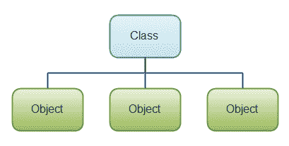

# Java 核心概念

> 原文：<https://jenkov.com/tutorials/java/core-concepts.html>

关于[什么是 Java](/java/what-is-java.html)的文中提到，Java 不仅仅是编程语言本身。Java 是一个有很多子主题和概念的平台。不过，在 Java 语言本身内部，有一些核心概念是理解起来必不可少的。本文将仔细研究这些核心 Java 概念。

## 变量

不管编程语言如何，计算机程序通常从某个地方(文件、键盘、鼠标、网络等)读取数据。)，处理数据，再在某个地方写一些数据(到屏幕，文件，网络等。).

在 Java 程序中，数据保存在*变量*中。您的 Java 程序首先声明变量，然后将数据读入变量，对变量执行操作，然后再次将变量(或基于变量的数据)写入某个地方。变量在 [Java 变量](variables.html)的文本中有更详细的解释。

每个变量都有一种数据类型。数据类型决定了变量可以包含的数据类型，以及可以对其执行的操作。例如，变量可以是一个数字。数字可以加、减、乘、除等。或者，变量可以是字符串(文本)。字符串可以分为子字符串，搜索字符，与其他字符串连接等。Java 附带了一组内置的数据类型。这些数据类型在关于 [Java 数据类型](data-types.html)的文本中有更详细的描述。

下面是一个简单的 Java 变量声明和操作示例。现在不懂也不用担心。本 Java 语言教程后面的文章解释了细节。这个例子的目的只是给你一个使用 Java 变量的感觉。

```
int myNumber;

myNumber = 0;

myNumber = myNumber + 5;

```

该示例的第一行声明了一个名为`myNumber`的变量，其数据类型为`int`。一个`int`是一个 32 位的整数(没有分数的数)。

第二行将变量`myNumber`的值设置为 0。

第三行将`myNumber`的当前值加 5(我们刚刚在上一行中将其设置为 0)。

## 操作

Java 中的操作是可以用来处理变量中的数据的指令。一些操作读取和写入变量值(正如您已经看到的示例)，而其他操作控制程序流。最重要的操作是:

*   可变操作
    *   可变赋值。
    *   数值的可变读数。
    *   可变算术。
    *   对象实例化。
*   程序流程
    *   [`for`循环往复](/java/for.html)。
    *   [`while`循环往复](/java/while.html)。
    *   [`if`【报表(分支)](/java/if.html)。
    *   [`switch`报表](/java/switch.html)。
    *   方法调用。

所有这些操作在他们自己的文本中都有详细的解释。

以下是一些操作示例:

```
int number = 0;
int abs    = 0;

//imagine some operations that assign a value to number 
// - but left out of this example.

if(number >= 0) {
    abs = number;    
} else {
    abs = -number; 
}

```

这个例子首先声明了两个名为`number`和`abs`的变量。变量`abs`应该包含`number`的绝对值。一个数的绝对值总是正的。对于正数，绝对值就是数字本身。对于负数，绝对值是没有负号的数字。例如，-10 的绝对值是 10。

`if`操作检查`number`变量的值，看它是否大于或等于 0。如果是，分配给`abs`变量的绝对值就是`number`变量的值。如果`number`值小于 0，则分配给`number`的值等于`-number`。否定一个负数会得到一个正数，记得吗？-(-10)是 10。

## 类+对象

类在一致的模块中将变量和操作组合在一起。一个类可以有字段、构造函数和方法(还有更多，但现在这些都不重要了)。我将在这里简要描述字段、构造函数和方法，但是它们在自己的文本中也会有更详细的解释。

对象是类的实例。当您创建一个对象时，该对象属于某个类。这个类就像一个模板(或蓝图),告诉我们这个类的对象应该是什么样子。当你创建一个对象时，你说“给我一个这个类的对象”。

如果你认为一个工厂生产很多很多相同的产品，那么类就是成品外观的蓝图/手册，对象就是每一个成品。如果工厂生产汽车，那么要生产的汽车的蓝图/设计手册对应一个 Java 类，生产的物理汽车对应 Java 对象。

这是一个简单的图表，说明了对象属于某一类的原理。该类确定该类的对象具有哪些字段和方法。

|  |
| 一个 Java 类可以包含字段、构造函数和方法。 |

下面是一个 Java 类声明示例:

```
public class Car {

}

```

这个例子声明了一个名为`Car`的类。Car 类不包含任何字段、构造函数或方法。它是空的。这个例子主要是向你展示一个 Java 代码中类声明的例子。

### 菲尔茨

字段是属于类或对象的变量。换句话说，它是一段数据。例如，一个汽车类可以定义所有汽车对象都会有的字段`brand`。然后，每个汽车对象的品牌字段可以有不同的值。

字段在 [Java 字段](fields.html)的文本中有更详细的介绍。

下面是上面的 Car 类声明，添加了一个字段名称`brand`:

```
public class Car {
    private String brand;
}

```

本例声明了一个名为`brand`的字段，其数据类型为文本`String`。

### 构造器

构造函数是一种特殊的方法，在创建该类的对象时执行。构造函数通常初始化对象的内部字段——如果需要的话。

关于 Java 构造函数的文章中详细介绍了构造函数。

下面是之前的 Car 类，它带有一个初始化`brand`字段的构造函数:

```
public class Car {

    private String brand;

    public Car(String theBrand) {
        this.brand = theBrand;
    }
}

```

### 方法

方法是一起执行特定功能的一组操作。例如，一个方法可以将数字相加，然后除以第三个数字。或者，一个方法可以读写数据库中的数据等。

当您需要将操作分组在一起时，通常会使用方法，您需要能够从几个不同的位置执行这些操作。或者，如果您只是想让代码更容易阅读。在其他编程语言中，方法可能被称为“过程”或“函数”。

方法在关于 Java 方法的文本中有更详细的介绍。

下面是之前的 Car 类，添加了一个简单的方法`getBrand`:

```
public class Car {

    private String brand;

    public Car(String theBrand) {
        this.brand = theBrand;
    }

    public String getBrand() {
        return this.brand;
    }
}

```

## 接口

接口是 Java 的核心概念。接口描述了一个特定的对象应该有哪些可用的方法。类可以实现一个接口。当一个类实现一个接口时，这个类必须实现接口中描述的所有方法。接口在我关于 [Java 接口](/java/interfaces.html)的文本中有更多的描述。

## 包装

Java 中的包是另一个核心概念。包是包含 Java 类和接口的目录。Packages 提供了一种将相关类和接口分组的简便方法，从而使 Java 代码的模块化变得更加容易。包在我的关于 Java 包的文章中有更详细的描述。